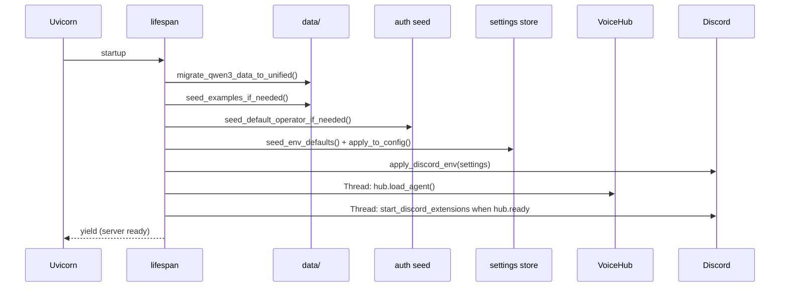

# Launch Flow

Every Maya Unified session begins at **`launch.py`** in the repository root. There is no separate voice server process in the default unified workflow—understanding this file explains why port **8090** is the only port you need.

## Entry: `launch.py`

```python
# Simplified flow from launch.py
setup_paths()                    # services.paths — sys.path, VOICE_RUNTIME
load_env_files(.env)             # root + legacy voice-runtime/.env
_check_voice_deps()              # warns if faster_whisper / faster_qwen3_tts missing
from apps.gateway.main import run
run()                            # uvicorn on PORT (default 8090)
```

### Path setup (`services.paths.setup_paths`)

Before any voice imports, the repo root and `packages/voice-runtime` are inserted into `sys.path`. This allows:

- `from llm import LLMClient` inside voice-runtime (legacy import style)
- `from apps.gateway.main import run` from the root launcher
- Shared `services/` modules visible to both gateway and runtime

### Environment loading

`services/env_loader.load_env_files` reads:

1. **`maya-unified/.env`** (primary)
2. **`packages/voice-runtime/.env`** (legacy override, optional)

Shell-exported variables are **not** overridden by `.env` values on disk—the loader respects existing OS env for deployment flexibility.

### Voice dependency check

`_check_voice_deps()` attempts:

```python
import faster_qwen3_tts
import faster_whisper
```

If either fails, Maya **still starts** but prints setup instructions (`make setup`, `uv sync`). TTS falls back to `NullTTS`; the dashboard shows text replies without audio.

### Venv hint

On Windows/Linux, if you're not running inside `.venv/Scripts/python`, `launch.py` prints a tip to use the project venv—voice CUDA wheels are installed there.

## Gateway startup: `apps/gateway/main.run()`

```python
uvicorn.run(
    "apps.gateway.main:app",
    host="0.0.0.0",
    port=int(os.getenv("PORT", "8090")),
    reload=os.getenv("ENV") == "development",
    reload_excludes=["packages/voice-runtime/*"],  # avoid TTS reload loops
)
```

## Lifespan sequence (`apps/gateway/lifespan.py`)

FastAPI `lifespan` runs **before** the server accepts connections:



### Data migration

`migrate_qwen3_data_to_unified()` copies legacy standalone `qwen3-voice-agent/data` into root `data/` **once**, leaving marker `data/.migrated-from-qwen3`.

### Example seeding

`seed_examples_if_needed()` copies [[Getting Started/Bundled Examples]] (voice ref clip, personalities, skills) if not already present.

### Operator seeding

If PostgreSQL is reachable and `operator_users` is empty, creates default **`admin`/`admin`** (configurable via `OPERATOR_DEFAULT_*`). Also imports legacy global voice data into admin scope when applicable.

### Agent load (background thread)

`hub.load_agent()` runs in a **daemon thread** so Uvicorn binds immediately while GPU models load (Whisper + Qwen3-TTS can take tens of seconds).

The dashboard polls `/api/voice/agent/status` until `ready: true`.

## Shutdown

On process exit, lifespan `yield` completes and FastAPI tears down. Daemon agent threads do not block graceful shutdown; Uvicorn uses `timeout_graceful_shutdown=5` so SSE streams don't wedge reload.

## Operational implications

| Concern | Behavior |
|---------|----------|
| **First boot slow** | TTS model download + GPU init in background |
| **Missing Postgres** | Operator seed skipped; OAuth tables missing → 503 on Google routes |
| **PORT conflict** | Set `PORT=8091` in `.env` |
| **Dev reload** | Voice-runtime file changes excluded from auto-reload |

## Related

- [[Apps/Launch]] — wrapper scripts (`launch.bat`, `launch.sh`)
- [[Apps/Unified Gateway]] — what mounts after lifespan
- [[Architecture/Voice Hub Bridge]] — what `load_agent()` constructs
