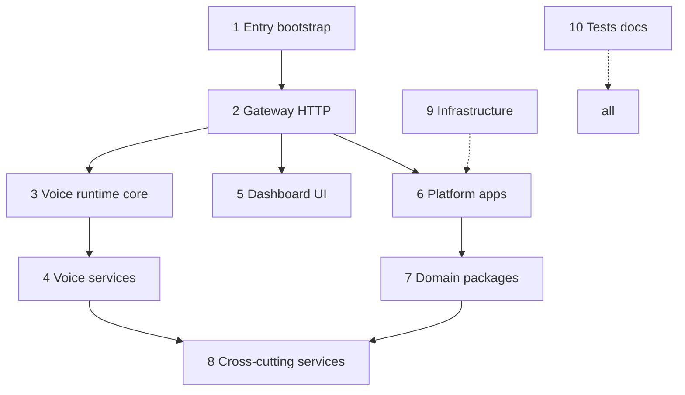

# Architectural Layers

The Maya Unified codebase organizes into **ten architectural layers** (from `/understand` knowledge-graph analysis). Read them in order when onboarding—each layer depends on the ones above it.

## Layer 1 — Entry & bootstrap

**Paths:** `launch.py`, `services/paths.py`, `services/env_loader.py`

**Purpose:** Single process entry, Python path setup, environment loading, optional voice dep warning.

**You touch this when:** Adding a new top-level launcher flag, changing `.env` discovery, fixing import paths on Nix.

→ [[Architecture/Launch Flow]]

## Layer 2 — Gateway & HTTP

**Paths:** `apps/gateway/main.py`, `*_routes.py`, `lifespan.py`

**Purpose:** FastAPI app, auth middleware, router mounting, static dashboard pages, OpenAPI.

**You touch this when:** New HTTP routes, auth rules, CORS, HTML page additions.

→ [[Apps/Unified Gateway]], [[Architecture/Request Pipeline]]

## Layer 3 — Voice runtime core

**Paths:** `packages/voice-runtime/agent.py`, `llm.py`, `stt.py`, `tts.py`, `vad.py`, `chunker.py`

**Purpose:** Real-time turn pipeline—where latency and GPU behavior are determined.

**You touch this when:** Barge-in bugs, TTS quality, LLM streaming, sentence chunking.

→ [[Voice Runtime]]

## Layer 4 — Voice services (unified adapter)

**Paths:** `services/voice/hub.py`, `inference.py`, `services/llm/provider.py`

**Purpose:** Embed runtime in multi-operator gateway—context switching, settings application, LLM hot-swap, inference locking.

**You touch this when:** Per-operator isolation, settings not applying, agent load order.

→ [[Architecture/Voice Hub Bridge]], [[Services/Voice Hub Service]]

## Layer 5 — Dashboard UI

**Paths:** `apps/dashboard/*.html`, `apps/dashboard/js/*`

**Purpose:** Operator-facing conversation UI, settings, memory browser, integrations UI.

**You touch this when:** Frontend bugs, WebLLM integration, mic capture, SSE client.

→ [[Apps/Dashboard]]

## Layer 6 — Platform applications

**Paths:** `apps/maya-gateway/`, `apps/maya-bot/`, `apps/maya-ingest/`

**Purpose:** Optional product features beyond core voice—arena, discover, research, Discord bot, ingest.

**You touch this when:** Platform API features, missing route imports, Prefect flows.

→ [[Platform/Maya Gateway]], [[Platform/Maya Bot]]

## Layer 7 — Domain packages

**Paths:** `packages/maya-*`, `packages/voice-runtime/` (also layer 3)

**Purpose:** Reusable domain logic—DB models, contracts, research graphs, image clients.

**You touch this when:** Schema migrations, API type changes, research pipeline logic.

→ [[Packages/Overview]]

## Layer 8 — Cross-cutting services

**Paths:** `services/auth/`, `services/settings/`, `services/integrations/`

**Purpose:** Auth, persisted settings, Google OAuth—shared by gateway and platform.

**You touch this when:** Login failures, session cookies, OAuth redirect mismatches.

→ [[Services/Overview]], [[Operations/Google OAuth]]

## Layer 9 — Infrastructure

**Paths:** `infra/comfyui/`, Nix flake, Docker compose fragments

**Purpose:** External service deployment (ComfyUI for image gen), OS-level deps.

→ [[Operations/ComfyUI Infrastructure]]

## Layer 10 — Tests & documentation

**Paths:** `tests/`, `docs/`, `scripts/check_tts.py`

**Purpose:** Quality gates and operator docs.

→ [[Development/Testing]], `docs/README.md`

## Suggested reading tour (12 steps)

| Step | Topic | Page |
|------|-------|------|
| 1 | Clone & install | [[Getting Started/Installation]] |
| 2 | First launch | [[Getting Started/Quick Start]] |
| 3 | Repo layout | [[Architecture/Repository Map]] |
| 4 | Startup sequence | [[Architecture/Launch Flow]] |
| 5 | Gateway auth | [[Architecture/Request Pipeline]] |
| 6 | VoiceHub bridge | [[Architecture/Voice Hub Bridge]] |
| 7 | Agent turn loop | [[Voice Runtime/Agent Orchestrator]] |
| 8 | LLM & tools | [[Voice Runtime/LLM]] |
| 9 | TTS & VAD | [[Voice Runtime/TTS Pipeline]], [[Voice Runtime/VAD and Barge-in]] |
| 10 | Memory | [[Voice Runtime/Memory and Tools]] |
| 11 | Configuration | [[Configuration/Environment Variables]] |
| 12 | Operations | [[Operations/Deployment]] |

## Related

- [[Architecture/Overview]]
- Knowledge graph dashboard (local): `.understand-anything/knowledge-graph.json`
