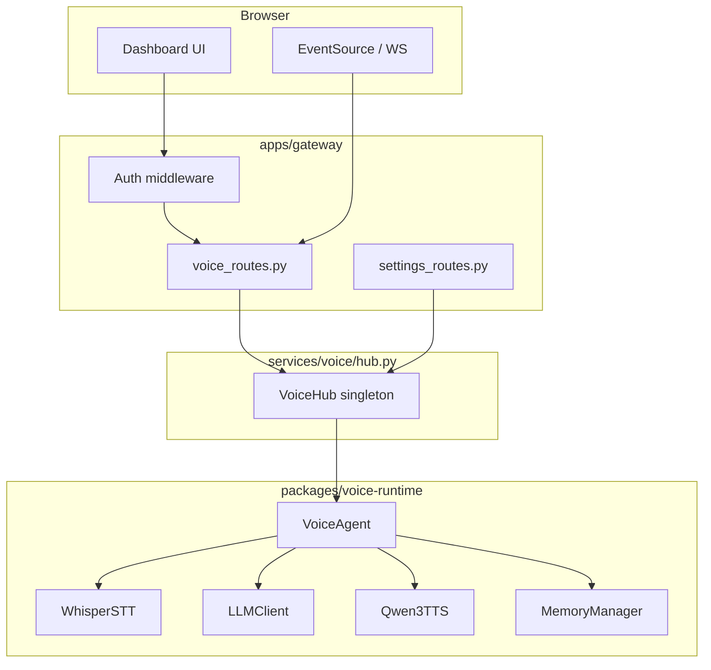

# Architecture Overview

Maya Unified is a **monorepo** that colocates a local voice AI runtime, an operator-facing web dashboard, and optional platform services behind one FastAPI process. The design goal is **one clone, one venv, one port (`8090`)**—operators authenticate once, and all voice/platform APIs share the same session and settings store.

This page explains the high-level shape. For file-level detail see [[Architecture/Repository Map]]; for startup order see [[Architecture/Launch Flow]].

## Three cooperating planes

### 1. Gateway plane (`apps/gateway/`)

The gateway is a standard FastAPI application (`apps/gateway/main.py`) that:

- Serves HTML dashboard pages from `apps/dashboard/` (`/`, `/memory`, `/settings`, …)
- Mounts REST and WebSocket **voice agent APIs** under `/api/voice/*`
- Optionally mounts **platform routes** from `apps/maya-gateway/` (arena, discover, research, …)
- Enforces **operator authentication** via HTTP middleware before protected HTML and JSON routes

The gateway does **not** implement STT, LLM, or TTS itself—it delegates to the voice hub.

### 2. Voice plane (`packages/voice-runtime/` + `services/voice/`)

The voice runtime is the original Qwen3 streaming agent:

- **`VoiceAgent`** (`agent.py`) — orchestrates each conversational turn
- **`WhisperSTT`** (`stt.py`) — faster-whisper transcription
- **`LLMClient`** (`llm.py`) — OpenAI-compatible streaming chat
- **`Qwen3TTS`** (`tts.py`) — faster-qwen3-tts with sub-chunk streaming
- **`MemoryManager`** (`memory/manager.py`) — layered memory and tool registration

In unified mode, **`VoiceHub`** (`services/voice/hub.py`) wraps the legacy `server.Hub` and adds:

- Per-operator data directories
- Dashboard settings → runtime `CONFIG` application
- Voice lease / room coordination
- Hot LLM swap when Settings change

### 3. Platform plane (optional)

When dependencies are installed (`uv sync`) and `DATABASE_URL` is set, `apps/gateway/main.py` mounts routers from `maya_gateway.routes.*`:

- Arena, music, feeds, discover, research, notifications, …
- Backed by `packages/maya-db`, `maya-contracts`, domain packages

Platform features are **gracefully absent** if imports fail—the gateway logs a warning and continues with voice-only mode.

## End-to-end data flow

## Architectural layers (10 layers)

From codebase analysis (`/.understand-anything/knowledge-graph.json`):

| # | Layer | Primary paths | Responsibility |
|---|-------|---------------|----------------|
| 1 | Entry & bootstrap | `launch.py`, `services/paths.py`, `services/env_loader.py` | Path setup, `.env` loading, dep checks |
| 2 | Gateway & HTTP | `apps/gateway/` | Routing, auth, static files, OpenAPI |
| 3 | Voice runtime core | `packages/voice-runtime/agent.py`, `llm.py`, `stt.py`, `tts.py` | Turn pipeline |
| 4 | Voice services | `services/voice/`, `services/llm/` | Hub bridge, provider factory, inference lock |
| 5 | Dashboard UI | `apps/dashboard/` | Operator-facing HTML/JS |
| 6 | Platform apps | `apps/maya-gateway/`, `maya-bot/`, `maya-ingest/` | Optional product features |
| 7 | Domain packages | `packages/maya-*` | Contracts, DB, research, image, feeds |
| 8 | Cross-cutting services | `services/auth/`, `services/settings/`, `services/integrations/` | Sessions, settings, OAuth |
| 9 | Infrastructure | `infra/comfyui/`, Nix, Docker | Image gen stack |
| 10 | Tests & docs | `tests/`, `docs/` | Quality and documentation |

See [[Architecture/Architectural Layers]] for a reading guide through these layers.

## Authentication model (two user concepts)

Maya Unified distinguishes:

1. **Operators** — local dashboard accounts in PostgreSQL (`operator_users`). Cookie: `maya_op_session`. Used for voice APIs and HTML pages.
2. **Platform users** — invite/OAuth/email users when the full maya-gateway social stack is enabled (separate from operator auth).

For most voice-only deployments you only need **operators**. Google OAuth can link Google identity *to* an operator for login and Gmail/Calendar integrations — [[Operations/Google OAuth]].

## Request classification

The auth middleware in `main.py` classifies every request:

| Class | Examples | Auth behavior |
|-------|----------|---------------|
| Open HTML | `/login`, `/setup`, `/static/*` | No session required |
| Guarded HTML | `/`, `/memory`, `/settings`, `/admin/*` | Redirect to `/login` if no session |
| Protected API | `/api/voice/*`, `/api/operators/*`, `/api/admin/*` | **401 JSON** if no session |
| Room guest API | `/api/rooms/{slug}/join`, guest chat | Special guest token rules |
| Open API | `/health`, `/docs`, `/api/platform/auth/status` | Public |

Detail: [[Architecture/Request Pipeline]].

## Why embed the agent instead of microservices?

The voice pipeline is **latency-sensitive** and **GPU-contended** (STT and TTS share CUDA). Running agent + gateway in-process:

- Avoids serializing audio and token streams over IPC
- Lets `services/voice/inference.py` hold a single inference lock
- Allows settings changes to hot-swap `LLMClient` without restarting Uvicorn

Tradeoff: a heavy TTS reload blocks the same process—but Uvicorn reload excludes `packages/voice-runtime/*` in dev mode to reduce accidental model reloads.

## Related pages

- [[Architecture/Launch Flow]] — `launch.py` through agent load
- [[Architecture/Voice Hub Bridge]] — hub responsibilities
- [[Apps/Unified Gateway]] — router list and static mounts
- [[Voice Runtime]] — pipeline internals
