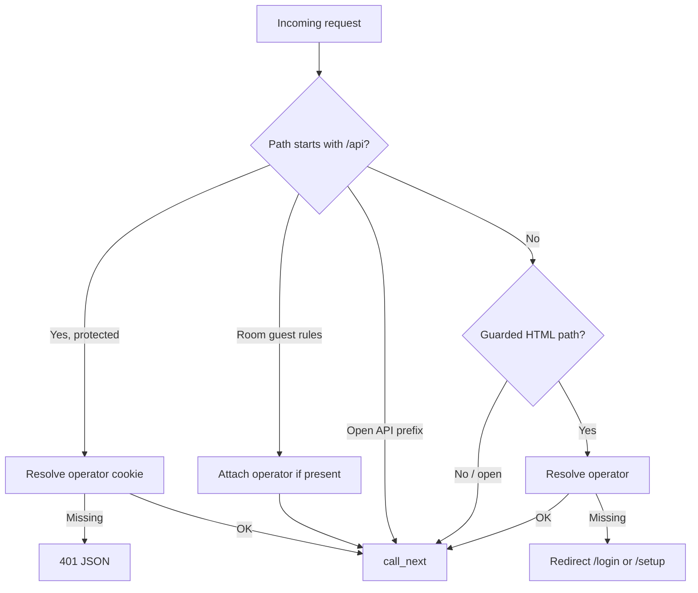
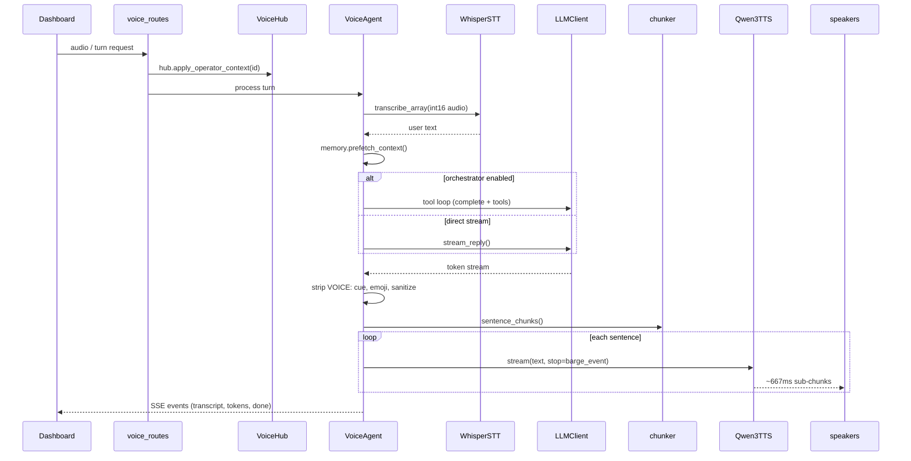

# Request & Turn Pipeline

Maya Unified handles two distinct pipeline types on the same port:

1. **HTTP/WebSocket requests** through the FastAPI gateway (auth, routing, SSE events)
2. **Voice turns** inside `VoiceAgent` (audio → text → LLM → audio)

This page explains both, because debugging "401 on API" vs "empty TTS" requires knowing which layer failed.

## HTTP request pipeline

### Middleware order

Every request passes `_auth_guard` in `apps/gateway/main.py`:

### Protected API prefixes

`_path_needs_api_auth` returns true for:

- `/api/operators/*` (except POST bootstrap in some cases)
- `/api/admin/*`
- **`/api/voice/*`** — entire voice agent surface
- `/api/rooms` GET/POST and PATCH on room ids

Open voice-adjacent routes include `/api/auth/login`, `/api/platform/auth/status`, health checks.

### Operator resolution

`_attach_operator`:

1. Reads cookie `maya_op_session`
2. Verifies HMAC signature via `services/auth/session.py`
3. Loads `Operator` row from PostgreSQL via `resolve_operator_from_token`
4. Attaches to `request.state.operator` for route handlers

Banned operators get **403** on API, redirect with `?banned=1` on HTML.

## Voice turn pipeline

Once a turn reaches `VoiceAgent` (via [[Services/Voice Hub]]), the **per-turn pipeline** is:

### Stage 1 — Capture & STT

Audio arrives as int16 PCM (browser or push-to-talk buffer). `WhisperSTT.transcribe_array`:

- Writes temp WAV
- Runs `faster_whisper` with `beam_size=1` for speed
- For **barge-in** passes, uses stricter `no_speech_threshold` / `vad_filter` — see [[Voice Runtime/STT Pipeline]]

### Stage 2 — Memory context

Before LLM call, `MemoryManager`:

- **`system_suffix()`** — stable curated memory + skills index (prompt-cache friendly)
- **`prefetch_context(user_text)`** — semantic recall from cognitive memory (if enabled)
- **`history`** — recent turns from session store (bounded by `VA_LLM_HISTORY_TURNS`)

### Stage 3 — LLM

Two paths:

| Path | When | Module |
|------|------|--------|
| **Tool loop** | `VA_LLM_ORCHESTRATOR=1` | `tools/loop.py` — native or JSON tool protocol |
| **Direct stream** | Orchestrator off | `llm.stream_reply()` — lowest latency for speech |

Streaming uses threaded producer + 90s wall timeout so a stuck LM Studio can't hang the agent forever.

### Stage 4 — Text cleanup

Before TTS, `agent.py`:

- Strips `VOICE:` delivery cue via `strip_voice_cue_stream` (when auto-instruct enabled)
- Removes emoji (Windows console + TTS safety)
- Runs `sanitize_llm_output` / `polish_spoken_reply`

### Stage 5 — TTS streaming

`chunker.sentence_chunks` splits on sentence boundaries respecting abbreviations. Each chunk feeds `Qwen3TTS.stream()` which yields **~667ms audio sub-chunks** (`VA_TTS_CHUNK_SIZE` steps) while generation continues—this overlaps LLM completion with playback for low latency.

`VA_TTS_DELIVERY` controls full vs hybrid vs per-sentence synthesis tradeoffs — [[Voice Runtime/TTS Pipeline]].

### Stage 6 — Barge-in

While TTS plays, `SharedMic` + VAD listen for user speech. On detection:

- `threading.Event` passed to `TTS.stream(stop=...)` stops decode
- Player drains queued audio
- New STT pass runs with `barge=True`

## Inference locking

STT and TTS share GPU. `services/voice/inference.INFERENCE_LOCK` serializes heavy inference to prevent CUDA OOM from concurrent Whisper + Qwen3 loads.

## Event delivery to UI

`voice_routes.py` exposes:

- **SSE** `/api/voice/agent/events` — chat transcripts, tool traces, status
- **REST** control endpoints — push-to-talk, settings, voice upload, VRM/animations

Events include `corr_id` and `message_id` from `services/ids` for tracing.

## Failure modes by layer

| Symptom | Layer to inspect |
|---------|------------------|
| Redirect to login | Gateway auth middleware |
| 401 on `/api/voice/*` | Missing/expired `maya_op_session` |
| Empty transcript | STT — check mic permissions, `VA_WHISPER_MODEL` |
| Empty reply text | LLM — reasoning effort, model id, LM Studio logs |
| Text but no audio | TTS — `NullTTS`, CUDA OOM, `VA_TTS_ENABLED=0` |
| Choppy cancel mid-sentence | Barge-in — headphones, VAD aggressiveness |

## Related

- [[Architecture/Voice Hub Bridge]]
- [[Voice Runtime/Agent Orchestrator]]
- [[Reference/HTTP API Reference]]
