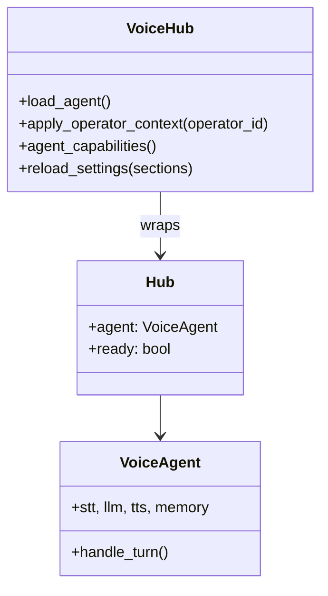

# Voice Hub Bridge

`services/voice/hub.py` implements **`VoiceHub`**—the adapter between Maya Unified's multi-operator gateway and the single-user **`server.Hub`** / **`VoiceAgent`** from `packages/voice-runtime`.

Without the hub, the voice runtime would assume one global data directory and no dashboard-driven settings. The hub is what makes Maya Unified **multi-tenant at the operator level** while keeping one GPU-resident agent instance.

## Why a hub instead of per-operator agents?

Loading Whisper + Qwen3-TTS per operator would exhaust GPU memory. The hub therefore:

- Maintains **one** `VoiceAgent` (lazy-loaded on startup)
- Switches **context** (data dir, memory scope, settings) per request via `apply_operator_context(operator_id)`
- Serializes conflicting operations with locks (`_llm_lock`, `_tts_lock`, inference lock)

## Class relationship



`VoiceHub` imports `from server import Hub`—the legacy FastAPI hub in `packages/voice-runtime/server.py`—and extends it with unified-specific behavior.

## Key responsibilities

### Per-operator data paths

`services/operator_voice/paths.operator_data_dir(operator_id)` returns an isolated subtree under `data/operators/{id}/` for:

- Operator-scoped memory and session files
- Voice settings overrides
- Uploaded reference clips (when scoped)

When an API request arrives, `voice_routes._apply_operator_scope` calls `hub.apply_operator_context(oid)` before touching the agent.

### Settings application

Dashboard changes flow:

```
Settings UI → PATCH /api/voice/settings → services/settings/store.py
  → hub.reload_settings({discord, tools, memory, runtime})
  → apply_to_config() mutates CONFIG
  → optional agent subsystem reload
```

Sections in `_RELOAD_SECTIONS = {discord, tools, memory, runtime}` trigger targeted reloads without full process restart.

### LLM provider hot-swap

When operator changes **Settings → Reasoning** provider (LM Studio, LiteLLM, WebLLM):

```python
# services/llm/provider.py
def swap_agent_llm(agent):
    agent.llm = create_llm_client()
    agent.memory.llm = agent.llm
    agent.tool_loop.llm = agent.llm  # if present
```

`create_llm_client()` reads persisted settings—not raw `.env`—so dashboard changes take effect immediately for server-side providers.

### Data migration

On startup (also in lifespan), `migrate_qwen3_data_to_unified()` copies legacy standalone voice data into unified `data/` once.

### Voice lease & rooms

The hub coordinates **who may hold the mic** when multiple operators or **room guests** participate. Room APIs under `/api/rooms/*` integrate with hub queue/release semantics—see [[Reference/HTTP API Reference]].

### Event enrichment

Chat events emitted to SSE include unified correlation ids:

```python
# services/voice/hub.py — _chat_event()
{**base, "corr_id": corr_id, "message_id": message_id, ...}
```

## Startup: `load_agent()`

Called from `lifespan` in a background thread:

1. Apply global settings to `CONFIG`
2. Construct `Hub` / `VoiceAgent` with STT, TTS, memory, tool loop
3. Set `hub.ready = True` when models initialized
4. Discord extensions start after ready (if configured)

Until `ready`, `/api/voice/agent/status` reports loading state—the dashboard should disable push-to-talk.

## Interaction with gateway routes

`apps/gateway/voice_routes.register_agent_routes(app)` is the primary consumer:

| Endpoint pattern | Hub method (typical) |
|------------------|----------------------|
| `GET /api/voice/agent/status` | `agent_capabilities()` |
| `POST /api/voice/agent/...` | turn control, PTT |
| `GET /api/voice/agent/events` | SSE subscription to hub event bus |

All routes require operator auth except where explicitly guest-scoped.

## Threading model

Voice processing runs on **worker threads** inside the agent; FastAPI endpoints must not block on full turns. The hub uses queues and callbacks to emit SSE events back to async handlers via `services/async_bridge`.

## Debugging checklist

| Issue | Check |
|-------|-------|
| Wrong personality/memory | Operator context not applied — verify login, `apply_operator_context` |
| Settings change ignored | Was section in `_RELOAD_SECTIONS`? WebLLM is browser-side only |
| Agent never ready | GPU OOM loading TTS — read startup thread stderr |
| Cross-operator bleed | Data dir collision — inspect `data/operators/` layout |

## Related

- [[Services/Voice Hub Service]]
- [[Architecture/Request Pipeline]]
- [[Apps/Unified Gateway]]
