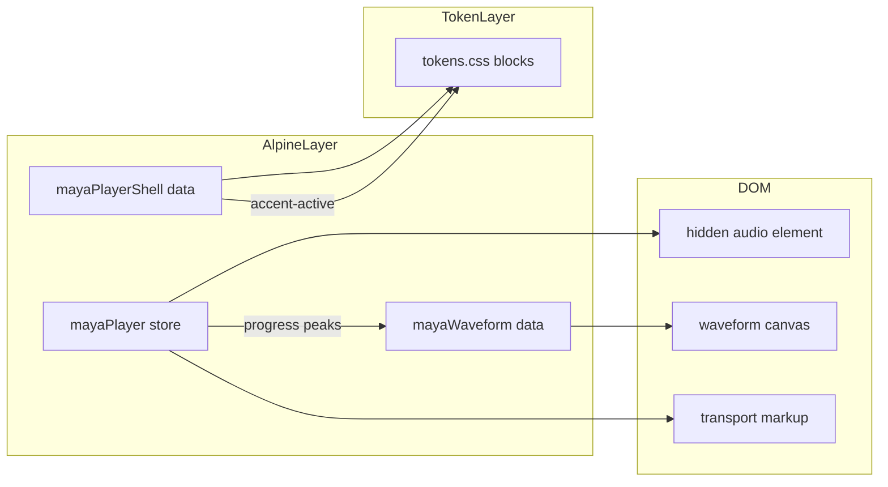

# Music Player — Alpine.js

Alpine.js patterns for the Maya mini player: global store for audio state, declarative HTML bindings, canvas waveform lifecycle, and relative color blocking via CSS custom properties. See [[Design/Music Player Interface]] for layout tokens and visual spec.

## Architecture



| Layer | Live dashboard | Reference module |
|-------|----------------|------------------|
| Global state | `Alpine.store("mayaPlayer")` in `apps/dashboard/js/mayaConversation.js` | Same store when embedded; `mayaPlayerDemo()` in Quartz demo |
| Canvas | `mayaWaveform()` canvas seek | Same component in `mayaWaveform.js` |
| Volume | `mayaVolumeControl()` vertical mixer fader | Same component; binds store or demo root |
| Tokens | `preset-maya` + `--mv-*` dashboard vars | `preset-compact` in Quartz demo |

## Live demo

Try the embedded player — waveform seek, queue, volume, and per-track accent colors with synthetic audio:

<iframe class="player-demo-embed" src="../static/player-demo/index.html" title="Music player interactive demo" loading="lazy"></iframe>

Built from `mayaWaveform.js`, `demo.js`, and `tokens.css` in `quartz/static/player-demo/`.

---

## Alpine conventions in Maya dashboard

Dashboard JS files share these patterns:

- **Register on init** — `document.addEventListener("alpine:init", () => { … })`. Never call `Alpine.store` before this event.
- **`Alpine.store`** — cross-page global state (`mayaPlayer`, `mayaShell`, `mayaTheme`, `mayaConversation`).
- **`Alpine.data`** — scoped components with `$refs`, `$nextTick`, and optional `destroy()` (`mayaEqViz`, `mayaWaveform`, `mayaThemePicker`).
- **`$store.mayaPlayer`** in markup — avoids prop drilling through nested components.
- **`x-cloak`** + **`x-show`** — hide player until Alpine hydrates and `active` is true.
- **`template x-for`** — queue rows; **`template x-if`** — conditional album art vs placeholder glyph.

Script load order on conversation page: vendor Alpine → feature modules → `mayaConversation.js` (registers stores).

---

## `mayaPlayer` store API

Defined in `apps/dashboard/js/mayaConversation.js` (approx. lines 1667–1906).

### State

| Property | Type | Description |
|----------|------|-------------|
| `active` | boolean | Player visible and holding a playlist |
| `playing` | boolean | Audio element is playing |
| `buffering` | boolean | Waiting for data (`waiting` event) |
| `current` | number | Index into `tracks` |
| `tracks` | array | Normalized track objects |
| `currentTime` | number | Seconds elapsed |
| `duration` | number | Track length in seconds |
| `volume` | number | 0–1 |
| `muted` | boolean | Mute flag |
| `queueOpen` | boolean | Queue panel expanded |
| `error` | string | User-facing playback error |
| `title` | string | Playlist title |
| `url` | string | Optional playlist source URL |

### Getters

| Getter | Returns |
|--------|---------|
| `currentSrc` | Stream URL for active track (`/api/media/stream?q=…` or `src`) |
| `currentTrack` | `tracks[current]` |
| `currentArt` | `currentTrack.art` or empty |
| `subtitle` | Artist name, playlist title fallback, or `Track N of M` |
| `progress` | `currentTime / duration` (0 when duration unknown) |
| `volumeDisplay` | Integer 0–100 for UI (respects mute) |
| `volumePct` | CSS string e.g. `"80%"` for legacy range fill |

### Methods

| Method | Purpose |
|--------|---------|
| `load(artifact, { autoplay })` | Activate player from playlist artifact |
| `play(i)` | Switch track index and start playback |
| `toggle()` | Play/pause |
| `next()` / `prev()` | Track navigation |
| `pause()` / `resume()` | Direct audio control |
| `seekTo(fraction)` | Seek to 0–1 position |
| `setVolume(v)` / `setVolumePercent(p)` / `toggleMute()` | Volume control (0–1 or 0–100) |
| `toggleQueue()` / `clear()` | Queue UI and reset |
| `control(action, index)` | External API: `pause`, `resume`, `skip`, `previous`, `play`, `clear` |
| `fmtTime(sec)` | `M:SS` formatting |

### Audio element callbacks

Wire these on `<audio id="maya-player-audio">`:

| Event | Store method |
|-------|--------------|
| `@play` | `onPlay()` |
| `@pause` | `onPause()` |
| `@timeupdate` | `onTime()` |
| `@loadedmetadata` / `@durationchange` | `onMeta()` |
| `@waiting` | `onWaiting()` |
| `@playing` | `onPlaying()` |
| `@volumechange` | `onVolume()` |
| `@ended` | `next()` |
| `@error` | `onError()` |

---

## HTML binding patterns

From `apps/dashboard/conversation.html` (sticky player block).

### Visibility and audio bridge

```html
<div class="md-player-sticky" x-show="$store.mayaPlayer.active" x-cloak>
  <audio
    id="maya-player-audio"
    preload="none"
    :src="$store.mayaPlayer.currentSrc"
    @timeupdate="$store.mayaPlayer.onTime()"
    @ended="$store.mayaPlayer.next()"
  ></audio>
</div>
```

The audio element is hidden via `.md-player-audio-engine { display: none }`. The store syncs `src` in `_syncAudioElement()` on `play()`.

### Seek via range input

Integer precision avoids floating-point drift on `<input type="range">`:

```html
<input
  type="range"
  min="0"
  max="1000"
  step="1"
  :value="$store.mayaPlayer.progress * 1000"
  @input="$store.mayaPlayer.seekTo($event.target.value / 1000)"
/>
```

### Transport and queue

```html
<button
  @click="$store.mayaPlayer.prev()"
  :disabled="$store.mayaPlayer.current <= 0"
>⏮</button>

<button
  class="md-player-queue-toggle"
  :class="$store.mayaPlayer.queueOpen ? 'is-open' : ''"
  @click="$store.mayaPlayer.toggleQueue()"
></button>

<template x-for="(tr, i) in ($store.mayaPlayer.tracks || [])" :key="i">
  <li
    :class="$store.mayaPlayer.current === i ? 'md-playlist-track-active' : ''"
    @click="$store.mayaPlayer.play(i)"
  ></li>
</template>
```

Active queue styling uses dashboard `--mv-accent` via `color-mix` in CSS — parallel to `--block-accent-soft` in the token system.

---

## Persistence and hydration

Per-operator localStorage key: `maya.player.v2.{userId}`.

**Persisted fields:** `title`, `url`, `tracks`, `current`, `volume`, `muted`.

**Flow:**

1. `mayaConversation.ensureHydrated()` calls `_restorePlayerStore(player)`.
2. Track list normalized via `_normalizePlayerTrack()` — ensures `query`, `src`, `title`, optional `art`/`artist`.
3. Mutations call `_persistPlayerStore()`; cleared when `active` is false or tracks empty.

Legacy v1 keys in `sessionStorage` are migrated on read.

---

## Agent integration

### Playlist artifacts

When the agent returns artifacts with `type: "playlist"`, `_routePlaylistArtifacts()` calls `player.load(lastPlaylist)` and strips playlist objects from chat turn display.

### SSE control events

| Event | Handler |
|-------|---------|
| `player.load` + `playlist` | `player.load(ev.playlist)` |
| `player.control` | `player.control(ev.action, ev.index)` |

### Album art lazy fetch

`_ensureArt(i)` requests `/api/media/meta?q=…` and patches `tracks[i].art` and `artist` when missing.

---

## Relative color blocking in Alpine

Import `design-reference/music-player/tokens.css`. Apply preset class and **one** dynamic style binding on the player root:

```html
<div
  class="player-root preset-compact player-shell"
  x-data="mayaPlayerShell()"
  :style="{ '--accent-active': accentColor }"
>
```

### `mayaPlayerShell` accent resolution

1. `$store.mayaPlayer.currentTrack?.color` when live store has per-track metadata
2. `currentTrack.color` from mock catalog in standalone demo
3. Fallback `#00d4a0`

### Presets

| Class | Use |
|-------|-----|
| `preset-compact` | Figma-style purple-tinted surfaces |
| `preset-hero` | AI Studio achromatic layout |
| `preset-maya` | **Live dashboard default** — bridge to `--mv-*` dashboard tokens |
| `preset-compact` | Quartz demo default |

### Volume slider without inline gradients

Bind CSS variable instead of template string hex:

```html
<input
  type="range"
  class="player-volume-track"
  :style="{ '--volume-pct': volumePct }"
  @input="setVolume($event.target.value)"
/>
```

All other colors come from derived `--block-*` tokens — components never use `` `${color}55` `` alpha suffixes.

---

## Mixer volume — `mayaVolumeControl`

Defined in `apps/dashboard/js/mayaWaveform.js` (ported to `quartz/static/player-demo/mayaWaveform.js`).

### Markup

```html
<div class="mp-volume-vertical" x-data="mayaVolumeControl()">
  <div class="player-volume-groove player-volume-groove--vertical">
    <div class="player-volume-groove-track"></div>
    <div class="player-volume-fill" :style="{ height: volume + '%' }"></div>
    <input type="range" class="player-volume-mixer player-volume-mixer--vertical"
      min="0" max="100" :value="volume" @input="setVolumePercent($event.target.value)" />
  </div>
  <!-- speaker SVG + click-to-edit % input -->
</div>
```

### API

| Property / method | Purpose |
|-------------------|---------|
| `volume` (getter) | 0–100 integer from store or parent demo |
| `isMuted` | True when muted or volume is zero |
| `isEditing` | Toggles between `%` label and number input |
| `setVolumePercent(p)` | Clamps 0–100, calls store `setVolumePercent` or `setVolume(p/100)` |
| `toggleMute()` | Delegates to store / demo root |
| `startEditing()` | Shows input; `$nextTick` → focus + select |
| `finishEditing()` | Hides input on blur or Enter |

Data source resolution: `Alpine.store("mayaPlayer")` when active, else `$root` demo/shell with `setVolume`.

---

## Canvas waveform — `mayaWaveform`

Reference: `design-reference/music-player/mayaWaveform.js`.

### Markup

```html
<div
  class="player-waveform-wrap"
  @mouseleave="hoverProgress = null"
  x-data="mayaWaveform()"
  x-init="init()"
  @destroy="destroy()"
>
  <canvas
    x-ref="canvas"
    class="player-waveform-canvas"
    @click="onClick($event)"
    @mousemove="onMouseMove($event)"
  ></canvas>
</div>
```

Nest inside `.player-root` so `getComputedStyle` resolves `--block-accent`, `--block-accent-hover`, `--block-muted-bg`, `--player-fg`.

### Lifecycle

| Phase | Action |
|-------|--------|
| `init()` | `$nextTick` → attach `ResizeObserver` on canvas → `draw()` → `$watch('progress')` |
| `destroy()` | Disconnect observer, unwatch |
| `draw()` | DPR-scaled bar render; colors from computed CSS vars |
| `onClick` | `$dispatch('waveform-seek', { fraction })` + `mayaPlayer.seekTo()` |
| `onMouseMove` | Updates `hoverProgress` for preview tint |

### Data sources

Priority for `peaks` and `progress`:

1. `Alpine.store("mayaPlayer")` when embedded in dashboard (extend track model with `peaks[]` for full spec)
2. Parent `mayaPlayerShell()` mock state in standalone demo
3. Built-in `MOCK_TRACKS` fallback

### Mini queue waveform

`window.mayaWaveformUtils.drawMini(container, peaks, active, tokenRoot)` renders bar previews into a flex container — use in queue rows with `x-init="$nextTick(() => drawQueueMini($refs.mini, tr, i))"`.

### Comparison with `mayaEqViz`

| | `mayaEqViz` | `mayaWaveform` |
|---|-------------|----------------|
| Canvas logic | External `EqVisualizer` class | Inline `draw()` loop |
| Data source | Agent spectrum API / browser audio | Store progress + peaks array |
| Colors | EqVisualizer internal palette | CSS `--block-*` tokens |
| Polling | 60ms interval when speaking | `$watch` on progress + ResizeObserver |

---

## Gap analysis

| Feature | Live dashboard | Design spec | Reference module |
|---------|---------------|-------------|------------------|
| Seek UI | Canvas waveform | Canvas waveform | Canvas |
| Accent color | Per-track `--accent-active` | Per-track `--accent-active` | Dynamic via inline style |
| Layout | Compact strip + hero (container) | Compact + Hero | `preset-maya` / `preset-compact` |
| Shuffle / repeat | Implemented | Yes | Demo toggles |
| BPM / key badges | LCD + queue when metadata present | Yes | Mock track metadata |
| Peaks on tracks | Client-generated when missing | Required | `generatePeaks()` helper |
| Volume UX | Mixer fader + precision input | Groove + fader + `%` edit | `mayaVolumeControl()` |

---

## Standalone demo load order

For local development outside Quartz, serve `quartz/static/player-demo/` and open `index.html`:

```html
<link rel="stylesheet" href="tokens.css" />
<link rel="stylesheet" href="demo.css" />
<script defer src="https://cdn.jsdelivr.net/npm/alpinejs@3/dist/cdn.min.js"></script>
<script defer src="mayaWaveform.js"></script>
<script defer src="demo.js"></script>
```

The Quartz docs embed the same demo via iframe (`../static/player-demo/index.html`). Audio is synthetic sine tones bundled under `audio/` — no copyrighted material.

`mayaPlayerShell` in the reference module still supports mock timer playback when no `<audio>` element is present.

---

## Source references

| File | Role |
|------|------|
| `apps/dashboard/js/mayaConversation.js` | `mayaPlayer` store, persistence, SSE routing |
| `apps/dashboard/conversation.html` | Hardware player markup and audio bindings |
| `apps/dashboard/css/maya-player-tokens.css` | Token presets including `preset-hardware` |
| `apps/dashboard/css/maya-player.css` | Hardware layout styles |
| `apps/dashboard/css/maya-dashboard.css` | `.md-player-sticky` placement |
| `apps/dashboard/js/mayaWaveform.js` | `mayaWaveform()` + `mayaVolumeControl()` |
| `design-reference/music-player/tokens.css` | Relative color blocking tokens |
| `quartz/static/player-demo/` | Embeddable interactive demo with real audio |
| [[Design/Music Player Interface]] | Visual design spec |
