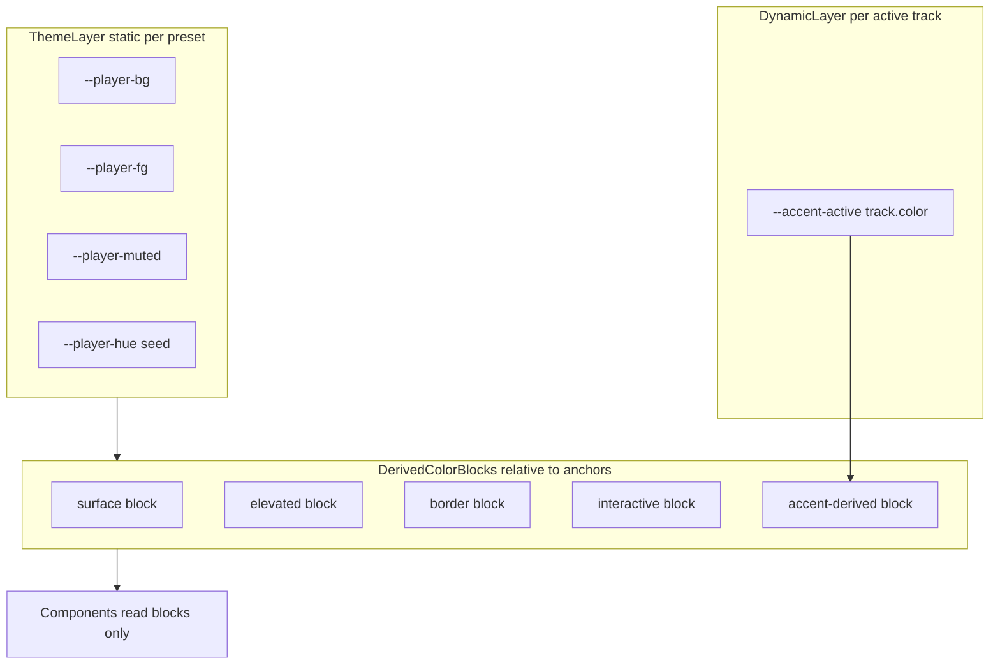
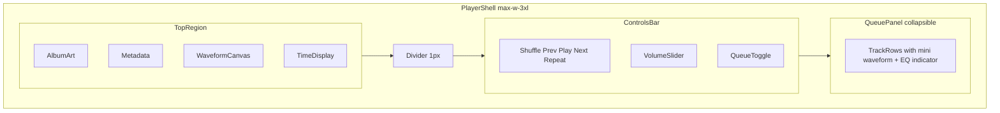

# Music Player Interface

Design reference for a compact **mini player** web component: waveform seek bar, transport controls, vertical mixer volume, and collapsible queue. The live dashboard uses **`preset-maya`** (bridges dashboard `--mv-*` tokens). A **relative color blocking** token system lets themes swap by changing anchors and track accents propagate without per-component hex edits.

## Overview

| | Compact Strip | Hero Art |
|---|---------------|----------|
| **Source** | Figma Make export | Google AI Studio export |
| **Reference path** | `design-reference/project-2/` | `design-reference/music-player-aistudio/` |
| **Layout** | Single horizontal row (88px art + metadata + waveform + time) | Left hero art column + stacked metadata/waveform |
| **Stack** | React, Tailwind 4, shadcn tokens, Lucide icons | React, Tailwind 4, inline hex, Lucide icons |
| **Live default** | Quartz demo (`preset-compact`) | Container-responsive via `player-layout-auto` |

The live dashboard implements the **Compact Strip** layout with **`preset-maya`**, inline Heroicons-style SVG transport controls, a vertical mixer fader (`mayaVolumeControl`), and a list-music icon for the queue toggle.

Both variants share the same mock catalog (Current Value — *Holodeck*), canvas waveform algorithm, per-track accent colors, and transport icon set. Typography: **Inter** for titles and artist names; **JetBrains Mono** for time, BPM, key, and section labels.

## Live demo

Interactive mini player with canvas waveform, transport controls, and synthetic demo audio (no network required):

<iframe class="player-demo-embed" src="../static/player-demo/index.html" title="Music player interactive demo" loading="lazy"></iframe>

Source: `quartz/static/player-demo/` — Alpine.js, color-blocking tokens, and bundled WAV tones.

## Relative color theory blocking

Both reference implementations hardcode hex values inline (`#11111c`, `${color}55`, `#00FFC2`). The target architecture uses **anchor tokens** and **derived color blocks** so:

- **Custom themes** swap by overriding six anchors on a preset class
- **Dynamic styles** update by setting one runtime variable (`--accent-active`) when the active track changes
- **Components** read semantic block tokens only — never raw track hex or manual alpha suffixes

Portable reference CSS: `design-reference/music-player/tokens.css`

### Two-layer model



**Theme layer** — set once per preset (`preset-compact`, `preset-hero`, `preset-maya`).

**Dynamic layer** — set on `.player-root` when track changes:

```css
.player-root {
  --accent-active: #00d4a0; /* track.color */
}
```

### Anchor tokens

| Token | Role | Compact default | Hero default |
|-------|------|-----------------|--------------|
| `--player-bg` | Page/shell base | `oklch(0.12 0.02 280)` | `oklch(0.08 0 0)` |
| `--player-fg` | Primary text | `oklch(0.91 0.02 280)` | `oklch(0.88 0 0)` |
| `--player-muted` | Secondary text | `oklch(0.55 0.04 280)` | `oklch(0.45 0 0)` |
| `--player-hue` | Neutral surface tint seed | `280` | `0` |
| `--player-chroma` | Surface saturation bias | `0.02` | `0` |
| `--accent-active` | Dynamic per-track accent | *(runtime)* | *(runtime)* |

### Derived color blocks

Each block is a semantic role derived via relative OKLCH or `color-mix`:

```css
/* Surface block */
--block-surface-0: var(--player-bg);
--block-surface-1: oklch(from var(--player-bg) calc(l + 0.02) c h);
--block-surface-2: oklch(from var(--player-bg) calc(l + 0.04) c h);

/* Border block */
--block-border-subtle: color-mix(in oklch, var(--player-fg) 6%, transparent);
--block-border-strong: color-mix(in oklch, var(--player-fg) 12%, transparent);

/* Muted block */
--block-muted-fg: var(--player-muted);
--block-muted-bg: color-mix(in oklch, var(--player-fg) 4%, var(--player-bg));

/* Accent block */
--block-accent: var(--accent-active);
--block-accent-fg: oklch(from var(--accent-active) 0.15 c h);
--block-accent-soft: color-mix(in oklch, var(--accent-active) 12%, transparent);
--block-accent-hover: color-mix(in oklch, var(--accent-active) 33%, transparent);
--block-accent-glow: color-mix(in oklch, var(--accent-active) 33%, transparent);
--block-accent-border: color-mix(in oklch, var(--accent-active) 27%, transparent);

/* Interactive block */
--block-interactive-idle: var(--player-muted);
--block-interactive-hover: oklch(from var(--accent-active) 0.85 c h);
```

### Reference hex → block mapping

| Reference value | Block token | Notes |
|-----------------|-------------|-------|
| `#11111c` / `#080808` shell | `--block-surface-1` | Theme anchor offset, not literal hex |
| `#0a0a0a` / `#0d0d1a` panels | `--block-surface-2` | Elevated surface |
| `#2a2a42` / `#1a1a1a` waveform idle | `--block-muted-bg` | Compact has purple-gray chroma from `--player-hue` |
| `rgba(255,255,255,0.06)` dividers | `--block-border-subtle` | Relative to `--player-fg` |
| `${color}55` hover waveform | `--block-accent-hover` | Replaces manual alpha suffix |
| `${color}12` queue selection | `--block-accent-soft` | |
| `#00FFC2` transport hover (AI Studio) | `--block-interactive-hover` | Derive from accent, not fixed teal |
| `#e2e2f0` slider thumb | `--player-fg` | |

### Theme presets

Named presets override anchors only — blocks auto-derive:

**`preset-compact`** — Figma Make variant. Higher chroma seed (hue 280), tighter surfaces. Default `--accent-active: #00d4a0`. Optional `.shadcn-bridge` maps shadcn `--primary`, `--background`, `--foreground`, `--muted-foreground`.

**`preset-hero`** — AI Studio variant. Achromatic anchors, flat page background, larger surface offsets.

**`preset-maya`** — Bridge to Maya dashboard theme (**live dashboard default**):

```css
--player-bg: var(--mv-bg);
--player-fg: var(--mv-text);
--player-muted: var(--mv-muted);
--accent-active: var(--mv-accent);
--block-groove-bg: color-mix(in oklch, var(--player-fg) 8%, var(--player-bg));
```

### Runtime dynamic styles

When the active track changes, update only `--accent-active` on the player root. Canvas waveform drawing should read computed block values via `getComputedStyle(el).getPropertyValue('--block-accent')` — not string-concat hex alpha like `` `${color}55` ``.

## Shared non-color tokens

### Per-track accent catalog

Default accent seeds assigned per track in mock data:

| Track | Accent |
|-------|--------|
| Denominator | `#00d4a0` |
| Second Horizon | `#7b6fff` |
| Turbulance | `#ff6b35` |
| Immediacy | `#e040fb` |
| Holodeck | `#00b4e6` |
| Effusion | `#ffcc00` |

### Track data model

```typescript
interface Track {
  id: number;
  title: string;
  artist: string;
  album: string;
  bpm: number;
  key: string;
  genre: string;
  duration: number;      // seconds
  peaks: number[];       // 200 normalized bar heights
  color: string;         // maps to --accent-active
  releaseYear?: number;  // Hero variant only
}
```

### Typography

| Role | Font | Treatment |
|------|------|-----------|
| Titles, artist | Inter 400–700 | truncate, tracking-tight in Hero |
| Time, BPM, key, queue labels | JetBrains Mono | `tabular-nums`, `uppercase`, `tracking-widest` for section labels |
| Base size | 14px | Compact; Hero uses up to `text-3xl` for title |

## Layout variants

| Element | Compact Strip | Hero Art |
|---------|---------------|----------|
| Shell bg | `--block-surface-1` + page gradient | `--block-surface-0` flat |
| Border | `--block-border-subtle` | `--block-border-strong` |
| Corner radius | `rounded-sm` (~2px) | None (sharp) |
| Album art | 88×88, brightness filter + right fade | 192–224px, grayscale → color on hover |
| Metadata | Narrow column + badge chips | Headline line + pipe-separated mono row |
| Title scale | `text-sm` semibold | `text-3xl` bold |
| Time display | Stacked current / remaining | Inline current (accent) / duration |
| Waveform panel | Inline in top row | Bordered sub-panel on `--block-surface-2` |
| Play button | 36px square, `rounded-sm` | 48px circle, `rounded-full` |
| Transport | Inline Heroicons SVGs | Same icon set |
| Volume | Vertical mixer fader + speaker + `%` edit | Same |
| Queue toggle | List-music SVG icon | Same |
| Controls padding | `px-4 py-2.5` | `px-8 py-5` |

### Layout anatomy



**Compact** places art, metadata, waveform, and time in one horizontal row.

**Hero** uses album art as a left column with metadata and waveform stacked in the right column.

## Component specs

### Waveform canvas

- 200 bars, 18% gap between bars, 88% of canvas height
- **Played region:** `--block-accent`
- **Unplayed:** `--block-muted-bg`
- **Hover preview:** `--block-accent-hover`
- **Playhead:** 2px needle in `--player-fg`
- Click-to-seek; `ResizeObserver` redraw on resize
- DPR-aware canvas scaling

### Hover time tooltip

- 10px mono chip on `--block-surface-2`
- Border: `--block-border-strong`
- Horizontal position clamped to avoid edge clipping

### Transport controls

| Control | Size | Idle | Active / hover |
|---------|------|------|----------------|
| Shuffle / Repeat | 18px inline SVG | `--block-interactive-idle` | `--block-accent` when toggled |
| Prev / Next | 18px inline SVG | `--block-interactive-idle` | `--block-interactive-hover` |
| Play / Pause | 36–48px | filled `--block-accent`, icon `--block-accent-fg` | glow `--block-accent-glow` when playing |

Icons use Heroicons outline paths (24 viewBox, `stroke-width="1.5"`), matching other dashboard controls.

Prev behavior: restart track if elapsed > 3s, else go to previous track.

### Volume slider — `mayaVolumeControl`

Vertical mixer fader in the controls bar:

- Inset groove track (`.player-volume-groove--vertical`) using `--block-groove-bg`
- Accent fill bar grows bottom-to-top via `height: N%`
- Native range input with metallic vertical thumb (16×36px) styled via `--block-*` tokens
- Speaker SVG below fader: mute X at 0, one wave below 50%, two waves above 50%
- Click `%` label to reveal number input; `$nextTick` auto-focus and select (0–100)
- Speaker icon click toggles mute

### Queue toggle

- List-music inline SVG icon (no text label)
- Inactive: `--block-interactive-idle`, transparent bg, `--block-border-subtle` border
- Active: `--block-accent` text, `--block-accent-soft` bg, `--block-accent-border` border

### Queue panel

- Header: "Up Next — N tracks", uppercase mono, `--block-muted-fg`
- Max height 224–256px, thin scrollbar tinted `--block-muted-bg`
- **Row active:** left border `--block-accent`, bg `--block-accent-soft`
- **Row hover:** subtle `--block-surface-2` or `color-mix` overlay
- **Mini waveform:** 28–32px wide bar preview; active track uses `--block-accent`, inactive `--block-muted-bg`
- **Playing indicator:** 4 animated EQ bars in `--block-accent` (`scaleY` keyframes, staggered timing)

## Interaction patterns

| Action | Behavior |
|--------|----------|
| Click waveform | Seek to position |
| Click prev | Restart if > 3s elapsed, else previous track |
| Click next | Next track (respects shuffle) |
| Toggle shuffle / repeat | Accent-on-active via `--block-accent` |
| Toggle queue | Expand/collapse panel |
| Click queue row | Select track, reset time, start playback |
| Simulated playback | 250ms interval, 0.25s tick increment |

## Figma shadcn bridge

The Compact variant ships with shadcn tokens in `design-reference/project-2/src/styles/theme.css`:

| shadcn token | Player anchor |
|--------------|---------------|
| `--background` | `--player-bg` |
| `--foreground` | `--player-fg` |
| `--muted-foreground` | `--player-muted` |
| `--primary` | default `--accent-active` fallback |
| `--card` | `--block-surface-1` |

shadcn chart OKLCH tokens (`--chart-1` … `--chart-5`) are unrelated to player blocks.

## Quartz site cross-reference

Maya Quartz uses a parallel palette in `quartz.config.yaml` and `quartz/styles/custom.scss`:

| Quartz token | Player bridge (`preset-maya`) |
|--------------|-------------------------------|
| `--light` | `--player-bg` |
| `--darkgray` | `--player-fg` |
| `--gray` | `--player-muted` |
| `--secondary` | `--accent-active` |
| `--tertiary` | `--block-interactive-hover` |

Patterns callable for docs UI using the same blocking model:

- Mono uppercase section labels (`tracking-widest`) for sidebar group headers
- Left-border active nav via `--block-accent`
- Glass-chip badges via `--block-accent-soft`
- Dividers via `--block-border-subtle` instead of solid `--lightgray`

Both Quartz docs and the player widget can share a single accent swap without duplicating hex values.

## Source references

| Archive | Extracted path |
|---------|----------------|
| `Downloads/project(2).zip` | `design-reference/project-2/` |
| `Downloads/zip(1).zip` | `design-reference/music-player-aistudio/` |
| Token reference | `design-reference/music-player/tokens.css` |
| Interactive demo | `quartz/static/player-demo/` (embedded via iframe above) |

Key implementation files:

- `design-reference/project-2/src/app/App.tsx` — Compact Strip player
- `design-reference/project-2/src/styles/theme.css` — shadcn token overrides
- `design-reference/music-player-aistudio/src/App.tsx` — Hero Art player
- `design-reference/music-player-aistudio/src/index.css` — fonts and base colors

## Alpine.js implementation

See [[Design/Music Player Alpine]] for store patterns, HTML bindings, canvas lifecycle, and the portable reference module (`design-reference/music-player/mayaWaveform.js`).
