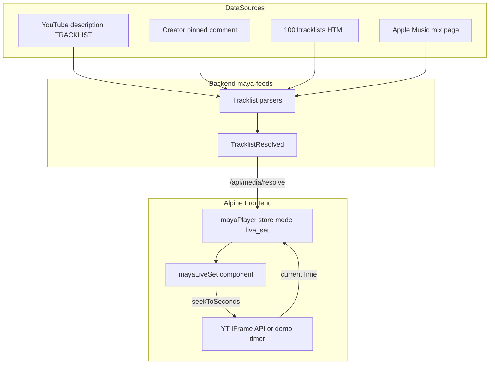
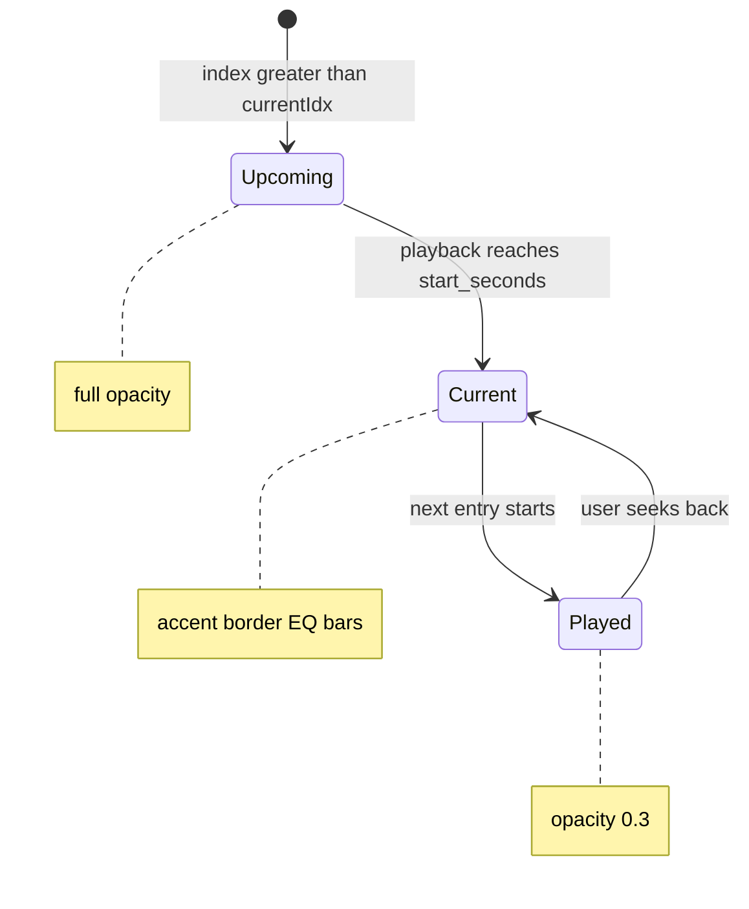

# Music Player — Live Set Mode

Third player mode for Maya: a **live set viewer** that pairs a YouTube recording with a timestamped tracklist. Inspired by [1001tracklists](https://www.1001tracklists.com/) (video + setlist association) and Apple Music live sets (dim played tracks, highlight current, click-to-jump).

See [[Design/Music Player Interface]] for shared color-blocking tokens and [[Design/Music Player Alpine]] for base `mayaPlayer` store patterns.

## Live demo

Interactive viewer with bundled USB002 tracklist — demo mode simulates playback when YouTube API is unavailable:

<iframe class="live-set-demo-embed" src="../static/live-set-demo/index.html" title="Live set viewer demo" loading="lazy"></iframe>

Built from `mayaLiveSet.js` and `live-set-demo/` in `quartz/static/`. React reference: `design-reference/live-set-viewer/`.

---

## Overview

| | Mini Player (queue) | Live Set Viewer |
|---|---------------------|-----------------|
| **Transport** | Hidden `<audio>` per track | Single YouTube embed (container) |
| **Tracklist** | Queue panel — discrete tracks | Timestamped entries in one continuous set |
| **Time sync** | `@timeupdate` on audio element | YT IFrame API poll (500ms) |
| **Seek** | `seekTo(fraction)` on current track | `seekToSeconds(start_seconds)` on video |
| **Row states** | Active queue row | Played (dim) / current (accent) / narrative |
| **Reference** | `design-reference/project-2/` | `design-reference/live-set-viewer/` |

Test set: [Fred again.. & Thomas Bangalter — USB002](https://www.youtube.com/watch?v=gfF8jzBVWvM) (`gfF8jzBVWvM`).

---

## Architecture



---

## Layout anatomy

```
┌─────────────────────────────────────────────────────────────┐
│ Header: set ID · artists · venue · date · track count       │
├──────────────────────────────┬──────────────────────────────┤
│ 58% Video column             │ 42% Tracklist column         │
│  - YT embed 16:9             │  - # / Track / Time headers  │
│  - Now Playing bar + EQ      │  - scrollable rows           │
│  - Set progress + milestones │  - auto-scroll to current    │
└──────────────────────────────┴──────────────────────────────┘
```

On narrow viewports the layout stacks: video column on top (~45vh), tracklist below.

### Color tokens

Reuse `design-reference/music-player/tokens.css`. Apply `preset-compact` or `preset-maya` on `.player-root` and bind `--accent-active` at runtime:

| Mockup hex | Block token |
|------------|-------------|
| `#0b0b10` shell | `--block-surface-0` |
| `#00d4a0` accent | `--accent-active` |
| `#9090b8` track title | `--block-muted-fg` (tinted) |
| `rgba(0,212,160,0.05)` current row | `--block-accent-soft` |

---

## Entry data model

UI contract aligned with backend `TracklistEntry` in `maya_feeds/tracklist/protocol.py`:

| Field | Type | UI behavior |
|-------|------|-------------|
| `position` | int | Track number (skip for `attrs.is_narrative`) |
| `start_seconds` | int | Seek target; current-index lookup |
| `end_seconds` | int? | Optional segment end |
| `label` | string | Primary display title |
| `artist` / `title` | string? | Split display when present |
| `timestamp` | string | Mono column (`3:16`, `1:01:00`) |
| `attrs.footnote` | string? | Expandable inline note |
| `attrs.is_narrative` | bool | ✦ marker, italic, no seek on click |
| `attrs.linked_1001tl` | ref? | Future cross-link badge |

### LiveSet artifact

```json
{
  "mode": "live_set",
  "set_id": "USB002",
  "title": "Fred again.. & Thomas Bangalter",
  "venue": "Alexandra Palace, London",
  "date": "27 Feb 2026",
  "video_id": "gfF8jzBVWvM",
  "container_url": "https://www.youtube.com/watch?v=gfF8jzBVWvM",
  "duration_seconds": 6918,
  "entries": [],
  "linked_sets": [
    { "schema_id": "1001tl", "external_id": "2gu8q2xk", "url": "..." },
    { "schema_id": "apple_music", "external_id": "1890298647", "url": "..." }
  ]
}
```

---

## Interaction spec

Ported from `design-reference/live-set-viewer/src/app/App.tsx`:

| Action | Behavior |
|--------|----------|
| Time poll | 500ms interval on YT `getCurrentTime()` |
| Current index | Last entry where `currentTime >= start_seconds` |
| Played | `index < currentIdx` → opacity 0.3 |
| Current | Left border `--block-accent`, soft bg, EQ bars replace track # |
| Click track row | `seekToSeconds(start_seconds)` + `playVideo()` |
| Click footnote icon | Toggle inline expansion (`stopPropagation`) |
| Auto-scroll | `scrollIntoView({ block: 'center' })` when current row leaves viewport |
| Demo fallback | After 4s without YT API, simulate time at 250ms / +4s steps |

### Tracklist row states



**Narrative rows** (`attrs.is_narrative`): ✦ marker instead of track number, italic muted text, click does not seek.

**Footnotes**: message icon on rows with `attrs.footnote`; expands inline below title with left border accent.

---

## `mayaPlayer` store extension

Documented API for dashboard integration (`apps/dashboard/js/mayaConversation.js`). Not yet wired in production — reference implementation in `mayaLiveSet.js`.

### New state

| Property | Type | Description |
|----------|------|-------------|
| `mode` | `'queue' \| 'live_set'` | Player layout discriminator (default `'queue'`) |
| `liveSet` | object \| null | LiveSet artifact when `mode === 'live_set'` |
| `expandedFootnote` | number \| null | Entry index with open footnote |
| `demoMode` | boolean | YT API unavailable — simulated time |

### New getters / methods

| API | Purpose |
|-----|---------|
| `currentSetEntry` | Entry at `liveSetCurrentIdx` |
| `liveSetCurrentIdx` | Derived from `currentTime` + `liveSet.entries` |
| `liveSetProgress` | `currentTime / duration_seconds` |
| `loadLiveSet(artifact)` | Set `mode='live_set'`, bind video and entries |
| `seekToSeconds(sec)` | YT `seekTo` or audio `currentTime` |
| `toggleFootnote(i)` | Expand/collapse footnote |
| `fmtSetTime(sec)` | `H:MM:SS` when hours > 0 |

### Transport duality

| Mode | Time source | Seek target |
|------|-------------|-------------|
| `queue` | Hidden `<audio>` `@timeupdate` | `seekTo(fraction)` on active track |
| `live_set` | YT IFrame API poll (or demo timer) | `seekToSeconds(start_seconds)` on container |

In production dashboard: bind `mayaLiveSet` `currentTime` from `$store.mayaPlayer.currentTime` once unified; replace YT.Player block with store signal.

---

## Alpine reference module

`design-reference/music-player/mayaLiveSet.js`

### Load order

```html
<link rel="stylesheet" href="tokens.css" />
<link rel="stylesheet" href="live-set-demo.css" />
<script defer src="https://www.youtube.com/iframe_api"></script>
<script defer src="mayaLiveSet.js"></script>
<script defer src="https://cdn.jsdelivr.net/npm/alpinejs@3/dist/cdn.min.js"></script>
```

### Markup

```html
<div
  class="player-root preset-compact live-set-root"
  x-data="mayaLiveSet()"
  x-init="init()"
  @destroy="destroy()"
  :style="{ '--accent-active': accentColor }"
>
  <div id="yt-player"></div>
  <div class="live-set-tracklist" x-ref="tracklist">
    <template x-for="(track, i) in entries" :key="track.id">
      <div :data-track-idx="i" @click="onRowClick(track, i)">…</div>
    </template>
  </div>
</div>
```

### Utilities (`window.mayaLiveSetUtils`)

| Function | Purpose |
|----------|---------|
| `parseTime(s)` | `M:SS` or `H:MM:SS` → seconds |
| `fmtSetTime(sec)` | Seconds → display timestamp |
| `currentEntryIndex(entries, t)` | Active entry index |
| `buildTrackNumbers(entries)` | Skip narrative rows in numbering |
| `normalizeEntry(raw, i)` | UI ↔ API shape bridge |

### Bundled fixture

`window.FRED_USB002_SET` — 31 entries from creator comment tracklist (golden data for demo and tests).

---

## Parser and API path

### Resolve flow

1. User pastes URL in ingest → `resolveIngestUrl()` → `POST /api/media/resolve`
2. [`url_handler.py`](../../../services/music/url_handler.py) detects platform via `classify_tracklist_url`
3. Parser returns `TracklistResolved` → `tracklist_to_resolved_set()` in [`set_bridge.py`](../../../services/music/set_bridge.py)
4. Gateway returns artifact with `presentation: "set"` → `mayaPlayer._loadSetPresentation()`

### Supported platforms

| Platform | Parser | Schema ID |
|----------|--------|-----------|
| YouTube | `parse_youtube_set_from_info` | `yt` |
| 1001tracklists | `parse_1001tracklists_html` | `1001tl` |
| Apple Music | Apple mix parser | `apple_music` |

### Parser gap (Fred USB002)

Current [`parse_tracklist_lines`](../../../packages/maya-feeds/src/maya_feeds/youtube_setlist.py) handles `TRACKLIST:` blocks in video descriptions (`MM:SS label`).

- Fred description fixture yields **3 entries** only (`tests/tracklists/youtube/fixtures/fred_again_youtube_description.txt`)
- Full **31-entry** mockup data comes from **creator comment** format (`timestamp : title` + narrative lines)

**Implemented:**

1. Fetch pinned comment via [`youtube.py` `fetch_comments`](../../../packages/maya-feeds/src/maya_feeds/youtube.py) when description tracklist is empty
2. `parse_youtube_comment_tracklist()` for timestamp lines and following prose
3. Footnotes in `entry.attrs.footnote`, narrative rows as `attrs.is_narrative: true`
4. Cross-platform enrichment via [`set_correlate.py`](../../../services/music/set_correlate.py) (unchanged)

---

## Gap analysis

| Feature | Live dashboard | Design spec | Reference module |
|---------|---------------|-------------|------------------|
| Live set layout | Queue panel with `presentation: "set"` tracklist rows | Documented | `mayaLiveSet.js` + demo |
| YT sync | YT IFrame + 4s audio fallback | 500ms poll | `mayaSetYtTransport` + demo |
| Comment tracklist parse | `parse_youtube_comment_tracklist` + url_handler fallback | Documented | `fred_usb002_comment.txt` fixture |
| 1001tl cross-link badges | `linked_sets` in artifact (metadata) | Future | `linked_sets` in artifact |
| Footnotes / narrative rows | Set queue rows + expand | Documented | Demo + dashboard CSS |

---

## Source references

| File | Role |
|------|------|
| `design-reference/live-set-viewer/src/app/App.tsx` | React interaction spec |
| `design-reference/music-player/mayaLiveSet.js` | Alpine reference module |
| `quartz/static/live-set-demo/` | Embeddable interactive demo |
| `packages/maya-feeds/src/maya_feeds/youtube_setlist.py` | Description tracklist parser |
| `packages/maya-feeds/src/maya_feeds/tracklist/protocol.py` | Shared entry types |
| `services/music/url_handler.py` | URL fetch and platform routing |
| `apps/dashboard/js/mayaConversation.js` | `mayaPlayer` store (queue mode live) |
| [[Design/Music Player Interface]] | Visual tokens and layout variants |
| [[Design/Music Player Alpine]] | Store patterns and mini player bindings |
