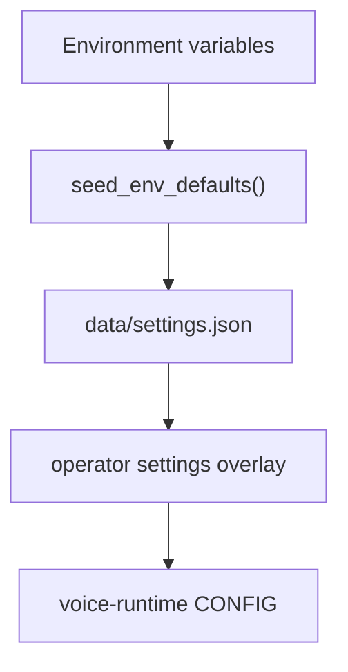

# Monorepo Conventions

Maya Unified is a **single git repository** combining the voice agent, unified gateway, dashboard static assets, platform packages, and optional apps (bot, ingest). Understanding where code belongs prevents circular imports, split-brain settings, and duplicate business logic.

## Top-level layout

```
maya-unified/
├── apps/                 # Deployable applications and HTML dashboard
│   ├── gateway/          # Unified FastAPI entry (main.py)
│   ├── dashboard/        # Static HTML/JS/CSS
│   ├── maya-gateway/     # Platform API routers (library)
│   ├── maya-bot/         # Discord /imagine bot
│   └── maya-ingest/      # Prefect ingest flows
├── packages/             # Reusable Python packages (uv workspace)
│   ├── voice-runtime/    # Voice engine (path import, not always uv member)
│   └── maya-*/           # Platform domain packages
├── services/             # Cross-cutting modules (root wheel)
├── data/                 # Runtime state — settings, operators, outputs
├── examples/             # Bundled seed assets
├── infra/                # ComfyUI, compose, ops scripts
├── docs/                 # Quartz documentation site
├── launch.py             # CLI entry: maya-unified script
└── pyproject.toml        # Root project + uv workspace
```

Runtime data **never** commits to git — only `data/.gitkeep` or markers like `data/.migrated-from-qwen3`.

## Where to make changes

| Change type | Primary location | Also check |
|-------------|------------------|------------|
| HTTP route, auth middleware | `apps/gateway/` | `services/auth/` |
| Dashboard UI / JS | `apps/dashboard/` | Matching API in gateway |
| Voice STT/TTS/agent loop | `packages/voice-runtime/` | [[Services/Voice Hub]] for scoping |
| Operator settings persistence | `services/settings/` | `schema.py` defaults |
| Platform API business logic | `apps/maya-gateway/src/maya_gateway/services/` | `packages/maya-*` |
| Shared API types | `packages/maya-contracts/` | OpenAPI in `/docs` |
| Database schema | `packages/maya-db/migrations/` | Alembic revision |
| Discord in voice session | `services/discord/`, `voice-runtime/tools/` | Settings discord section |
| Discord arena bot | `apps/maya-bot/` | [[Packages/Maya Image]] |

## Import and path conventions

`services/paths.py` inserts repo root, `packages/voice-runtime`, and gateway src into `sys.path` via `setup_paths()`. Gateway `main.py` calls this before importing voice modules.

Voice-runtime imports use bare names (`from config import CONFIG`, `from server import Hub`) when running under gateway — do not refactor to absolute `voice_runtime.config` without updating path setup.

Platform packages use normal namespace imports: `from maya_contracts import ...`, `from maya_db.models import ...`.

## Workspace and install

Root `pyproject.toml`:

```toml
[tool.uv.workspace]
members = ["packages/*", "apps/maya-gateway", "apps/maya-bot", ...]
exclude = ["packages/voice-runtime", ...]
```

| Command | Effect |
|---------|--------|
| `pip install -e .` | Voice + gateway + services (Windows setup path) |
| `uv sync --all-packages` | Full platform workspace |
| `uv sync --extra dev --extra mcp --extra otel` | Optional extras |

Single virtual environment at **repo root** (`.venv`) — avoid nested venvs in packages.

## Configuration sources (precedence)



Operator UI edits JSON settings; env vars bootstrap empty fields and supply secrets (API keys redacted from JSON on save).

## Data migration

Legacy standalone `qwen3-voice-agent/data` migrates once to `data/` via `services/voice/data_migration.py`. Marker file: `data/.migrated-from-qwen3`. Do not delete source until migration succeeds.

## Git and CI conventions

- Tests: `make test` / `uv run pytest` ([[Development/Testing]])
- E2E: Playwright under `tests/e2e/`
- Docs: `docs/` Quartz site — separate Node build
- Do not commit `.env`, `data/settings.json` with secrets, or Google token dir

## Adding a new platform feature

1. Define contracts in `packages/maya-contracts/`
2. Add DB models + migration in `packages/maya-db/` if persistent
3. Implement domain logic in appropriate `packages/maya-*`
4. Expose HTTP route in `apps/maya-gateway/src/maya_gateway/routes/`
5. Register router in `apps/gateway/main.py` `_mount_platform_routes()`
6. Document in `docs/content/` and OpenAPI

## Related documentation

- [[Architecture/Repo Map]] — detailed tree
- [[Architecture/Layers]] — apps vs services vs packages
- [[Packages/Overview]] — workspace packages
- [[Getting Started/Installation]] — developer setup
