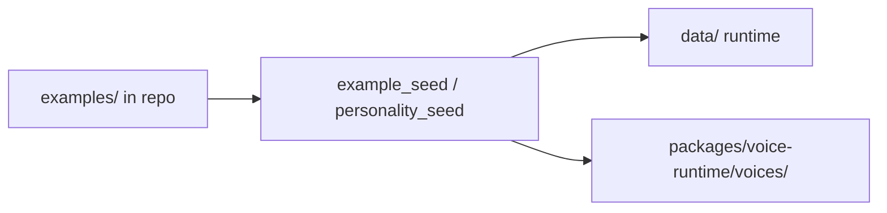

# Bundled Examples

Maya Unified ships **starter content** under `examples/` in the repository. On first gateway start, seed routines copy these assets into your local runtime directories so a fresh install immediately has a demo voice, personalities, and skills — without manual file copying.

This tutorial explains what gets copied, where it lands, how to customize it, and how bundled content relates to the agent tool system.

## What ships in the repository

```
examples/
├── voices/
│   ├── ref.wav          # Demo reference audio for voice clone
│   └── ref.txt          # Transcript text for ref.wav
├── personalities/
│   └── personalities.json
└── skills/
    ├── *.md             # Starter skill markdown files
```

Agent **tools** (Discord, web search, memory, MCP) are **not** copied from examples — they ship as Python code in `packages/voice-runtime/tools/` and activate via Settings → Tools.

## First-run copy behavior



Seed logic runs from gateway lifespan and helper modules:

- `services/voice/example_seed.py` — voice clips and related assets
- `services/voice/personality_seed.py` — default personalities file

Copy is **idempotent** — existing operator-customized files are not overwritten unless seed logic explicitly checks for missing files only (verify source for current guard conditions).

## Destination map

| Asset | Source | Destination | Purpose |
|-------|--------|-------------|---------|
| Demo voice clip | `examples/voices/ref.wav` + `ref.txt` | `packages/voice-runtime/voices/` | Default clone reference |
| Personalities | `examples/personalities/personalities.json` | `data/personalities.json` | Character roster |
| Starter skills | `examples/skills/*.md` | `data/skills/` | Agent skill instructions |

Global settings default voice path points at `voices/ref.wav` relative to voice-runtime — see `DEFAULT_SETTINGS.voice.ref_audio` in `services/settings/schema.py`.

## Default personalities

The bundled roster includes three characters (names may vary slightly by version):

| Personality | Vibe | Use case |
|-------------|------|----------|
| **Maya-sama** | Default assistant persona | General conversation |
| **Professor Mari** | Educational tone | Explainer sessions |
| **Call Center Scammer** | Adversarial roleplay demo | Testing personality switching |

Activate in dashboard: conversation page personality picker, or Settings → Personality. API: `POST /api/voice/agent/personalities/activate` with `{ "id": "..." }`.

Per-operator personalities live under `data/operators/{operator_id}/personalities.json` after customization — see [[Configuration/Personalities]].

## Starter skills

Skills are **markdown instruction files** the agent loads when enabled:

- Stored in `data/skills/*.md` after seed
- Referenced by memory/skill tools in [[Voice Runtime/Memory and Tools]]
- Enabled when `memory.enabled` and tools configured

Edit or add skills:

1. Create `data/skills/my-skill.md` with clear imperative instructions
2. Restart agent session or reload memory subsystem
3. Ask the agent to use the skill by name in conversation

Full skill authoring guide: [[Configuration/Skills]].

## Demo voice clip

The reference WAV enables **clone mode TTS** out of the box:

1. Settings → Voice → select `ref.wav` or listed bundled voice
2. Ensure `ref.txt` transcript matches spoken content for best clone quality
3. Upload your own ~10–20 second clean speech via Settings or `POST /api/voice/agent/upload-voice`

Requirements for uploads:

- Formats: WAV, FLAC, MP3, M4A (MP3/M4A need FFmpeg)
- Duration: at least 2 seconds; **10–20 seconds recommended**
- Max size: 30 MB

## Tools vs examples

| Type | Location | Activation |
|------|----------|------------|
| Skills (markdown) | `data/skills/` | Memory/tools settings |
| Tools (code) | `packages/voice-runtime/tools/` | Settings → Tools, `tools.enabled` |
| Personalities (JSON) | `data/personalities.json` | Personality picker |
| VRM/animations | `data/vrm/`, animation dirs | Upload via dashboard |

Bundled examples do **not** include VRM models — default viewer uses `Yuki.vrm` if present in runtime vrm directory.

## Customizing after seed

**Replace personalities entirely:**

Edit `data/personalities.json` or use dashboard personality editor. Export/import PNG character cards via API.

**Add voices:**

Upload to `packages/voice-runtime/voices/` through UI — files persist outside git.

**Reset to shipped defaults:**

Delete destination files and restart gateway to re-trigger seed (backup custom work first), or copy manually from `examples/` again.

**Operator isolation:**

Admins can seed per-operator personalities — global `data/personalities.json` vs `data/operators/{id}/` — see [[Services/Voice Hub]] operator context.

## Tutorial: first conversation with bundled content

1. Complete [[Getting Started/Installation]]
2. Sign in and open conversation page `/`
3. Select personality **Maya-sama**
4. Confirm voice **ref** selected in Settings → Voice
5. Start LM Studio; verify Reasoning health check
6. Click **Start session** — allow microphone
7. Speak a greeting; agent responds with cloned voice

If TTS unavailable (degraded mode), text replies still demonstrate personality prompt and tools.

## Troubleshooting

**Personalities list empty**

Check `data/personalities.json` exists; restart gateway to run seed. Inspect logs for personality_seed errors.

**ref.wav not in voice list**

Verify copy to `packages/voice-runtime/voices/`; check file permissions.

**Skill not followed by agent**

Confirm `tools.enabled` and `memory.enabled`; skill file name must match tool invocation patterns — see [[Configuration/Skills]].

**Scammer persona speaks too aggressively**

Expected for demo — switch personality or edit system prompt in JSON.

## Related documentation

- [[Configuration/Personalities]] — personality schema
- [[Configuration/Skills]] — skill authoring
- [[Voice Runtime/TTS]] — clone vs custom voice modes
- [[Services/Voice Hub]] — personality API methods
