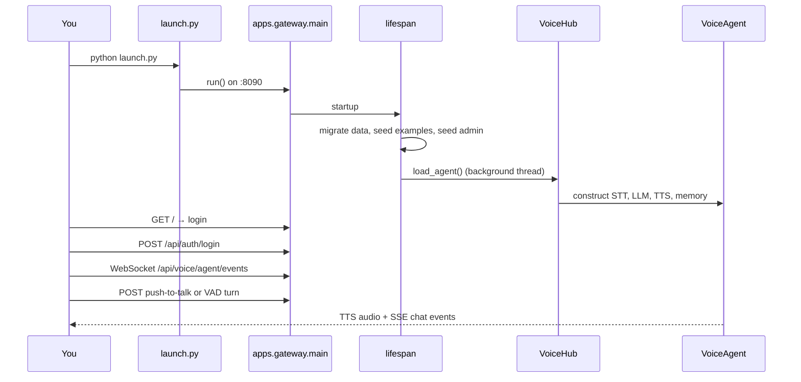

# Quick Start

This guide walks through a **first working voice session** on Maya Unified. It assumes you have already run [[Getting Started/Installation]] (Python venv, voice deps, `.env` copied).

## What happens when you launch



## Step 1 — Start the LLM backend

Maya talks to an **OpenAI-compatible** HTTP API. The default is LM Studio:

1. Open LM Studio → download an **instruct** model (Gemma 3, Qwen3 8B, Llama 3.1 8B, etc.).
2. **Local Server** tab → load model → **Start Server**.
3. Confirm `http://localhost:1234/v1` responds.

Set in `.env` (or later in **Settings → Reasoning**):

```env
VA_LLM_BASE_URL=http://localhost:1234/v1
VA_LLM_MODEL=local-model
VA_LLM_API_KEY=lm-studio
```

Use the **exact model id** LM Studio shows (e.g. `google/gemma-3-12b-it`) in `VA_LLM_MODEL` if `local-model` misroutes.

### Reasoning-model gotcha

Gemma and other reasoning models may return **empty spoken text** if hidden chain-of-thought consumes the token budget. Fix:

```env
VA_LLM_REASONING_EFFORT=none
VA_LLM_DISABLE_THINKING=1
```

Qwen3 thinking is disabled automatically when `VA_LLM_DISABLE_THINKING=1` (default).

## Step 2 — Launch Maya

```bash
python launch.py
# Windows: launch.bat
# NixOS: ./launch.sh
```

`launch.py` will warn (but still start) if `faster_whisper` or `faster_qwen3_tts` are missing—you get **text-only degraded mode** until you run `setup_windows.bat` or `make setup`.

Open **http://localhost:8090**.

## Step 3 — Sign in

| Scenario | What you see |
|----------|--------------|
| No operators in DB | Redirect to `/setup` or auto-seed `admin`/`admin` |
| Operators exist | `/login` — use your credentials |

Protected routes (`/`, `/memory`, `/settings`, `/api/voice/*`) require a valid `maya_op_session` cookie. See [[Operations/Operator Auth]].

## Step 4 — Grant microphone access

The dashboard captures audio in the browser and sends it to the gateway, which forwards turns to `VoiceAgent` via [[Services/Voice Hub]].

**Use headphones.** Without them, speaker output feeds back into the mic and triggers false **barge-in** (TTS cancellation). See [[Voice Runtime/VAD and Barge-in]].

## Step 5 — Your first turn

Two input modes (configurable in Settings):

| Mode | Behavior |
|------|----------|
| **Push-to-talk** | Hold button → speak → release → STT → LLM → TTS |
| **VAD (always listening)** | WebRTC VAD detects speech start/end automatically |

Each turn follows the pipeline in [[Architecture/Request Pipeline]]:

```
audio → faster-whisper → LLM token stream → sentence chunks → Qwen3-TTS stream → speakers
```

Watch the dashboard EQ meter and chat panel for partial transcripts and streaming reply text.

## Step 6 — Verify tools and memory

- **Memory explorer:** `/memory` — browse curated and cognitive memories
- **Settings:** user menu → Settings — reasoning provider, voice clone ref, Discord, integrations
- **OpenAPI:** `/docs` — full HTTP surface

Bundled personalities and skills are copied on first launch — [[Getting Started/Bundled Examples]].

## Common first-session failures

| Symptom | Likely cause | Fix |
|---------|--------------|-----|
| Empty spoken reply | Reasoning model eating tokens | `VA_LLM_REASONING_EFFORT=none` |
| No audio out | TTS failed to load | Check stderr for `[tts] WARNING`; run `make tts-check` |
| 401 on voice API | Not logged in | Visit `/login` |
| LM Studio connection error | Server not running | Start LM Studio local server |
| Very slow first TTS | Cold GPU model | Normal; `VA_TTS_WARMUP=1` warms at startup |

## Next steps

- [[Architecture/Overview]] — how gateway, hub, and agent relate
- [[Voice Runtime/Agent Orchestrator]] — turn loop internals
- [[Configuration/Environment Variables]] — full `VA_*` reference
