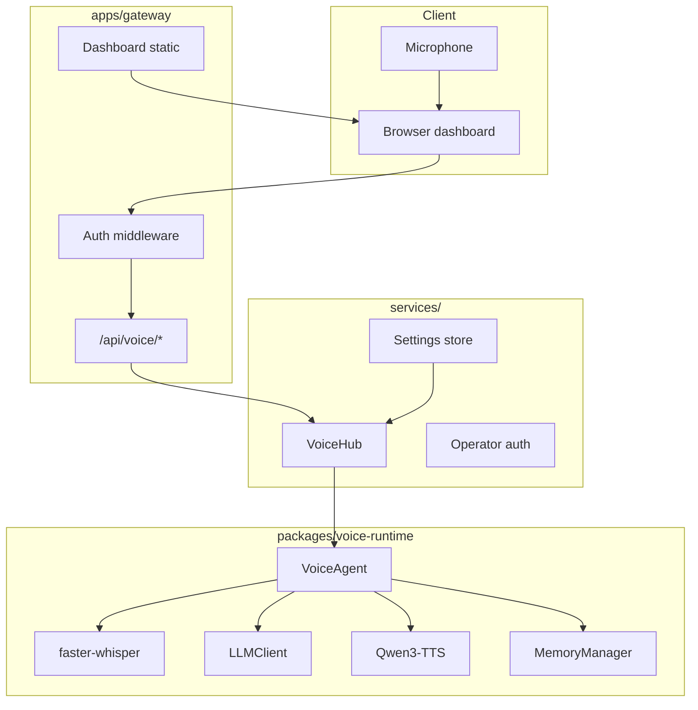
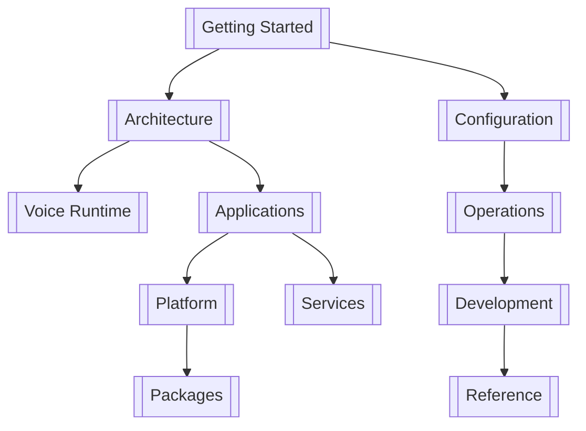

# Maya Unified

Maya Unified is a **single-repository** local voice AI stack: you talk into a microphone, faster-whisper transcribes your speech, an LLM (typically LM Studio on `:1234`) reasons and replies, and Qwen3-TTS speaks the answer back in a cloned or built-in voice—all on your machine. A FastAPI **unified gateway** on port **8090** serves the operator dashboard, voice APIs, optional platform routes (arena, discover, research), and Google OAuth integrations.

Unlike the older standalone `qwen3-voice-agent` layout, nothing is launched as a separate project. Voice runtime code lives in `packages/voice-runtime/`, but the **entry point is always** `launch.py` → `apps/gateway/main.py`. The gateway embeds the agent through `services/voice/hub.py` rather than running `server.py` on `:7861` (that legacy path still exists for debugging).

## What you get out of the box

| Capability | How it works |
|------------|--------------|
| **Voice conversation** | Browser mic → STT → LLM stream → sentence chunker → streaming TTS → speakers |
| **Operator dashboard** | Static UI at `/` with EQ visualization, chat, push-to-talk / VAD modes |
| **Memory & personalities** | Layered memory (curated, cognitive, sessions), SillyTavern-style character cards |
| **Tools** | Web search, Discord, MCP servers, memory read/write tools |
| **Multi-operator** | PostgreSQL-backed accounts, roles, per-operator data dirs |
| **Optional platform** | Arena, feeds, research, image gen when `uv sync` + Postgres are configured |

Runtime state—personalities, skills, memory DBs, operator preferences—lives under **`data/`** at the repo root (gitignored). Code never writes durable state into `packages/`.

## Quick start

```bash
git clone https://github.com/System-Nebula/maya-unified.git
cd maya-unified
setup_windows.bat          # Windows — or see [[Getting Started/NixOS]]
copy .env.example .env
launch.bat                 # → http://localhost:8090
```

Default operator login: **`admin` / `admin`** (auto-seeded when the database has no operators). Change the password immediately under **Settings → Account**.

## System diagram



## Documentation map

The docs mirror how the codebase is organized—not as a flat README, but as **layers you can read in order**:

| If you want to… | Start here |
|-----------------|------------|
| Install and run your first session | [[Getting Started/Installation]] → [[Getting Started/Quick Start]] |
| Understand how pieces connect | [[Architecture/Overview]] → [[Architecture/Launch Flow]] |
| Debug voice latency, TTS, or LLM | [[Voice Runtime]] section |
| Configure `.env` and dashboard settings | [[Configuration/Environment Variables]] |
| Set up Google login or Gmail/Calendar | [[Operations/Google OAuth]] |
| Work on gateway vs voice engine code | [[Development/Monorepo Conventions]] |



## Unified vs standalone voice-runtime

The upstream `packages/voice-runtime/README.md` still describes the original **qwen3-voice-agent** repo (`server.py`, port `7861`). In Maya Unified those paths are **adapted**:

| Standalone (legacy) | Unified (this repo) |
|---------------------|---------------------|
| `python server.py` | `python launch.py` |
| `http://127.0.0.1:7861` | `http://localhost:8090` |
| Single-user, no auth | Operator sessions + scoped data dirs |
| Local `data/` in voice-runtime | Root `data/` via `VA_DATA_DIR` |
| Settings in local JSON only | `services/settings/store.py` + dashboard |

First unified boot may migrate legacy data once (marker: `data/.migrated-from-qwen3`).

## Key source files

| File | Role |
|------|------|
| `launch.py` | Entrypoint; checks voice deps, calls gateway |
| `apps/gateway/main.py` | FastAPI app, auth middleware, route mounting |
| `apps/gateway/lifespan.py` | Startup: seed operator, load agent, Discord |
| `services/voice/hub.py` | Bridge to `VoiceAgent`; per-operator context |
| `packages/voice-runtime/agent.py` | Turn loop: STT → LLM → TTS → barge-in |
| `packages/voice-runtime/config.py` | All `VA_*` environment defaults |

> Generated from the maya-unified codebase. Last updated: 2026-07-04.
