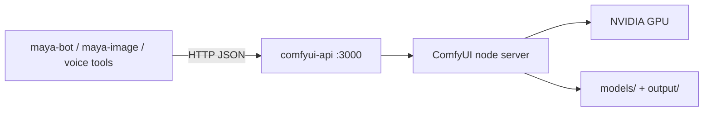

# ComfyUI Infrastructure

Local image generation for Maya Unified flows through a **ComfyUI node server** plus an HTTP API wrapper (`comfyui-api`) that [[Packages/Maya Image]] and [[Platform/Maya Bot]] call. Infrastructure definitions live under `infra/comfyui/` with Makefile targets for weight downloads and Docker Compose services.

Without this stack, `/imagine` arena battles and in-agent imagine tools fail gracefully with connection errors — voice chat continues unaffected.

## Stack components



| Component | Typical port | Role |
|-----------|--------------|------|
| comfyui-api | 3000 | Stable REST API for workflow submit/poll |
| ComfyUI | 8188 (internal) | Graph execution engine |
| Maya consumers | — | `COMFYUI_API_URL=http://localhost:3000` |

## Repository layout

```
infra/comfyui/
├── README.md           # authoritative setup guide
├── docker-compose.yml  # optional containerized stack
├── Makefile            # fetch-zimage, fetch-krea2, up/down targets
└── workflows/          # exported ComfyUI graphs for arena seeds
```

Start here before production image features:

```bash
cd infra/comfyui
make help
# follow README for GPU driver + model fetch
```

## Environment variables

| Variable | Default | Used by |
|----------|---------|---------|
| `COMFYUI_API_URL` | `http://localhost:3000` | maya-bot, maya-image, platform routes |
| `MAYA_IMAGE_ROOT` | `./data/outputs/maya-image` | Output PNG storage |
| `MAYA_ARENA_SIZE` | `512x512` | Arena panel normalization |
| `MAYA_ARENA_PAIR` | seeded workflow names | Opponent pairing |
| `HF_TOKEN` | *(optional)* | Hugging Face weight download scripts |
| `discord.comfyui_url` | `http://localhost:3000` | In-agent imagine (settings JSON) |

## Workflow seed data

Arena mode expects `image_workflows` rows with `is_arena_candidate=true` after [[Packages/Maya DB]] migrations — default seeds include **Z-Image Turbo** and **Krea 2 Turbo** workflows. Makefile fetch targets download weights into ComfyUI's model directories.

Tune pairing:

```env
MAYA_ARENA_PAIR=z-image-turbo-t2i,krea2-turbo-t2i
```

## Consumer integration paths

### Maya Bot (`uv run maya-bot`)

Slash `/imagine mode:Arena` submits two workflows via [[Packages/Maya Image]], displays A/B embed, records votes in Postgres.

### In-agent Discord tool

Enable `discord.imagine_enabled` in Settings with valid `discord.comfyui_url`. Agent tool path uses same API — no separate bot process.

### Platform HTTP

Arena routes under `/api/arena/*` when platform stack mounted ([[Platform/Maya Gateway]]).

## Hosted provider alternative

Set `MAYA_ENABLE_HOSTED_PROVIDERS=1` with fal.ai or Ideogram API keys to bypass local ComfyUI for some generation modes — see `packages/maya-image` optional `[hosted]` extra. Self-hosters typically use ComfyUI only.

## Operational checklist

- [ ] NVIDIA driver + CUDA compatible with ComfyUI build
- [ ] Sufficient VRAM for selected workflows (check workflow README)
- [ ] `make fetch-*` completed for arena candidates
- [ ] `COMFYUI_API_URL` reachable from gateway/bot host (`curl` smoke test)
- [ ] `MAYA_IMAGE_ROOT` writable by gateway/bot user
- [ ] Firewall allows internal access only — do not expose ComfyUI API publicly without auth

## Troubleshooting

**Connection refused on port 3000**

Start comfyui-api wrapper — raw ComfyUI on 8188 alone is insufficient for Maya clients.

**404 workflow not found**

Workflow name in DB must match ComfyUI export filename; re-run migrations/seeds.

**Timeout during generation**

GPU OOM or cold model load — check ComfyUI logs; reduce resolution via `MAYA_ARENA_SIZE`.

**Black or corrupted PNG**

Verify checkpoint paths after fetch; confirm same GPU device visible inside containers if using Docker.

**Bot works, in-agent imagine fails**

Settings `discord.comfyui_url` may differ from bot env — align URLs.

## Related documentation

- [[Packages/Maya Image]] — orchestration layer
- [[Platform/Maya Bot]] — Discord arena UX
- [[Operations/Optional Services]] — when to run ComfyUI
- [[Platform/Discord Integration]] — in-agent imagine settings
