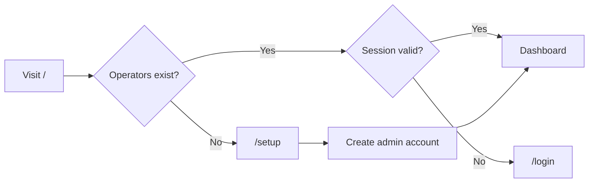

# Operator Auth

Maya Unified uses **local operator accounts** for dashboard access — usernames and passwords stored in PostgreSQL, sessions in a signed browser cookie. This document covers what operators experience during setup, daily login, and account management. Implementation details live in [[Services/Operator Auth]].

Platform Google sign-in ([[Operations/Google OAuth]]) is an **alternative login path** that links a Google identity to an operator row; it does not replace local password storage for operators who choose username/password.

## First-run setup

When the gateway starts and `operator_users` is empty, visiting any guarded page redirects to `/setup`:

The setup form calls `POST /api/operators` without authentication to create the first **admin** user. Subsequent operators are created only by admins via Settings or `/admin/users`.

## Daily login

1. Open `http://localhost:8090/login` (or your deployment URL).
2. Enter username and password.
3. On success, the gateway sets cookie `maya_op_session` (14-day TTL).
4. Browser redirects to `?next=` path or `/`.

**Default credentials:** if you used auto-seed or manual first admin, change the default password immediately in **Settings → Account**. Never run production with `admin`/`admin`.

## Roles

| Role | Capabilities |
|------|--------------|
| `admin` | Create/delete operators, ban users, admin workspaces (`/admin/*`) |
| `operator` | Voice dashboard, settings, rooms — no user management |

Role checks use `require_admin` on management APIs. Banned operators receive **403** on APIs and redirect to `/login?banned=1` on HTML routes.

## Session security

| Setting | Production guidance |
|---------|-------------------|
| `SESSION_SECRET` | Long random string — never commit to git |
| `SESSION_COOKIE_SECURE` | Set `1` when served over HTTPS |
| Password policy | Enforced server-side on create/password change |

Sessions are invalidated on logout (`POST /api/auth/logout` clears cookie). There is no server-side session table — invalidation is cookie removal plus optional password change (old cookies remain valid until expiry unless secret rotated).

## Google sign-in (optional)

When `GOOGLE_CLIENT_ID` is configured, the login page may offer **Sign in with Google**:

- Flow starts at `GET /api/platform/auth/login/google`
- Callback sets the same `maya_op_session` cookie after linking `operator_google_identities`
- Operators can still set a local password in Settings for backup auth

See [[Operations/Google OAuth]] for Console registration.

## Protected surfaces

Without a valid session:

- **HTML pages** (`/`, `/settings`, `/memory`, …) redirect to login
- **JSON APIs** under `/api/voice/*`, `/api/admin/*`, most `/api/operators/*` return **401** `{"detail":"not authenticated"}`

OpenAPI docs at `/docs` remain accessible for development.

Guest **voice rooms** (`/room/{slug}`) use a separate guest token model — operators create rooms authenticated, guests join via slug link.

## Account management

Operators access **Settings → Account** to update display name, avatar color, and password. Admins additionally use:

- `/admin/users` — list, create, ban operators
- `/admin/workspaces` — cross-operator conversation and personality oversight

API equivalents documented in [[Reference/API]] under `/api/operators` and `/api/admin`.

## Troubleshooting

**Forgot password (single admin)**

Reset via database or create a new admin row with SQL — there is no email recovery in self-hosted mode. For dev, truncate `operator_users` and revisit `/setup` (destructive).

**Login succeeds but instant logout**

Check HTTPS/`SESSION_COOKIE_SECURE` mismatch. On localhost HTTP, secure cookies must be disabled.

**Google login creates duplicate operators**

Linking matches email/username when possible; manual merge may require admin deleting duplicate row in Postgres.

**401 on API from custom frontend**

Include credentials: `fetch(url, { credentials: 'include' })`. Cookie is host-only.

## Related documentation

- [[Services/Operator Auth]] — session signing, deps, store
- [[Packages/Maya DB]] — operator_users schema
- [[Operations/Deployment]] — production secret checklist
- [[Getting Started/Installation]] — initial setup path
