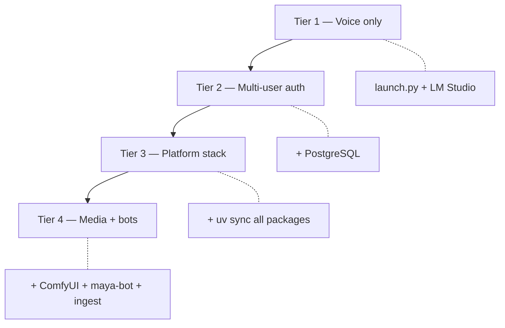

# Optional Services

Maya Unified's **core voice dashboard** runs from a single gateway process after `pip install -e .` or `setup_windows.bat`. Platform features, Discord arena, image generation, and background ingest are **opt-in** — each adds processes, dependencies, or infrastructure documented below.

Use this page as a decision matrix: what to enable, what it requires, and where to read next.

## Feature matrix

| Feature | Process / command | Requires | Documentation |
|---------|-------------------|----------|---------------|
| Voice dashboard | `python launch.py` | Python 3.11, GPU recommended, LLM | [[Getting Started/Installation]] |
| Operator login | *(same gateway)* | PostgreSQL + migrations | [[Operations/Operator Auth]] |
| Google OAuth / Gmail | *(same gateway)* | Google Console + Postgres | [[Operations/Google OAuth]] |
| Voice rooms (guest) | *(same gateway)* | Postgres | [[Reference/API]] `/api/rooms` |
| Platform APIs (arena, discover, research) | *(same gateway)* | `uv sync --all-packages`, Postgres | [[Platform/Maya Gateway]] |
| Discord voice/music tools | *(same gateway)* | Discord bot token, FFmpeg | [[Platform/Discord Integration]] |
| Discord `/imagine` arena | `uv run maya-bot` | Postgres, ComfyUI, GPU | [[Platform/Maya Bot]] |
| Image generation (ComfyUI) | ComfyUI stack | NVIDIA GPU, port 3000 | [[Operations/ComfyUI]] |
| Feed ingest | Prefect / ingest worker | Postgres, full workspace | [[Platform/Maya Ingest]] |
| Legacy standalone WebUI | `python packages/voice-runtime/server.py` | Voice deps only | [[Voice Runtime]] |
| VTube Studio lip sync | *(same gateway)* | VTS running locally | Settings → VTS |
| WebLLM browser inference | *(same gateway + browser)* | WebGPU-capable browser | [[Voice Runtime/LLM]] |

## Dependency tiers



### Tier 1 — Voice only

- Install root package and voice-runtime path setup
- Configure LLM in Settings → Reasoning
- No database — operator auth disabled or setup skipped

### Tier 2 — Multi-user auth

- PostgreSQL with [[Packages/Maya DB]] migrations
- Operator accounts, per-operator settings overlays
- Google OAuth optional

### Tier 3 — Platform stack

```bash
uv sync --all-packages
```

Mounts `/api/arena`, `/api/discover`, `/api/research`, etc. Log confirmation: `mounted platform routes`.

### Tier 4 — Media and bots

- ComfyUI under `infra/comfyui/` ([[Operations/ComfyUI]])
- `uv run maya-bot` for Discord arena
- Ingest flows for fresh discover content

## Discord: two entry points

Do not conflate:

1. **In-agent Discord** — token in Settings → Discord, runs inside gateway ([[Platform/Discord Integration]])
2. **Maya Bot** — separate token and process for `/imagine` ([[Platform/Maya Bot]])

Using the same token for both causes Discord gateway disconnects.

## ComfyUI usage paths

| Consumer | Config key / env |
|----------|------------------|
| Maya Bot arena | `COMFYUI_API_URL` |
| In-agent imagine tool | `discord.comfyui_url` in settings |
| Platform image APIs | [[Packages/Maya Image]] env |

One ComfyUI instance can serve all consumers if network and GPU capacity allow.

## When not to enable optional services

- **Skip Postgres** for single-user local experiments — accept no login persistence
- **Skip ComfyUI** if you only need voice chat — set `VA_TTS_ENABLED=0` if TTS also unwanted
- **Skip maya-bot** if Discord is voice-only via in-agent tools
- **Skip ingest** if discover feed can be empty in dev

## Resource planning

| Service | CPU | GPU | RAM |
|---------|-----|-----|-----|
| Gateway + STT/TTS | moderate | **high** | 8–16 GB+ VRAM typical |
| PostgreSQL | low | — | 1–2 GB |
| ComfyUI | moderate | **high** | model-dependent |
| maya-bot | low | — | shares ComfyUI GPU |
| Ingest worker | moderate | optional | spikes during embed jobs |

## Troubleshooting

**Enabled platform but routes 404**

Gateway log lacks `mounted platform routes` — run `uv sync --all-packages`.

**Discord works in settings but not arena**

Arena requires `maya-bot` process — not the in-agent tool.

**ComfyUI up but imagine fails**

Verify URL matches on bot, settings, and `curl http://localhost:3000/health` (exact path depends on comfyui-api).

**Ingest runs but discover empty**

Shared `DATABASE_URL` between ingest and gateway; check Prefect flow completion logs.

## Related documentation

- [[Operations/Deployment]] — production topology
- [[Packages/Overview]] — package requirements
- [[Architecture/Overview]] — system layers
