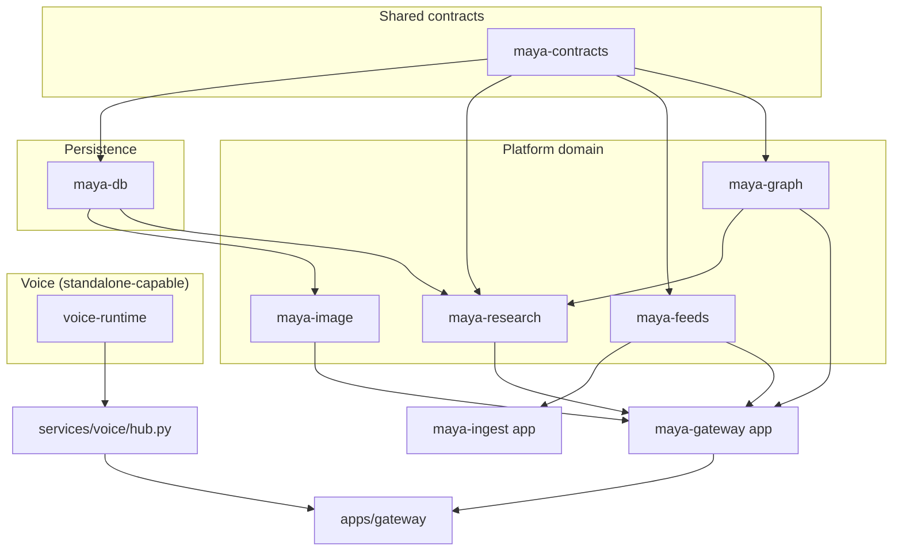

# Domain Packages

Maya Unified is a Python monorepo. Most reusable logic lives under `packages/` as editable workspace members declared in the root `pyproject.toml`. The unified gateway (`apps/gateway/`) and cross-cutting services (`services/`) import these packages; the dashboard and Discord surfaces consume their APIs indirectly through HTTP routes.

The packages split cleanly into two tiers:

1. **Voice tier** — real-time STT, TTS, agent loop, and tool execution in [[Voice Runtime]] (`packages/voice-runtime/`). This tier can run standalone and does not require PostgreSQL.
2. **Platform tier** — optional arena, discover, research, feeds, and image generation built on shared contracts and persistence. These packages activate when you run `uv sync` with the full workspace and mount platform routes in [[Apps/Unified Gateway]].

## Package map



## Package reference

| Package | Path | Doc | Purpose |
|---------|------|-----|---------|
| `maya-contracts` | `packages/maya-contracts/` | [[Packages/Maya Contracts]] | Pydantic schemas — single source of truth for public API shapes |
| `maya-db` | `packages/maya-db/` | [[Packages/Maya DB]] | SQLAlchemy models, Alembic migrations, Postgres session factory |
| `maya-research` | `packages/maya-research/` | [[Packages/Maya Research]] | LangGraph research agent with parallel source fetching |
| `maya-image` | `packages/maya-image/` | [[Packages/Maya Image]] | ComfyUI-backed image generation and arena orchestration |
| `maya-feeds` | `packages/maya-feeds/` | [[Packages/Maya Feeds]] | Feed adapters for YouTube, Instagram, TikTok |
| `maya-graph` | `packages/maya-graph/` | [[Packages/Maya Graph]] | Entity resolution and property-graph helpers |
| `voice-runtime` | `packages/voice-runtime/` | [[Voice Runtime]] | Voice agent engine — STT, TTS, LLM loop, tools |

Additional workspace packages exist but are excluded from the default install (see `tool.uv.workspace.exclude` in root `pyproject.toml`): `maya-audio`, `maya-llm`, `maya-voice`, `maya-voice-stack`, and the standalone `voice-runtime` wheel path.

## How packages are installed

All workspace members install from the repository root:

```bash
# Minimal voice path (pip)
pip install -e .

# Full platform stack (uv)
uv sync --all-packages
```

The root `pyproject.toml` declares `[tool.uv.workspace]` with members under `packages/*` plus `apps/maya-gateway`, `apps/maya-bot`, `apps/discord-shim`, and `apps/maya-ingest`. Cross-package dependencies use `[tool.uv.sources]` workspace references (for example `maya-research` depends on `maya-contracts`, `maya-db`, and `maya-graph` via `{ workspace = true }`).

## Dependency direction

Contracts sit at the bottom of the platform stack. Nothing in `maya-contracts` imports other Maya packages. `maya-db` owns persistence models consumed by gateway routes, auth, OAuth, and platform services. Domain packages (`maya-image`, `maya-research`, `maya-feeds`, `maya-graph`) depend on contracts and usually on `maya-db`. Application entry points under `apps/` wire routes and background workers; they should not duplicate business logic that belongs in packages.

Voice-runtime is intentionally isolated: it ships its own `config.py`, `agent.py`, and tool modules. The unified bridge in [[Services/Voice Hub]] subclasses the runtime `Hub` and applies operator-scoped settings from [[Services/Settings Store]] without forking the engine.

## When you need which packages

| Goal | Required packages |
|------|-------------------|
| Local voice dashboard only | Root install + `voice-runtime` (via path setup in `services/paths.py`) |
| Operator login and per-user settings | `maya-db` + migrations |
| Google OAuth sign-in or Gmail/Calendar | `maya-db` + `services/integrations/google/` |
| Arena / discover / research APIs | Full `uv sync` + `apps/maya-gateway` routes |
| Discord `/imagine` bot | `maya-image`, `maya-db`, [[Platform/Maya Bot]] |
| Feed ingestion pipelines | `maya-feeds`, `maya-graph`, [[Platform/Maya Ingest]] |

## Related documentation

- [[Development/Monorepo Conventions]] — where to put changes
- [[Architecture/Layers]] — how apps, services, and packages relate
- [[Architecture/Repo Map]] — full directory tree
- [[Reference/Environment Index]] — env vars that configure packages
