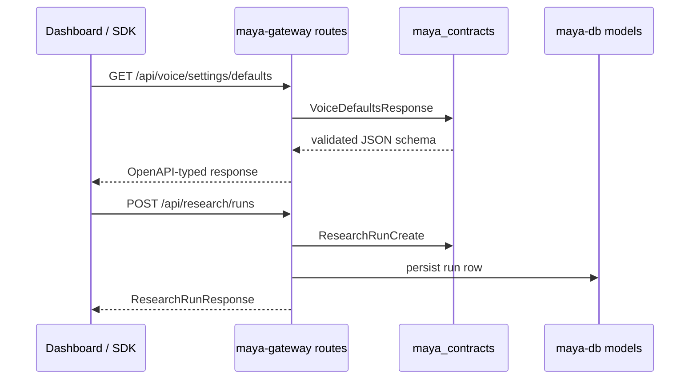

# Maya Contracts

`packages/maya-contracts/` is the **schema source of truth** for every public Maya API surface. All request and response bodies that cross process boundaries — HTTP routes, SDK fixtures, and frontend TypeScript codegen — derive from Pydantic models defined here. Keeping contracts in one package prevents the dashboard, gateway, and Discord bot from drifting into incompatible JSON shapes.

## Location and layout

```
packages/maya-contracts/
├── pyproject.toml
└── src/maya_contracts/
    ├── __init__.py          # re-exports common models
    ├── common.py            # shared primitives, pagination
    ├── voice.py             # OperatorVoiceSettings, VoiceTurnRequest
    ├── arena.py             # arena battles, candidates, votes
    ├── discover.py          # discover feed items, ranking
    ├── feeds.py             # feed adapter payloads
    ├── follow.py            # follow graph entities
    ├── intel.py             # intel cards and sources
    ├── knowledge.py         # knowledge graph nodes
    ├── music.py             # music catalog entries
    ├── music_query.py       # search/query DTOs
    ├── notifications.py     # notification envelopes
    ├── registry.py          # content registry entries
    └── research.py          # research run state, artifacts
```

## How it works

When [[Apps/Unified Gateway]] mounts a route, FastAPI uses these models as `response_model` declarations or request body validators. For example, the voice SDK defaults endpoint in `apps/maya-gateway/src/maya_gateway/routes/voice.py` returns a `VoiceDefaultsResponse` wrapping `OperatorVoiceSettings()` — the same structure the dashboard settings panel expects.



Contracts describe **wire format**, not storage. Database models in [[Packages/Maya DB]] may have extra columns (timestamps, foreign keys) that never appear in public responses. Gateway route handlers map ORM rows to contract types before returning JSON.

## Key model groups

| Module | Primary types | Consumed by |
|--------|---------------|-------------|
| `voice.py` | `OperatorVoiceSettings`, `DetectionMode`, `VoiceTurnRequest` | Voice SDK, settings catalog |
| `arena.py` | Arena battle, candidate, vote DTOs | [[Platform/Maya Bot]], arena routes |
| `research.py` | Run lifecycle, planner output, synthesis | [[Packages/Maya Research]] |
| `discover.py` | Ranked items, inbox submissions | Discover routes, ingest |
| `feeds.py` | Normalized feed entries | [[Packages/Maya Feeds]], ingest |
| `registry.py` | Registry CRUD shapes | Content registry API |

## Configuration

Contracts themselves have no runtime configuration — they are pure Pydantic v2 models with `requires-python = ">=3.11"` and a single dependency on `pydantic>=2.0`.

Install as a workspace member:

```bash
uv sync   # pulls maya-contracts transitively
```

Or reference explicitly in another package's `pyproject.toml`:

```toml
dependencies = ["maya-contracts"]

[tool.uv.sources]
maya-contracts = { workspace = true }
```

## Versioning conventions

Field additions should be backward-compatible: new optional fields with defaults, never rename or remove fields without a coordinated migration across gateway, dashboard JS, and any external SDK consumers. Use `model_config = ConfigDict(extra="ignore")` on request types where clients may send unknown keys.

When the unified settings schema in `services/settings/schema.py` grows a new section, consider whether a corresponding contract type in `voice.py` should expose a subset for the public SDK. Not every internal setting belongs in contracts — only fields intended for third-party integrators.

## Troubleshooting

**ImportError: No module named `maya_contracts`**

Run `uv sync` from the repo root or `pip install -e packages/maya-contracts`. Platform routes fail to mount if contracts are missing.

**OpenAPI schema mismatch between `/docs` and dashboard**

The dashboard may call `/api/voice/settings` (unified store) while the SDK calls `/api/voice/settings/defaults` (contracts defaults). These are intentionally different endpoints — compare `OperatorVoiceSettings` in contracts against `DEFAULT_SETTINGS` in `services/settings/schema.py`.

**Validation errors on platform POST bodies**

Check the exact field names in the relevant `maya_contracts/*.py` module. FastAPI returns 422 with Pydantic detail; cross-reference the model definition rather than guessing JSON keys from the UI.

## Related documentation

- [[Packages/Maya DB]] — persistence layer below contracts
- [[Reference/API]] — HTTP routes that consume these schemas
- [[Platform/Maya Gateway]] — primary consumer of platform contract types
- [[Voice Runtime]] — runtime config parallel to `OperatorVoiceSettings`
