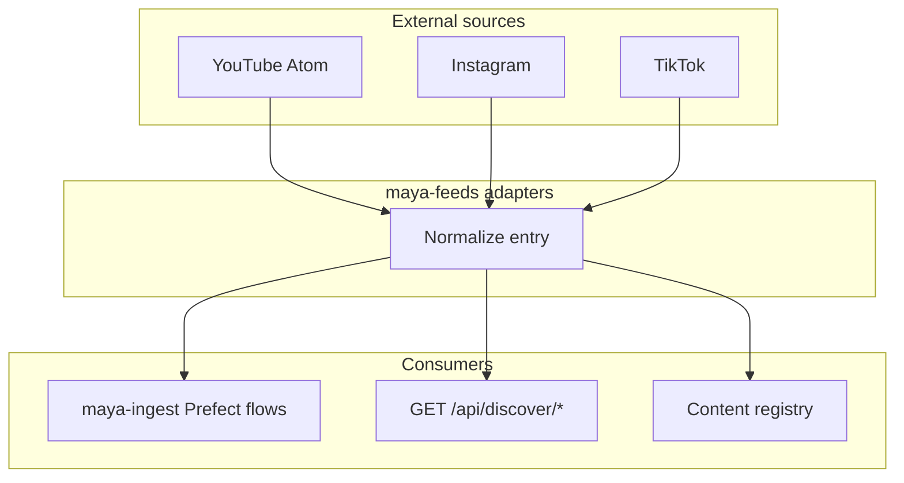

# Maya Feeds

`packages/maya-feeds/` implements **platform feed adapters** that normalize content from external sources into a common shape for discover pipelines and ingestion jobs. The package is deliberately generic and public-safe: it fetches and parses public feeds without requiring operator credentials, making it suitable for background workers and read-only API responses.

## Supported sources

| Adapter | Protocol | Notes |
|---------|----------|-------|
| YouTube | Atom/RSS via `feedparser` + Data API helpers | Channel and playlist polling |
| Instagram | HTTP scraping adapters | Public profile timelines where accessible |
| TikTok | HTTP adapters | Normalized metadata for discover ranking |

Implementation lives under `src/maya_feeds/` with shared HTTP utilities and source-specific parsers. All wire payloads align with types in [[Packages/Maya Contracts]] (`feeds.py`, `feed.py`, `discover.py`).

## Data flow



## Dependencies

```toml
# packages/maya-feeds/pyproject.toml
dependencies = [
    "maya-contracts",
    "feedparser>=6.0",
    "httpx>=0.27",
    "google-api-python-client>=2.0",
]
```

YouTube enrichment may use Google API client credentials configured at the platform level — distinct from per-operator Gmail OAuth in [[Services/Google Integrations]].

## Integration with ingest

[[Platform/Maya Ingest]] runs Prefect flows that call feed adapters on a schedule:

- `flows/poll_music_sources.py` — music catalog polling
- `tasks/yt_catalogue.py` — YouTube catalogue maintenance

Ingested entries pass to [[Packages/Maya Graph]] for entity resolution (artist names, channel IDs, cross-platform deduplication) before appearing in discover rankings.

## HTTP exposure

Normalized feed data surfaces through platform routes mounted from `apps/maya-gateway`:

| Prefix | Module |
|--------|--------|
| `/api/feeds/*` | `maya_gateway.routes.feeds` |
| `/api/discover/*` | `maya_gateway.routes.discover`, `discover_inbox` |

These routes require the full platform install (`uv sync --all-packages`) and Postgres.

## Configuration

Feed adapters read platform-level configuration rather than per-operator settings:

| Variable | Purpose |
|----------|---------|
| `DATABASE_URL` | Persist ingested entries and registry links |
| YouTube API keys | Optional quota for Data API enrichment (platform env) |
| Ingest schedule | Prefect deployment config in `apps/maya-ingest/` |

Check `apps/maya-ingest/src/maya_ingest/config.py` for flow-specific overrides.

## Design principles

**Normalization first.** Each adapter maps source-specific JSON/HTML into contract types with stable IDs (channel ID + video ID, etc.) so downstream graph writes remain idempotent.

**Public-safe defaults.** Adapters avoid storing private user data; operator-scoped Gmail reads live in `services/integrations/google/` instead.

**Rate awareness.** HTTP clients use timeouts and backoff suitable for batch ingest — not real-time voice latency requirements.

## Troubleshooting

**Discover feed empty after ingest**

Confirm Prefect flows ran successfully and `DATABASE_URL` matches between ingest worker and gateway. Check ingest logs for adapter HTTP 403 (YouTube quota, Instagram blocking).

**Duplicate entries in discover**

Entity resolution in [[Packages/Maya Graph]] may need tuning — verify `rapidfuzz` matching thresholds and that ingest passes consistent external IDs.

**Import errors in ingest worker**

Run `uv sync --all-packages` so `maya-feeds` and `maya-contracts` install as workspace members.

**feedparser decode errors**

Some Atom feeds use non-UTF-8 encodings; adapters catch and log malformed entries without failing the entire poll.

## Related documentation

- [[Platform/Maya Ingest]] — scheduled ingestion flows
- [[Platform/Maya Gateway]] — discover HTTP API
- [[Packages/Maya Graph]] — entity linking after ingest
- [[Packages/Maya Contracts]] — feed DTO definitions
