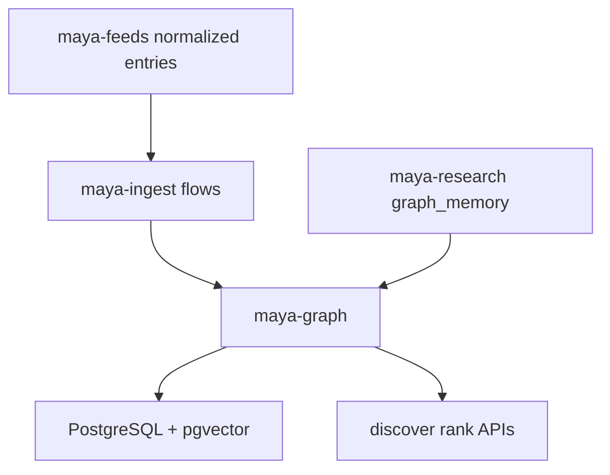

# Maya Graph

`packages/maya-graph/` provides **entity resolution and property-graph helpers** for the Maya platform. When ingest pipelines ([[Packages/Maya Feeds]], [[Platform/Maya Ingest]]) import artists, channels, videos, and cross-references, the graph layer deduplicates names, links aliases, and stores relationships queryable by discover and research features.

The package is marked **generic + public-safe** in its `pyproject.toml` description: it operates on public metadata rather than operator-private content.

## Responsibilities

| Capability | Description |
|------------|-------------|
| Entity resolution | Fuzzy matching (`rapidfuzz`) to merge "Artist A" with "artist-a-official" |
| Graph writes | Persist nodes and edges for discover ranking and research memory |
| Query helpers | Fetch neighborhoods, resolve external IDs to canonical entities |
| Async Postgres | Uses `asyncpg` for high-throughput ingest workers |

## Architecture



Research runs ([[Packages/Maya Research]]) write structured findings into graph memory via `maya_research/storage/graph_writer.py`, which delegates entity linking to graph helpers.

## Package layout

```
packages/maya-graph/
├── pyproject.toml
└── src/maya_graph/
    ├── __init__.py
    ├── resolve.py           # fuzzy entity matching
    ├── store.py             # graph persistence
    └── query.py             # read paths for APIs
```

Exact module names may vary — inspect `src/maya_graph/` for the current API surface.

## Dependencies

```toml
dependencies = [
    "maya-contracts",
    "rapidfuzz>=3.6",
    "asyncpg>=0.29",
]
```

Contracts define knowledge graph DTOs in `maya_contracts/knowledge.py` consumed by gateway intel routes (`/api/intel/*`).

## How entity resolution works

1. **Ingest** delivers a normalized feed entry with provisional entity labels (channel title, uploader name).
2. **Resolver** compares against existing graph nodes using fuzzy string similarity above a configurable threshold.
3. **Merge or create**: high-confidence matches attach the entry to an existing node ID; low-confidence matches create a new node flagged for later review.
4. **Edges** link entries to entities (e.g., `video → channel → artist`).

This prevents discover feeds from fragmenting the same creator across dozens of duplicate cards.

## Configuration

| Variable | Default | Description |
|----------|---------|-------------|
| `DATABASE_URL` | *(required)* | Postgres with pgvector for embedding-backed links |
| Fuzzy thresholds | code defaults | Tune in graph module constants |

Ensure Postgres has:

```sql
CREATE EXTENSION IF NOT EXISTS vector;
```

See [[Packages/Maya DB]] for migration requirements.

## HTTP consumers

Graph data is not exposed as a standalone REST prefix — it backs:

- `/api/discover/*` — ranked items with resolved entities
- `/api/intel/*` — intel cards referencing graph nodes
- `/api/follow/*` — follow relationships
- Research artifact exports

## Troubleshooting

**Duplicate entities in discover UI**

Lower fuzzy thresholds may fail to merge similar names; raise them carefully to avoid over-merging distinct artists. Inspect graph write logs during ingest.

**pgvector dimension mismatch**

Embedding models used by research must match column dimension in migrations. Re-embed after model changes.

**Slow ingest after graph enabled**

Batch graph writes in ingest flows; verify indexes on external ID columns exist post-migration.

**Module not found during ingest**

Install workspace packages: `uv sync --all-packages`.

## Related documentation

- [[Packages/Maya Feeds]] — upstream normalized entries
- [[Platform/Maya Ingest]] — batch graph write trigger
- [[Packages/Maya Research]] — graph memory during research runs
- [[Platform/Maya Gateway]] — discover and intel routes
