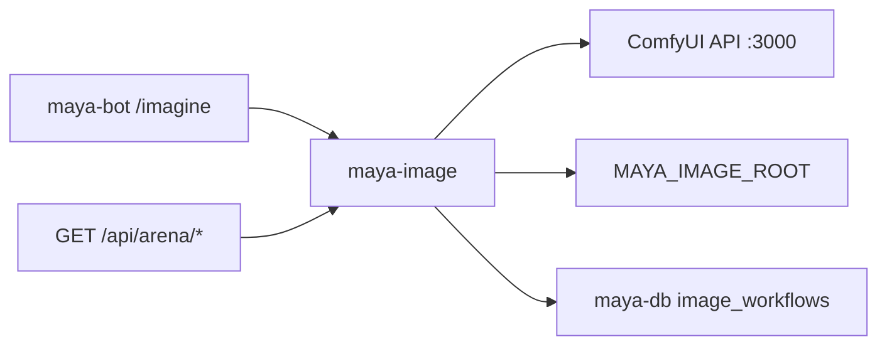

# Maya Image

`packages/maya-image/` provides **image generation orchestration** for Maya Unified: local ComfyUI workflow execution, optional hosted providers (fal.ai, Ideogram), output path management, and arena battle pairing for blind A/B comparisons. It backs both the Discord `/imagine` command in [[Platform/Maya Bot]] and platform arena APIs mounted through [[Platform/Maya Gateway]].

## Role in the stack



The package depends on [[Packages/Maya DB]] for workflow registry rows (`image_workflows`, `arena_candidates`, `arena_votes`) and on `arena-core` for ELO rating math shared with the bot.

## Package structure

```
packages/maya-image/
├── pyproject.toml
└── src/maya_image/
    ├── cli.py                 # maya-image CLI entry point
    ├── providers/             # ComfyUI + optional hosted backends
    ├── workflows/             # workflow name → ComfyUI graph mapping
    └── ...                    # job queue, output normalization
```

Console script:

```bash
uv run maya-image --help
```

## Configuration

| Variable | Default | Description |
|----------|---------|-------------|
| `COMFYUI_API_URL` | `http://localhost:3000` | Base URL for comfyui-api wrapper |
| `MAYA_IMAGE_ROOT` | `./data/outputs/maya-image` | Local directory for rendered PNGs |
| `MAYA_ARENA_PAIR` | seeded workflow names | Comma-separated arena opponents |
| `MAYA_ARENA_SIZE` | `512x512` | Normalized panel size for A/B layout |
| `MAYA_ENABLE_HOSTED_PROVIDERS` | `0` | Enable fal/Ideogram when `1` |
| `HF_TOKEN` | *(optional)* | Hugging Face downloads for weight fetch scripts |

Discord bot-specific variables are documented in [[Platform/Maya Bot]].

Settings panel integration: the unified dashboard can store `discord.comfyui_url` (default `http://localhost:3000`) for in-agent imagine tools — see `DEFAULT_SETTINGS.discord` in `services/settings/schema.py`.

## ComfyUI integration

Local generation expects the ComfyUI stack described in [[Operations/ComfyUI]]:

1. ComfyUI node server (GPU)
2. `comfyui-api` HTTP wrapper on port 3000
3. Downloaded workflow weights via Makefile targets in `infra/comfyui/`

The image package submits workflow JSON to the API, polls for completion, and writes normalized files under `MAYA_IMAGE_ROOT`. Failures surface as structured errors to the bot or HTTP client with HTTP status from ComfyUI preserved where possible.

## Arena flow

When `/imagine mode:Arena` runs ([[Platform/Maya Bot]]):

1. Select two workflows from `image_workflows` where `is_arena_candidate=true` (seeded defaults: Z-Image Turbo vs Krea 2 Turbo).
2. Render both at `MAYA_ARENA_SIZE`, cover-crop for side-by-side presentation.
3. Collect votes (A / B / Tie) into `arena_votes`.
4. Update ELO on `arena_candidates` when the battle completes.

Tune pairing with `MAYA_ARENA_PAIR=z-image-turbo-t2i,krea2-turbo-t2i`.

## Optional extras

`pyproject.toml` defines optional dependency groups:

```bash
# Hosted fal.ai provider
uv sync --extra hosted --package maya-image

# Redis-backed job queue
uv sync --extra redis --package maya-image
```

Self-hosted ComfyUI path does not require these extras.

## Troubleshooting

**ComfyUI 404 or connection timeout**

Verify `COMFYUI_API_URL` matches the running comfyui-api instance. Run weight fetch targets (`make fetch-zimage`, `make fetch-krea2`) per `infra/comfyui/README.md`.

**Generated files missing on disk**

Check `MAYA_IMAGE_ROOT` permissions and disk space. The gateway process user must write to this path.

**Arena shows duplicate or empty panels**

Confirm two distinct `is_arena_candidate` workflows exist in the database after migrations and seed scripts.

**Hosted provider errors**

Set `MAYA_ENABLE_HOSTED_PROVIDERS=1` and provider API keys. Without keys, the package falls back to ComfyUI-only mode.

## Related documentation

- [[Operations/ComfyUI]] — infrastructure setup
- [[Platform/Maya Bot]] — Discord `/imagine` user guide
- [[Packages/Maya DB]] — arena table schema
- [[Operations/Optional Services]] — enabling image features
