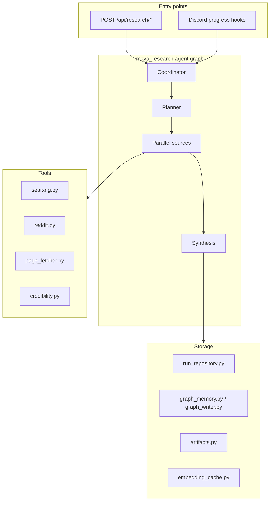

# Maya Research

`packages/maya-research/` implements a **LangGraph-based research agent** that plans multi-step investigations, fetches sources in parallel, scores credibility, and synthesizes findings into persistent artifacts. It powers deep-dive queries exposed through platform routes when the full Maya stack is enabled — distinct from the conversational voice agent in [[Voice Runtime]], which handles real-time dialogue rather than long-running research jobs.

## Architecture



## Package layout

```
packages/maya-research/
├── pyproject.toml
├── src/maya_research/
│   ├── runner.py              # orchestrates graph execution
│   ├── config.py              # research-specific env/config
│   ├── agent/
│   │   └── state.py           # LangGraph state schema
│   ├── tasks/
│   │   └── llm.py             # LLM calls for planner/synthesis
│   ├── tools/
│   │   ├── searxng.py         # SearXNG meta-search
│   │   ├── reddit.py          # Reddit source adapter
│   │   ├── page_fetcher.py    # HTTP fetch + optional trafilatura extract
│   │   └── credibility.py     # source scoring heuristics
│   ├── storage/
│   │   ├── run_repository.py  # Postgres run persistence
│   │   ├── graph_memory.py    # entity graph writes
│   │   ├── graph_writer.py
│   │   ├── artifacts.py       # file artifacts on disk
│   │   └── embedding_cache.py
│   └── discord/
│       └── progress.py        # Discord status updates during runs
└── tests/
```

## Dependencies

| Package | Role |
|---------|------|
| [[Packages/Maya Contracts]] | `research.py` request/response DTOs |
| [[Packages/Maya DB]] | Run rows, job status in Postgres |
| [[Packages/Maya Graph]] | Entity linking and graph memory |
| `langgraph>=0.2` | Graph execution engine |
| `httpx` | Async HTTP for tools |

Optional `[extract]` extra installs `trafilatura` for cleaner page text extraction:

```bash
uv sync --extra extract --package maya-research
```

## How a research run works

1. **Route handler** in `apps/maya-gateway/src/maya_gateway/routes/research.py` accepts a create request validated against `maya_contracts.research` types.
2. **Runner** (`runner.py`) initializes graph state with the operator query and scope constraints.
3. **Planner** decomposes the query into sub-questions and selects tool strategies (web search, Reddit, direct URL fetch).
4. **Parallel sources** execute tool calls concurrently; results pass through **credibility** scoring.
5. **Synthesis** merges evidence into a structured answer and optional citations.
6. **Storage** persists the run record, graph edges via [[Packages/Maya Graph]], and downloadable artifacts under the configured output root.

Progress events can stream to Discord when a bot context is attached (`discord/progress.py`).

## Configuration

Research behavior inherits LLM settings from the platform gateway environment. Typical variables:

| Variable | Default | Description |
|----------|---------|-------------|
| `DATABASE_URL` | *(required)* | Postgres for run persistence |
| `SEARXNG_URL` | varies | Base URL for SearXNG instance if used |
| Platform LLM env | see [[Voice Runtime/LLM]] | Planner/synthesis model endpoints |

Check `src/maya_research/config.py` for package-local defaults and overrides.

## HTTP surface

When platform routes mount successfully, research endpoints live under:

```
/api/research/*
```

See [[Reference/API]] for the full prefix list alongside arena, discover, and registry routes.

## Testing

```bash
cd packages/maya-research
uv run pytest
```

Tests cover planner output shape, credibility heuristics, graph memory writes, and operator history isolation (`tests/test_operator_history.py`).

## Troubleshooting

**Research routes return 503 or fail to import**

Ensure `uv sync --all-packages` completed and gateway logs show `mounted platform routes`. Missing `langgraph` or workspace packages prevent router registration.

**Runs stuck in "planning"**

Verify the configured LLM endpoint responds to chat completions — same diagnostics as Settings → Reasoning health check ([[Services/Settings Store]] `/api/voice/settings/health`).

**Empty synthesis despite successful fetches**

Check SearXNG availability and whether `trafilatura` is installed for JS-heavy pages. Reddit tool may rate-limit without proper credentials.

**Graph memory not linking entities**

Confirm [[Packages/Maya Graph]] migrations applied and `pgvector` extension enabled in Postgres.

## Related documentation

- [[Platform/Maya Gateway]] — route mounting and service wiring
- [[Packages/Maya Graph]] — entity resolution downstream of research
- [[Packages/Maya Contracts]] — public research API shapes
- [[Operations/Optional Services]] — when to enable the full platform stack
