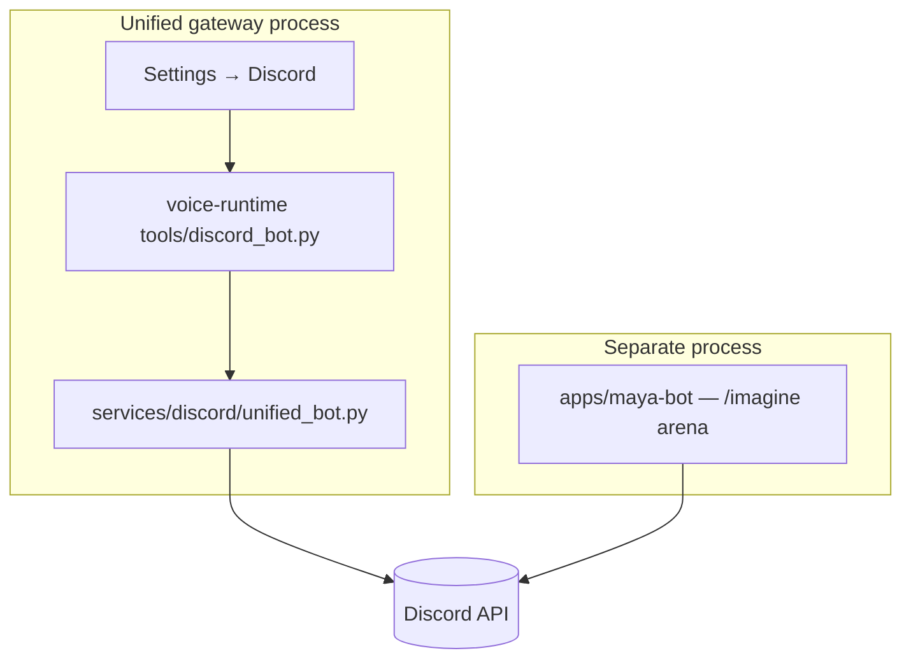

# Discord Integration

Maya Unified exposes **two independent Discord surfaces** that operators often conflate. Understanding which process owns which capability prevents misconfigured tokens, duplicate bot instances, and "bot online but no voice" support tickets.

## Two surfaces



| Surface | Entry | Primary features |
|---------|-------|------------------|
| **Voice Discord tools** | Unified gateway (`python launch.py`) | Join voice channels, music playback, auto-reply, optional in-agent imagine |
| **Maya Bot** | `uv run maya-bot` | Slash `/imagine`, arena ELO, ComfyUI battles |

See [[Platform/Maya Bot]] for the standalone bot and [[Voice Runtime/Memory and Tools]] for agent tool behavior.

## Voice Discord configuration

Settings persist under the `discord` section in unified settings (`services/settings/schema.py`) and map to voice-runtime `CONFIG` on reload.

| Setting key | Env mirror | Default | Description |
|-------------|------------|---------|-------------|
| `discord.enabled` | `VA_DISCORD_ENABLED` | `false` | Master switch for Discord tools |
| `discord.token` | `VA_DISCORD_TOKEN` | `""` | Bot token |
| `discord.guild_id` | `VA_DISCORD_GUILD_ID` | `""` | Target guild (string snowflake) |
| `discord.auto_reply` | `VA_DISCORD_AUTO_REPLY` | `true` | Reply in text channels when addressed |
| `discord.attach_voice` | — | `true` | Attach TTS audio to replies |
| `discord.music_volume` | — | `0.85` | Playback volume for music tool |
| `discord.imagine_enabled` | — | `false` | In-agent image generation via ComfyUI |
| `discord.comfyui_url` | — | `http://localhost:3000` | ComfyUI API for imagine tool |
| `discord.voice_channel_aliases` | — | `{}` | Friendly names → channel IDs |
| `discord.default_voice_channel` | — | `""` | Default join target |
| `discord.youtube_cookies_browser` | — | `""` | yt-dlp cookie source browser |
| `discord.youtube_cookies_file` | — | `""` | Path to cookies.txt for YouTube |

Example `.env` bootstrap:

```env
VA_DISCORD_ENABLED=1
VA_DISCORD_TOKEN=your-bot-token
VA_DISCORD_GUILD_ID=123456789012345678
VA_DISCORD_AUTO_REPLY=1
```

When a token is saved via the dashboard and `enabled` was false, the settings store auto-enables Discord (`services/settings/store.py`).

## discord-shim workspace member

`apps/discord-shim/` is a lightweight workspace package for Discord protocol shims or testing utilities used during development. It is listed in `[tool.uv.workspace].members` but is not the production bot — production slash commands live in [[Platform/Maya Bot]], and voice features patch the agent via `services/discord/patch_agent.py` and `services/discord/unified_bot.py`.

## How voice Discord starts

1. Operator enables Discord in **Settings → Discord** and saves token/guild ID.
2. [[Services/Voice Hub]] applies settings patch; `discord` section changes trigger agent reload (`_RELOAD_SECTIONS` in `hub.py`).
3. `unified_bot.py` connects discord.py client, registers voice/music handlers.
4. Agent tools (`tools/discord_bot.py`) expose join, play, search, and messaging to the LLM tool loop.

Music playback may use `yt-dlp` with optional cookie files for age-restricted content. Install **FFmpeg** on the host ([[Getting Started/Prerequisites]]).

## Permissions checklist

Discord Developer Portal → Bot → Privileged Gateway Intents:

- Message Content Intent (if auto-reply reads channel text)
- Server Members Intent (optional, for mentions)

OAuth2 URL generator scopes for voice bot:

- `bot`, `applications.commands`
- Permissions: Connect, Speak, Send Messages, Embed Links, Use Voice Activity

For [[Platform/Maya Bot]], only `applications.commands` and send/embed permissions are required — no voice Connect.

## Troubleshooting

**Bot online but agent says Discord unavailable**

Check `discord.enabled` and token validity. Inspect `/api/voice/agent/tools-status` for Discord subsystem state.

**Cannot join voice channel**

Verify bot role has Connect/Speak in target channel. Set `discord.default_voice_channel` or teach the agent channel aliases.

**YouTube playback fails**

Install FFmpeg. Configure `youtube_cookies_browser` or `youtube_cookies_file` for restricted videos.

**Two bots conflicting**

Use **different tokens** for maya-bot vs voice Discord, or run only one surface. Same token in two processes causes gateway disconnect loops.

**Guild ID not sticking**

Guild IDs must be strings in settings JSON — the store normalizes numeric JSON to string to avoid JavaScript precision loss on snowflakes.

## Related documentation

- [[Platform/Maya Bot]] — `/imagine` arena bot
- [[Voice Runtime/Memory and Tools]] — Discord agent tools
- [[Operations/Optional Services]] — optional Discord features
- [[Configuration/Environment Variables]] — `VA_DISCORD_*` reference
