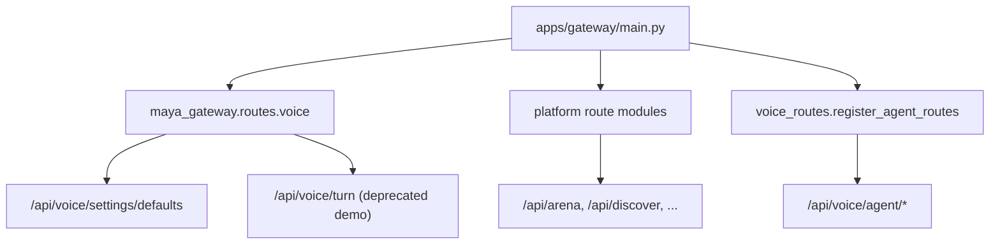

# Maya Gateway

`apps/maya-gateway/` is the **platform API layer** for Maya Unified: arena battles, music discovery, research orchestration, content registry, notifications, and the voice SDK defaults endpoint. It ships as a Python package (`maya_gateway`) whose routers are **mounted into** the unified FastAPI app at `apps/gateway/main.py` when the full workspace is installed.

Voice agent control lives separately under `/api/voice/agent/*` ([[Services/Voice Hub]]). Platform routes add `/api/arena`, `/api/discover`, `/api/research`, and related prefixes without replacing the voice pipeline.

## Mounting behavior



`_mount_platform_routes()` in `main.py` imports and registers these modules:

| Module | Prefix | Tag |
|--------|--------|-----|
| `health` | `/api/status` | status |
| `arena` | `/api/arena` | arena |
| `music` | `/api/music` | music |
| `music_query` | `/api/music/query` | music_query |
| `registry` | `/api/registry` | registry |
| `feeds` | `/api/feeds` | feeds |
| `intel` | `/api/intel` | intel |
| `follow` | `/api/follow` | follow |
| `notifications` | `/api/notifications` | notifications |
| `discover` | `/api/discover` | discover |
| `discover_inbox` | `/api/discover` | discover-inbox |
| `research` | `/api/research` | research |

If imports fail (typically missing `uv sync --all-packages`), the gateway logs `platform routes unavailable (run uv sync)` and continues serving voice + dashboard features.

## Package structure

```
apps/maya-gateway/
├── pyproject.toml
└── src/maya_gateway/
    ├── routes/           # FastAPI routers (listed above)
    ├── services/         # business logic — research_service, discover_rank, etc.
    └── static/
        ├── sdk/          # voice SDK assets mounted at /sdk
        └── gateway/      # imagine-app static UI
```

Services under `maya_gateway/services/` keep routes thin: for example `research_service.py` delegates to [[Packages/Maya Research]], `discover_rank.py` consumes [[Packages/Maya Graph]] query helpers.

## Requirements

| Requirement | Reason |
|-------------|--------|
| PostgreSQL + migrations | Arena, registry, research runs, discover persistence |
| `uv sync --all-packages` | Workspace packages `maya-*` and gateway deps |
| Optional ComfyUI | Image/arena generation via [[Packages/Maya Image]] |

Operator auth ([[Services/Operator Auth]]) gates dashboard HTML and `/api/voice/agent/*`, but many platform routes expect their own auth patterns from the original maya-public design — consult [[Reference/API]] for per-prefix auth rules.

## Voice SDK routes

`maya_gateway.routes.voice` mounts at `/api/voice` **before** agent routes:

- `GET /api/voice/settings/defaults` — returns [[Packages/Maya Contracts]] `OperatorVoiceSettings` defaults for SDK fixtures
- `POST /api/voice/turn` — **deprecated** offline stub for kitchen-sink demos; production chat uses `POST /api/voice/agent/chat`

Static SDK files serve from `/sdk` when `apps/maya-gateway/src/maya_gateway/static/sdk` exists.

## Configuration

Platform features inherit env from repo root `.env`:

| Variable | Default | Description |
|----------|---------|-------------|
| `DATABASE_URL` | *(required)* | Async Postgres DSN |
| `COMFYUI_API_URL` | `http://localhost:3000` | Image backend |
| `DISCORD_TOKEN` | *(optional)* | Platform bot — see [[Platform/Maya Bot]] |
| `PORT` | `8090` | Unified gateway listen port |

Unified settings may store `platform.database_url` and `platform.otel_enabled` — see `services/settings/schema.py`.

## How it differs from unified gateway

| Component | Path | Role |
|-----------|------|------|
| Unified gateway | `apps/gateway/` | Process entry, auth middleware, dashboard HTML, voice agent routes |
| Maya gateway package | `apps/maya-gateway/` | Platform API routers + SDK static assets |

There is a single Uvicorn process (`python launch.py` → `apps.gateway.main:app`). The maya-gateway package is a library of routers, not a separate server.

## Troubleshooting

**Log line: `platform routes unavailable`**

Run `uv sync --all-packages` from repo root. Verify `apps/maya-gateway` is listed in `[tool.uv.workspace].members`.

**Arena/discover 500 with DB errors**

Apply [[Packages/Maya DB]] migrations. Confirm `DATABASE_URL` uses the `asyncpg` driver for gateway async sessions.

**Voice SDK defaults 404**

Check `mounted voice SDK /api/voice routes` appears in logs. Import failures in `maya_contracts` block SDK mount.

**Duplicate route prefixes**

`discover` and `discover_inbox` share `/api/discover` — FastAPI merges routers; path conflicts are resolved by specific route paths within each module.

## Related documentation

- [[Apps/Unified Gateway]] — main FastAPI app and auth middleware
- [[Packages/Overview]] — domain packages behind platform routes
- [[Reference/API]] — complete HTTP prefix reference
- [[Operations/Optional Services]] — enabling platform features
