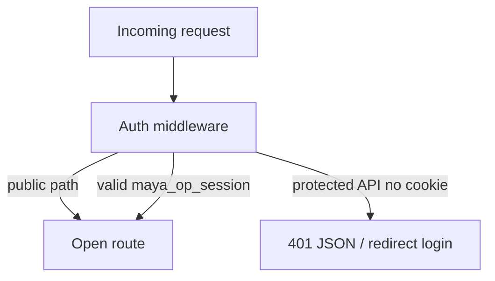

# HTTP API Reference

The unified gateway (`apps/gateway/main.py`) exposes a single OpenAPI document at `/openapi.json`. Interactive explorers: `/docs` (Swagger UI) and `/redoc` (ReDoc).

Base URL default: `http://localhost:8090`. Set `PORT` env to change listen port.

## Authentication overview

| Auth class | Behavior |
|------------|----------|
| **Operator session** | Cookie `maya_op_session` — most `/api/voice/*`, `/api/admin/*`, `/api/operators/*` |
| **Setup exception** | `POST /api/operators` allowed when no operators exist |
| **Open auth** | `/api/auth/login`, `/api/auth/logout`, `/api/auth/me`, platform auth status/login |
| **Guest room** | `/api/rooms/{slug}/join`, messages, chat, events — guest token rules |
| **Public** | `/health`, `/docs`, static `/dashboard`, `/sdk` |

Banned operators: **403** on APIs, redirect on HTML.

See [[Services/Operator Auth]] and [[Architecture/Request Pipeline]].

---

## Health and static

| Method | Path | Auth | Description |
|--------|------|------|-------------|
| `GET` | `/health` | open | `{"ok": true, "service": "maya-unified"}` |
| `GET` | `/` | guarded HTML | Conversation dashboard |
| `GET` | `/settings`, `/memory`, `/animations` | guarded HTML | Dashboard pages |
| `GET` | `/login`, `/setup` | open HTML | Auth pages |
| `GET` | `/rooms`, `/room/{slug}` | mixed | Room UI |
| `GET` | `/admin/users`, `/admin/workspaces` | guarded HTML | Admin panels |
| `*` | `/dashboard/*` | open static | JS/CSS assets |
| `*` | `/sdk/*` | open static | Voice SDK assets |

---

## Operator auth — `auth_routes.py`

| Method | Path | Auth | Description |
|--------|------|------|-------------|
| `GET` | `/api/auth/me` | open | Current operator or `setup_required` |
| `POST` | `/api/auth/login` | open | Login → set session cookie |
| `POST` | `/api/auth/logout` | open | Clear session cookie |
| `GET` | `/api/operators` | admin | List operators |
| `POST` | `/api/operators` | admin / setup | Create operator |
| `PATCH` | `/api/operators/{operator_id}` | admin / self | Update operator |
| `DELETE` | `/api/operators/{operator_id}` | admin | Delete operator |

---

## Admin — prefix `/api/admin`

Router: `apps/gateway/admin_routes.py`

| Method | Path | Description |
|--------|------|-------------|
| `GET` | `/api/admin/workspaces` | Cross-operator workspace summary |
| `GET` | `/api/admin/operators/{id}/conversation` | Fetch operator conversation |
| `DELETE` | `/api/admin/operators/{id}/conversation` | Clear conversation |
| `GET` | `/api/admin/operators/{id}/personalities` | List personalities |
| `DELETE` | `/api/admin/operators/{id}/personalities/{slug}` | Delete personality |
| `POST` | `/api/admin/operators/{id}/personalities/{slug}/flag` | Flag personality |
| `POST` | `/api/admin/operators/{id}/ban` | Ban operator |
| `POST` | `/api/admin/operators/{id}/unban` | Unban operator |

---

## Unified settings — prefix `/api/voice/settings`

Router: `apps/gateway/settings_routes.py`

| Method | Path | Description |
|--------|------|-------------|
| `GET` | `/api/voice/settings` | Effective settings JSON |
| `GET` | `/api/voice/settings/catalog` | UI catalog (models, voices, modes) |
| `POST` | `/api/voice/settings/health` | LLM health probe |
| `POST` | `/api/voice/settings` | Patch settings body |

---

## Voice agent — prefix `/api/voice/agent`

Router: `apps/gateway/voice_routes.py` → [[Services/Voice Hub]]

### Session and status

| Method | Path | Description |
|--------|------|-------------|
| `GET` | `/api/voice/agent/status` | Ready state, LLM health, lease, capabilities |
| `GET` | `/api/voice/agent/conversation` | Transcript snapshot |
| `GET` | `/api/voice/agent/events` | SSE event stream |
| `POST` | `/api/voice/agent/start` | Start voice session (operator lease) |
| `POST` | `/api/voice/agent/stop` | Stop session / release lease |
| `GET` | `/api/voice/agent/spectrum` | Playback level / spectrum |

### Chat and TTS

| Method | Path | Description |
|--------|------|-------------|
| `POST` | `/api/voice/agent/chat` | Text chat turn `{ "text": "..." }` |
| `POST` | `/api/voice/agent/speak` | Speak with optional instruct |
| `POST` | `/api/voice/agent/tts` | WAV response (cached) |
| `POST` | `/api/voice/agent/tts/stream` | Streaming WAV frames |

### Config (runtime agent config, distinct from settings store)

| Method | Path | Description |
|--------|------|-------------|
| `GET` | `/api/voice/agent/config` | Agent config snapshot |
| `POST` | `/api/voice/agent/config` | Patch agent config |

### WebLLM browser bridge

| Method | Path | Description |
|--------|------|-------------|
| `POST` | `/api/voice/agent/webllm/ready` | Browser model loaded ping |
| `POST` | `/api/voice/agent/webllm/fulfill` | Streaming token fulfillment |

### Personalities

| Method | Path | Description |
|--------|------|-------------|
| `GET` | `/api/voice/agent/personalities` | List personalities |
| `POST` | `/api/voice/agent/personalities/activate` | Activate by id |
| `POST` | `/api/voice/agent/personalities/save` | Save personality |
| `POST` | `/api/voice/agent/personalities/delete` | Delete by id |
| `POST` | `/api/voice/agent/personalities/import` | JSON import |
| `POST` | `/api/voice/agent/personalities/import-png` | PNG character card import |
| `POST` | `/api/voice/agent/personalities/build` | LLM build from prompt |
| `GET` | `/api/voice/agent/personalities/export?id=` | Export personality |

### Memory and tools

| Method | Path | Description |
|--------|------|-------------|
| `GET` | `/api/voice/agent/memory` | Memory subsystem status |
| `POST` | `/api/voice/agent/memory-edit` | Edit memory entry |
| `POST` | `/api/voice/agent/memory-approve` | Approve pending write |
| `POST` | `/api/voice/agent/memory-reject` | Reject pending write |
| `POST` | `/api/voice/agent/session-search` | Search session history |
| `GET` | `/api/voice/agent/memory-explore` | Paginated memory DB explore |
| `GET` | `/api/voice/agent/memory-skill?name=` | Read skill markdown |
| `GET` | `/api/voice/agent/tools-status` | Tool availability |
| `GET` | `/api/voice/agent/vts-status` | VTube Studio status |
| `POST` | `/api/voice/agent/vts-map` | Expression map |
| `POST` | `/api/voice/agent/vts-test` | Test expression |

### Voices, VRM, animations

| Method | Path | Description |
|--------|------|-------------|
| `GET` | `/api/voice/agent/voices` | List reference voices |
| `POST` | `/api/voice/agent/select-voice` | Select voice file |
| `POST` | `/api/voice/agent/upload-voice` | Upload reference audio (max 30 MB) |
| `GET` | `/api/voice/agent/vrm/models` | List VRM models |
| `GET` | `/api/voice/agent/vrm/file?name=` | Download VRM |
| `POST` | `/api/voice/agent/upload-vrm` | Upload VRM (max 120 MB) |
| `GET` | `/api/voice/agent/animations` | List animations + catalog |
| `PATCH` | `/api/voice/agent/animation/meta` | Update animation manifest |
| `POST` | `/api/voice/agent/upload-animation` | Upload FBX/VRMA (max 80 MB) |
| `DELETE` | `/api/voice/agent/animation?name=` | Delete animation |
| `GET` | `/api/voice/agent/animation/file?name=` | Download animation file |

---

## Voice SDK — prefix `/api/voice`

Router: `apps/maya-gateway/src/maya_gateway/routes/voice.py`

| Method | Path | Auth | Description |
|--------|------|------|-------------|
| `GET` | `/api/voice/settings/defaults` | open | Contract defaults for SDK fixtures |
| `POST` | `/api/voice/turn` | open | **Deprecated** offline demo stub |

Production chat uses `/api/voice/agent/chat`.

---

## Voice rooms — prefix `/api/rooms`

Router: `apps/gateway/room_routes.py`

| Method | Path | Auth | Description |
|--------|------|------|-------------|
| `POST` | `/api/rooms` | operator | Create room |
| `GET` | `/api/rooms` | operator | List operator rooms |
| `GET` | `/api/rooms/{slug}` | guest/operator | Room metadata |
| `PATCH` | `/api/rooms/{slug}` | operator | Update room settings |
| `POST` | `/api/rooms/{slug}/join` | guest | Join as guest speaker |
| `POST` | `/api/rooms/{slug}/leave` | guest | Leave room |
| `GET` | `/api/rooms/{slug}/messages` | guest | Message history |
| `POST` | `/api/rooms/{slug}/chat` | guest | Send chat message |
| `GET` | `/api/rooms/{slug}/queue` | guest | Voice queue state |
| `POST` | `/api/rooms/{slug}/queue/request` | guest | Request mic |
| `POST` | `/api/rooms/{slug}/queue/release` | guest | Release mic |
| `GET` | `/api/rooms/{slug}/events` | guest | Room SSE stream |

---

## Platform auth — Google login

Router: `apps/gateway/platform_auth_routes.py`

| Method | Path | Description |
|--------|------|-------------|
| `GET` | `/api/platform/auth/status` | OAuth configured + providers |
| `GET` | `/api/platform/auth/login/{provider}` | Start OAuth (google) |
| `GET` | `/api/platform/auth/callback/google` | OAuth callback |
| `GET` | `/auth/google/callback` | Legacy callback alias |

---

## Google integrations

Router: `apps/gateway/google_integrations_routes.py` — see [[Services/Google Integrations]]

| Method | Path | Description |
|--------|------|-------------|
| `GET` | `/api/integrations/google/status` | Connection status |
| `GET` | `/api/integrations/google/connect` | Start connect flow |
| `GET` | `/api/integrations/google/callback` | Connect callback |
| `DELETE` | `/api/integrations/google` | Disconnect |
| `GET` | `/api/services/email/inboxes` | Gmail threads |
| `GET` | `/api/services/calendar/events` | Calendar events |

---

## Platform routes (optional — `uv sync --all-packages`)

Mounted by `_mount_platform_routes()` in `main.py` from `apps/maya-gateway/src/maya_gateway/routes/`:

| Prefix | Module | Domain |
|--------|--------|--------|
| `/api/status` | `health` | Platform health |
| `/api/arena` | `arena` | Image arena battles |
| `/api/music` | `music` | Music catalog |
| `/api/music/query` | `music_query` | Music search |
| `/api/registry` | `registry` | Content registry |
| `/api/feeds` | `feeds` | Feed adapters API |
| `/api/intel` | `intel` | Intel cards |
| `/api/follow` | `follow` | Follow graph |
| `/api/notifications` | `notifications` | Notifications |
| `/api/discover` | `discover`, `discover_inbox` | Discover feed + inbox |
| `/api/research` | `research` | Research runs |

If imports fail, gateway logs `platform routes unavailable (run uv sync)` and continues without these prefixes.

---

## Error codes

| Code | Typical cause |
|------|---------------|
| 401 | Missing or invalid `maya_op_session` on protected API |
| 403 | Banned operator or insufficient role |
| 503 | Agent/TTS not ready, OAuth schema missing, Google not configured |
| 422 | Pydantic validation failure — check `/docs` schema |

---

## Related documentation

- [[Services/Voice Hub]] — agent route implementation
- [[Services/Settings Store]] — `/api/voice/settings`
- [[Operations/Google OAuth]] — Google routes setup
- [[Platform/Maya Gateway]] — platform prefix details
