# Google Integrations Service

`services/integrations/google/` implements **PKCE OAuth flows**, refresh token storage, and Gmail/Calendar read APIs for Maya Unified. Two flows share infrastructure but serve different purposes: **platform sign-in** (login page) and **app integration connect** (Settings → Integrations for an already-authenticated operator).

Full operator-facing setup lives in [[Operations/Google OAuth]]; this page documents service modules and gateway wiring.

## Module map

```
services/integrations/google/
├── config.py       # GOOGLE_CLIENT_ID, redirect URIs, dynamic host detection
├── oauth.py        # PKCE pair generation, state persistence, token exchange
├── scopes.py       # permission groups → Google OAuth scopes
├── token_store.py  # refresh tokens on disk (MAYA_GOOGLE_TOKEN_DIR)
├── service.py      # Gmail inbox threads, Calendar events
├── db_errors.py    # 503 when oauth tables missing
└── __init__.py
```

Gateway routes:

| File | Routes |
|------|--------|
| `apps/gateway/platform_auth_routes.py` | `/api/platform/auth/login/{provider}`, callbacks |
| `apps/gateway/google_integrations_routes.py` | connect, status, disconnect, service APIs |

Dashboard UI: `apps/dashboard/js/mayaIntegrations.js`.

## Dual-flow architecture

```mermaid
flowchart TB
    subgraph login["Platform sign-in flow"]
        L1["GET /api/platform/auth/login/google"]
        L2["oauth_pkce_states flow=login"]
        L3["/auth/google/callback"]
        L4["operator_google_identities"]
        L5["Set maya_op_session cookie"]
    end

    subgraph connect["Integration connect flow"]
        C1["GET /api/integrations/google/connect"]
        C2["oauth_pkce_states flow=connect"]
        C3["/api/integrations/google/callback"]
        C4["google_connections + token_store"]
        C5["Redirect /settings?tab=integrations"]
    end

    L1 --> L2 --> L3 --> L4 --> L5
    C1 --> C2 --> C3 --> C4 --> C5
```



Both flows use **PKCE S256** with short-lived state rows in Postgres (`oauth_pkce_states`). Authorization codes are single-use; stale back-button callbacks fail with "Invalid code verifier".

## Database tables

| Table | Purpose |
|-------|---------|
| `oauth_pkce_states` | Verifier, redirect_uri, flow type, operator_id (connect) |
| `operator_google_identities` | Google sub → operator_id for login |
| `google_connections` | Connected scopes metadata; tokens on disk |

Models: `packages/maya-db/src/maya_db/models/google_integration.py`.

Refresh token bytes never land in Postgres — `token_store.py` writes JSON files under `MAYA_GOOGLE_TOKEN_DIR` (default `.data/google-tokens`).

## Permission groups

`scopes.py` maps dashboard permission toggles to Google scopes:

| Permission | Scopes |
|------------|--------|
| `mailbox_read` | `gmail.readonly` |
| `mailbox_send` | `gmail.compose`, `gmail.send`, `gmail.modify` |
| `calendar_read` | `calendar.readonly` |
| `calendar_write` | `calendar` |

Connect URL: `GET /api/integrations/google/connect?permissions=mailbox_read,calendar_read`

Default when omitted: `mailbox_read,calendar_read`.

## Dynamic redirect URIs

When `MAYA_OAUTH_DYNAMIC_REDIRECT=1`, `redirect_uri_for_request()` builds callback URLs from the incoming Host header — useful behind dev proxies or alternate localhost ports. Google Cloud Console must register every variant ([[Operations/Google OAuth]] checklist).

Static overrides:

```env
GOOGLE_LOGIN_REDIRECT_URI=http://localhost:8090/auth/google/callback
GOOGLE_CONNECT_REDIRECT_URI=http://localhost:8090/api/integrations/google/callback
```

## Service APIs (post-connect)

| Method | Path | Description |
|--------|------|-------------|
| `GET` | `/api/integrations/google/status` | Connection state for current operator |
| `GET` | `/api/integrations/google/connect` | Start OAuth (session required) |
| `DELETE` | `/api/integrations/google` | Disconnect, delete tokens |
| `GET` | `/api/services/email/inboxes` | Gmail thread list |
| `GET` | `/api/services/calendar/events` | Calendar events |

All require valid `maya_op_session` except OAuth callbacks.

`service.py` raises `GoogleIntegrationError` for expired/revoked tokens — UI should prompt reconnect.

## Configuration

| Variable | Default | Description |
|----------|---------|-------------|
| `GOOGLE_CLIENT_ID` | *(required)* | OAuth client ID |
| `GOOGLE_CLIENT_SECRET` | *(required)* | OAuth client secret |
| `MAYA_APP_BASE_URL` | `http://localhost:8090` | Canonical app URL |
| `MAYA_OAUTH_DYNAMIC_REDIRECT` | `1` | Host-derived redirect URIs |
| `MAYA_GOOGLE_TOKEN_DIR` | `.data/google-tokens` | On-disk refresh tokens |
| `DATABASE_URL` | *(required)* | PKCE state + connection rows |

Verification script: `python scripts/verify_google_oauth.py` prints Console checklist with live redirect URIs.

## Error handling

`db_errors.raise_if_oauth_schema_missing()` converts missing tables into HTTP 503 with migration instructions — common when operators enable Google before running Alembic.

## Troubleshooting

**redirect_uri_mismatch**

Run verify script; add exact URI to Google Console Authorized redirect URIs.

**Invalid code verifier**

User must restart flow — codes and verifiers are one-shot.

**503 OAuth tables missing**

`cd packages/maya-db && uv run alembic upgrade head`

**Connect works but inbox empty**

Token scopes may lack `gmail.readonly` — disconnect and reconnect with `mailbox_read`.

**Login links wrong Google account**

Check `operator_google_identities` for prior link; admin may need to delete row for re-bind.

## Related documentation

- [[Operations/Google OAuth]] — Console setup and env template
- [[Services/Operator Auth]] — session cookie required for connect
- [[Packages/Maya DB]] — OAuth migrations
- [[Reference/API]] — full route list
