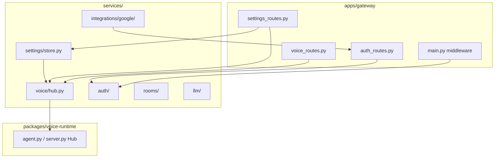

# Services

The `services/` directory at the repository root holds **cross-cutting Python modules** shared by the unified gateway (`apps/gateway/`), voice-runtime imports, and optional platform apps. Unlike workspace packages under `packages/`, services are installed as part of the root `maya-unified` wheel (`[tool.hatch.build.targets.wheel] packages = ["apps", "services"]`) and load without a separate `pip install`.

Services sit between HTTP routes and the voice engine: they translate operator sessions into scoped agent context, persist unified settings, broker WebLLM browser callbacks, and wrap Google OAuth.

## Architecture placement

## Service modules

| Service | Path | Doc |
|---------|------|-----|
| Voice Hub | `services/voice/hub.py` | [[Services/Voice Hub]] |
| Settings Store | `services/settings/` | [[Services/Settings Store]] |
| Operator Auth | `services/auth/` | [[Services/Operator Auth]] |
| Google Integrations | `services/integrations/google/` | [[Services/Google Integrations]] |
| Voice rooms | `services/rooms/` | Guest room logic (see [[Reference/API]] `/api/rooms`) |
| LLM adapters | `services/llm/` | Provider swap, WebLLM broker, health checks |
| Paths / env | `services/paths.py`, `env_loader.py` | Repo root resolution, `.env` loading |

## Design principles

**Single process, shared hub.** One `VoiceHub` singleton (`hub` export) owns the voice-runtime agent instance. All `/api/voice/agent/*` routes delegate to it rather than constructing agents per request.

**Operator scoping without forking runtime.** Per-operator data directories, personalities, and settings overlays live under `services/operator_voice/` while the underlying STT/TTS models remain singleton for GPU memory reasons.

**Settings as source of truth.** Dashboard changes write JSON settings; `apply_to_config()` pushes values into voice-runtime `CONFIG` in-process. Env vars seed defaults on first run via `seed_env_defaults()`.

**Auth before agent.** FastAPI middleware in `main.py` attaches `request.state.operator` before protected API handlers run. The hub receives operator IDs from routes, not from client-supplied body fields (except scoped admin paths).

## Related paths

| Path | Role |
|------|------|
| `services/voice/inference.py` | Global inference lock for TTS/STT |
| `services/voice/tts_cache.py` | WAV cache for `/tts` endpoints |
| `services/voice/data_migration.py` | One-time qwen3 → unified data move |
| `services/discord/` | Discord bot patching for unified process |
| `services/ids.py` | Correlation and message ID helpers |

## When to edit services vs packages

| Change | Location |
|--------|----------|
| New HTTP route or auth rule | `apps/gateway/` |
| Agent STT/TTS/LLM behavior | `packages/voice-runtime/` |
| Operator settings persistence | `services/settings/` |
| Per-operator file layout | `services/operator_voice/` |
| Platform business logic | `packages/maya-*`, `apps/maya-gateway/` |

See [[Development/Monorepo Conventions]] for the full decision table.

## Related documentation

- [[Architecture/Voice Hub Bridge]] — architectural view of hub layering
- [[Apps/Unified Gateway]] — HTTP entry point
- [[Packages/Overview]] — domain packages below services
- [[Reference/API]] — routes that call into services
