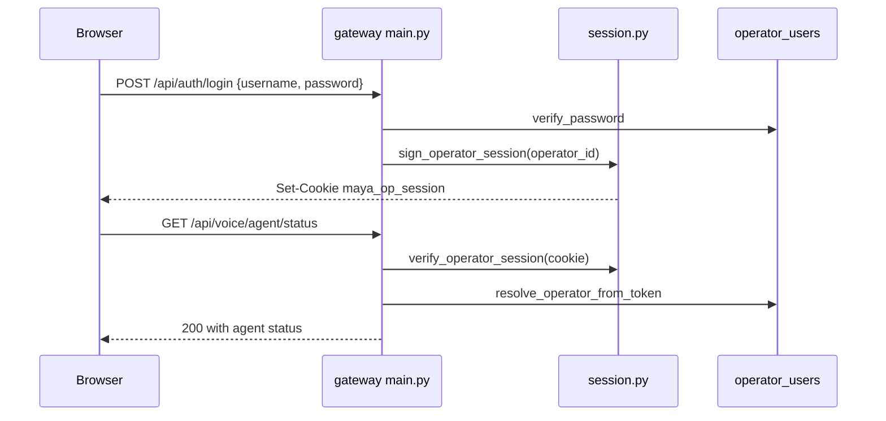

# Operator Auth Service

`services/auth/` implements **local operator authentication** for the Maya Unified dashboard: password hashing, signed session cookies, Postgres-backed user records, and FastAPI dependencies that gate protected routes. This is separate from Google platform sign-in ([[Operations/Google OAuth]]) and from legacy maya-public invite flows when the full platform stack is enabled.

## Module layout

```
services/auth/
├── session.py         # maya_op_session cookie sign/verify
├── passwords.py       # argon2 password hashing
├── operator_store.py  # CRUD on operator_users table
├── deps.py            # require_operator, require_admin, resolve_operator_from_token
├── scope.py           # scoped_operator_id for admin APIs
└── seed.py            # optional dev seed helpers
```

HTTP routes live in `apps/gateway/auth_routes.py` and `admin_routes.py`; middleware in `apps/gateway/main.py` enforces auth before HTML and JSON handlers.

## Session model



| Constant | Value | Description |
|----------|-------|-------------|
| `OPERATOR_SESSION_COOKIE` | `maya_op_session` | Cookie name (distinct from platform `maya_session`) |
| `OPERATOR_SESSION_MAX_AGE` | 14 days | Signed token TTL |
| Salt | `maya-operator-session` | itsdangerous salt |

Signing secret: `SESSION_SECRET` env, falling back to `SESSION_SECRET_FALLBACK` (`dev-insecure-change-me`) — **change in production** ([[Operations/Deployment]]).

`session_cookie_secure()` returns true when `SESSION_COOKIE_SECURE=1` for HTTPS deployments.

## Database model

Table `operator_users` in [[Packages/Maya DB]] (`models/operator.py`):

| Column | Purpose |
|--------|------|
| `id` | UUID primary key |
| `username` | Unique login name |
| `password_hash` | argon2 hash |
| `display_name` | UI display |
| `role` | `admin` or `operator` |
| `avatar_color` | Dashboard avatar |
| `is_banned` | Blocks login and APIs |

Roles validated by `validate_role()` in `operator_store.py`. Admins manage users via `/api/operators` and `/api/admin/*`.

## FastAPI dependencies

`services/auth/deps.py`:

| Dependency | Behavior |
|------------|----------|
| `require_operator` | 401 if no valid session; attaches operator |
| `require_admin` | 403 if role != admin |
| `resolve_operator_from_token` | Loads operator row from cookie payload |

Middleware `_attach_operator()` in `main.py` populates `request.state.operator` for routes that need soft auth (rooms).

## Auth middleware rules

Protected API prefixes (401 without session):

- `/api/admin/*`
- `/api/voice/*` (including agent and settings)
- `/api/operators/*` except `POST /api/operators` during setup
- `/api/rooms` GET/POST and PATCH on slug

Open API paths:

- `/api/auth/login`, `/api/auth/logout`, `/api/auth/me`
- `/api/platform/auth/status`, `/api/platform/auth/login`

HTML guarded paths redirect to `/login` or `/setup` when unauthenticated: `/`, `/memory`, `/settings`, `/animations`, `/admin`, `/rooms`.

Guest room APIs under `/api/rooms/{slug}/*` allow guest tokens — see [[Architecture/Request Pipeline]].

## HTTP routes (auth_routes.py)

| Method | Path | Auth | Description |
|--------|------|------|-------------|
| `GET` | `/api/auth/me` | open | Current operator or `setup_required` |
| `POST` | `/api/auth/login` | open | Username/password → cookie |
| `POST` | `/api/auth/logout` | open | Clears cookie |
| `GET` | `/api/operators` | admin | List operators |
| `POST` | `/api/operators` | admin/setup | Create operator |
| `PATCH` | `/api/operators/{id}` | admin/self | Update profile/password |
| `DELETE` | `/api/operators/{id}` | admin | Delete operator |

First-run setup: when no operators exist, `/setup` HTML creates the initial admin via `POST /api/operators` without prior auth.

## Password policy

`validate_password()` enforces minimum length and complexity rules in `operator_store.py`. Password changes require current password verification for self-service updates.

## Configuration

| Variable | Default | Description |
|----------|---------|-------------|
| `SESSION_SECRET` | *(fallback insecure)* | HMAC secret for cookie signing |
| `SESSION_COOKIE_SECURE` | `0` | Set `1` behind HTTPS reverse proxy |
| `DATABASE_URL` | *(required)* | Postgres for operator_users |

## Troubleshooting

**Redirect loop login ↔ dashboard**

Cookie not set — check `SESSION_COOKIE_SECURE` matches HTTP vs HTTPS. Verify browser allows cookies for localhost.

**401 on all /api/voice/* after login**

Clock skew rarely affects timed serializer; more often cookie `SameSite` blocked in embedded iframe. Use top-level navigation.

**setup_required forever**

Database empty or unreachable — run migrations; confirm `any_operators_exist()` query succeeds.

**403 account banned**

Admin must `POST /api/admin/operators/{id}/unban`.

**Default admin/admin still works**

Change password immediately in Settings → Account ([[Operations/Operator Auth]]).

## Related documentation

- [[Operations/Operator Auth]] — operator-facing guide
- [[Packages/Maya DB]] — schema and migrations
- [[Operations/Google OAuth]] — Google sign-in (parallel auth path)
- [[Reference/API]] — protected prefix list
