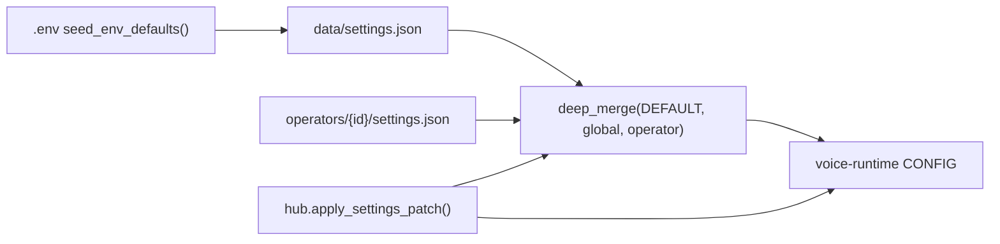

# Settings Store

The settings store (`services/settings/`) is Maya Unified's **persistence and application layer** for voice configuration. Dashboard toggles, reasoning LLM profiles, Discord tokens, TTS modes, and VRM preferences serialize to JSON on disk, merge with operator-specific overlays, and push into voice-runtime `CONFIG` without restarting the gateway process — except when TTS model weights change.

## Module layout

```
services/settings/
├── store.py      # load, save, apply_to_config, load_effective_settings
├── schema.py     # DEFAULT_SETTINGS document + deep_merge
└── catalog.py    # UI catalog lists (models, speakers, languages)
```

HTTP exposure: `apps/gateway/settings_routes.py` at prefix `/api/voice/settings`.

## Data paths

| File | Purpose |
|------|---------|
| `data/settings.json` | Global settings document |
| `data/operators/{operator_id}/settings.json` | Per-operator overlay (optional) |
| `.env` / `packages/voice-runtime/.env` | Bootstrap defaults via `seed_env_defaults()` |

`services/paths.py` defines `DATA_DIR` relative to repo root. Runtime never writes settings into `packages/voice-runtime/` except voice reference files under `voices/`.

## How effective settings resolve



`load_effective_settings(operator_id)` returns the merged view the dashboard displays. `load_settings()` returns global-only. Patches via `POST /api/voice/settings` route through `hub.apply_settings_patch()` so reload side effects (Discord reconnect, SSE broadcast) occur atomically with persistence.

## DEFAULT_SETTINGS sections

Defined in `services/settings/schema.py`:

| Section | Key defaults | Description |
|---------|--------------|-------------|
| `audio` | `output_sink: browser`, `eq_enabled: true` | Devices, volume, EQ preset |
| `detection` | `barge_mode: smart`, `detection_mode: vad` | VAD, barge-in, push-to-talk |
| `dictation` | `whisper_model: small.en`, `device: cuda` | STT engine |
| `reasoning` | `provider: lm_studio`, `base_url: http://localhost:1234/v1` | LLM profile |
| `personality` | `active_id: ""` | Active character card |
| `memory` | `enabled: true`, `write_approval: false` | Cognitive memory |
| `tools` | `enabled: true`, `mcp_enabled: true` | Agent tool loop |
| `discord` | `enabled: false` | Discord bot integration |
| `platform` | `database_url: ""` | Platform DB hint for UI |
| `vts` | `enabled: false`, `port: 8001` | VTube Studio |
| `vrm` | `model: Yuki.vrm`, `lip_sync_mode: viseme` | Avatar viewer |
| `delivery` | `tts_mode: clone`, `delivery: full` | TTS delivery mode |
| `voice` | `clone_model: Qwen/Qwen3-TTS-12Hz-0.6B-Base` | Reference voice, speakers |
| `runtime` | `orchestrator: true` | Web tools, orchestrator |

Full field list lives in schema source — this table highlights operator-tuned defaults.

## apply_to_config()

`store.apply_to_config(settings, operator_id=...)` maps JSON sections into `packages/voice-runtime/config.py` `CONFIG`:

- **reasoning** → `CONFIG.llm.*` (base URL, model, temperature, thinking flags)
- **dictation** → whisper model, device, compute type
- **detection** → VAD thresholds, barge mode
- **delivery / voice** → TTS mode, instruct, reference paths
- **memory / tools / discord** → respective subsystem flags

WebLLM provider forces `webllm.enabled` when selected. LiteLLM proxy mode can override `base_url` from nested `litellm.mode`.

## Security: API key redaction

`_redact_reasoning_api_key()` prevents real provider keys from persisting to `settings.json`. Keys starting with `sk-` save as placeholder `"lm-studio"` — actual secrets remain in `.env` only.

## HTTP API

| Method | Path | Description |
|--------|------|-------------|
| `GET` | `/api/voice/settings` | Effective settings for logged-in operator |
| `GET` | `/api/voice/settings/catalog` | UI dropdowns — models, voices, barge modes |
| `POST` | `/api/voice/settings/health` | LLM passive `/models` + active "Hi" probe |
| `POST` | `/api/voice/settings` | Patch settings (body: `{ "settings": { ... } }`) |

Catalog endpoint dynamically fetches OpenAI-compatible model lists when `llm=true` query params pass `base_url` and `api_key`. Falls back to saved reasoning model id when fetch fails.

## seed_env_defaults()

On first gateway start, environment variables map into empty settings fields — bridging `.env` templates ([[Configuration/Environment Variables]]) with dashboard-editable JSON. Operators can then override via UI without editing env files.

Discord guild IDs normalize to **strings** in JSON to avoid JavaScript Number precision loss on 64-bit snowflakes.

## Interaction with Voice Hub

[[Services/Voice Hub]] calls:

- `load_effective_settings()` on operator context switch
- `save_global_settings()` when mirroring operator TTS picks to global for cold start consistency
- `_settings_broadcast_payload()` SSE events on patch

Sections in `_RELOAD_SECTIONS` (`discord`, `tools`, `memory`, `runtime`) trigger agent subsystem reload inside hub.

## Troubleshooting

**Settings revert after restart**

Confirm `POST /api/voice/settings` returned 200 and `data/settings.json` updated on disk. Check file permissions on `data/`.

**LLM health check fails but LM Studio works**

Health probe uses saved `reasoning.base_url` — ensure `/v1` suffix consistency. Try `POST /api/voice/settings/health` after saving URL.

**Discord enables unexpectedly**

Saving a non-empty token auto-sets `discord.enabled: true` in `load_settings()`.

**Operator A sees operator B's TTS voice**

Voice reference paths are global under `packages/voice-runtime/voices/` unless operator context sets per-operator ref in overlay — verify `apply_operator_context` before voice select.

**Catalog missing voices**

TTS not loaded — `hub.ready` false skips dynamic speaker list; static catalog still returns.

## Related documentation

- [[Services/Voice Hub]] — applies patches and broadcasts changes
- [[Configuration/Environment Variables]] — env seed mapping
- [[Voice Runtime/LLM]] — runtime LLM behavior after apply
- [[Configuration/Personalities]] — personality storage paths
