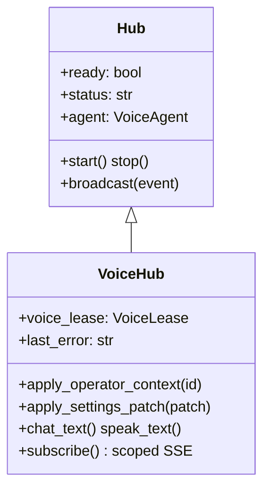

# Voice Hub Service

`services/voice/hub.py` defines **`VoiceHub`**, the unified bridge between FastAPI routes and the qwen3 voice-runtime `Hub` in `packages/voice-runtime/server.py`. A module-level singleton `hub` is imported by `apps/gateway/voice_routes.py`, `apps/gateway/settings_routes.py`, and the gateway lifespan handler. Every voice session, SSE event, settings reload, and room lease flows through this object.

For architectural context see [[Architecture/Voice Hub Bridge]]; this page documents **implementation responsibilities** and operator-facing behavior.

## Class hierarchy



`VoiceHub` extends the runtime `Hub` with operator scoping, voice lease arbitration, settings-driven reload, and LLM provider hot-swap without duplicating STT/TTS logic.

## Singleton and lifecycle

| Phase | Behavior |
|-------|----------|
| Import | `hub = VoiceHub()` created at module load |
| Lifespan start | `apps/gateway/lifespan.py` calls hub initialization — loads TTS/STT, migrates legacy data |
| `POST /api/voice/agent/start` | Acquires operator voice lease, starts mic session |
| `POST /api/voice/agent/stop` | Releases lease, stops capture |
| Settings patch | May reload discord/tools/memory sections or require agent restart for TTS engine |
| Shutdown | Lifespan teardown stops agent thread |

If TTS fails to load, `hub.ready` may be false while text chat still works — **degraded mode** ([[Reference/Glossary]]).

## Core responsibilities

### 1. Operator context

`apply_operator_context(operator_id)` switches the active operator:

- Seeds `services/operator_voice/paths` data directories
- Loads per-operator personalities file
- Overlays operator-specific settings via [[Services/Settings Store]] `load_effective_settings(operator_id)`
- Sets `_active_operator_id` for subsequent hub calls

Routes call this before memory, personality, and voice selection operations when an authenticated operator is present.

### 2. Voice lease (single active speaker)

Only one **operator** or **room** may hold the mic pipeline at a time:

```python
@dataclass
class VoiceLease:
    kind: str          # "operator" | "room"
    context_id: str
    speaker_id: str | None = None
    speaker_name: str | None = None
```

`_acquire_lease()` returns `voice_in_use` if another context holds the lease. Dashboard status exposes this via `hub.lease_status()` in `GET /api/voice/agent/status`.

### 3. SSE broadcast scoping

`subscribe(operator_id=..., room_id=...)` registers scoped subscribers. `broadcast()` filters events:

- Room events go only to matching `room_id` subscribers
- Operator events go to matching `operator_id` or global status/audio events
- Prevents operator A from receiving operator B's chat tokens

The events stream is `GET /api/voice/agent/events` (SSE, 15s keep-alive).

### 4. Settings apply and hot reload

`apply_settings_patch(patch, operator_id=...)` merges settings, persists via store, calls `apply_to_config()`, and computes live diffs:

| Changed section | Action |
|-----------------|--------|
| `audio`, `detection`, `delivery` (subset) | Live update via SSE `settings` event |
| `discord`, `tools`, `memory`, `runtime` | Agent section reload (`_RELOAD_SECTIONS`) |
| TTS engine keys (`clone_model`, `custom_model`, `tts_mode`, `device`) | Requires agent restart — model weights loaded once |

TTS engine changes compare `_tts_engine_changed()` because Qwen TTS weights cannot swap without reload.

### 5. LLM provider management

Uses `services/llm/provider.py`:

- `create_llm_client()` — construct client from settings
- `swap_agent_llm()` — hot-swap under `_llm_lock`
- `is_webllm_provider()` — browser-side inference path
- WebLLM fulfill endpoints delegate to `services/llm/webllm_broker.py`

`_ping_llm()` probes `/v1/models` before start when configured.

### 6. Chat and speech APIs

| Method | Route | Description |
|--------|-------|-------------|
| `chat_text()` | `POST .../chat` | Text turn through agent LLM + tools |
| `speak_text()` | `POST .../speak` | TTS + playback path |
| `render_speech()` / `iter_speech()` | `POST .../tts`, `.../tts/stream` | Raw WAV generation with cache |
| `conversation_state()` | `GET .../conversation` | Transcript snapshot |
| `start()` / `stop()` | `POST .../start`, `.../stop` | Voice session lifecycle |

Reply publishing uses `_publish_ai_reply()` to strip `VOICE:` delivery cues and emit separate `ai` and `delivery` SSE events when style cues enabled.

### 7. Personalities and memory

Operator-scoped variants (`*_for_operator`) read/write under operator data dirs:

- `list_personalities_for_operator`, `activate_personality_for_operator`, `save_personality_for_operator`
- `memory_status`, `memory_edit`, `memory_approve`, `memory_reject`, `memory_explore`, `session_search`
- `build_character_card()` — LLM-assisted personality creation

### 8. Asset management (delegated routes)

`voice_routes.py` handles file uploads; hub sets voice path via `set_voice()`. VRM and animation listing uses filesystem helpers in the route module with paths from `services/paths.py`.

## Key module imports

```text
services/voice/hub.py
├── server.Hub              # voice-runtime base
├── services.settings.store # load/save/apply settings
├── services.llm.provider   # LLM swap
├── services.operator_voice.paths
├── services.voice.inference.INFERENCE_LOCK
└── packages/voice-runtime/agent, config (lazy)
```

## Status and capabilities

`GET /api/voice/agent/status` aggregates:

- `hub.ready`, `hub.status`, `hub.last_error`
- `session_running` — agent mic active + operator holds lease
- `llm_ok`, `llm_model`, `llm_provider`, `llm_health`
- `capabilities` from `hub.agent_capabilities()`
- `lease_status()` voice owner info

## Configuration interaction

Effective settings = global `data/settings.json` merged with operator overlay in `data/operators/{id}/settings.json` (see [[Services/Settings Store]]). Hub never reads dashboard localStorage — all persistence is server-side JSON.

## Troubleshooting

**`agent not ready` on /tts**

TTS model failed to load. Check GPU memory, `VA_TTS_ENABLED`, and logs at lifespan start. Set `VA_TTS_ENABLED=0` for text-only degraded mode.

**`voice_in_use` on /start**

Another operator or room holds the lease. Call `/stop` on the owning session or wait for disconnect cleanup.

**Settings change not applied to LLM**

Provider swap errors are logged under `_llm_lock`. Run `POST /api/voice/settings/health` for passive/active probes.

**SSE silent after navigation**

Client must reconnect to `/events`; server drops subscriber on disconnect. Check operator cookie on fetch credentials.

**Memory tools show wrong operator data**

Route must call `apply_operator_context` — memory endpoints in `voice_routes.py` do this when `oid` present.

## Related documentation

- [[Architecture/Voice Hub Bridge]] — design overview
- [[Services/Settings Store]] — settings persistence hub consumes
- [[Voice Runtime/Agent]] — underlying agent loop
- [[Reference/API]] — full `/api/voice/agent/*` route list
