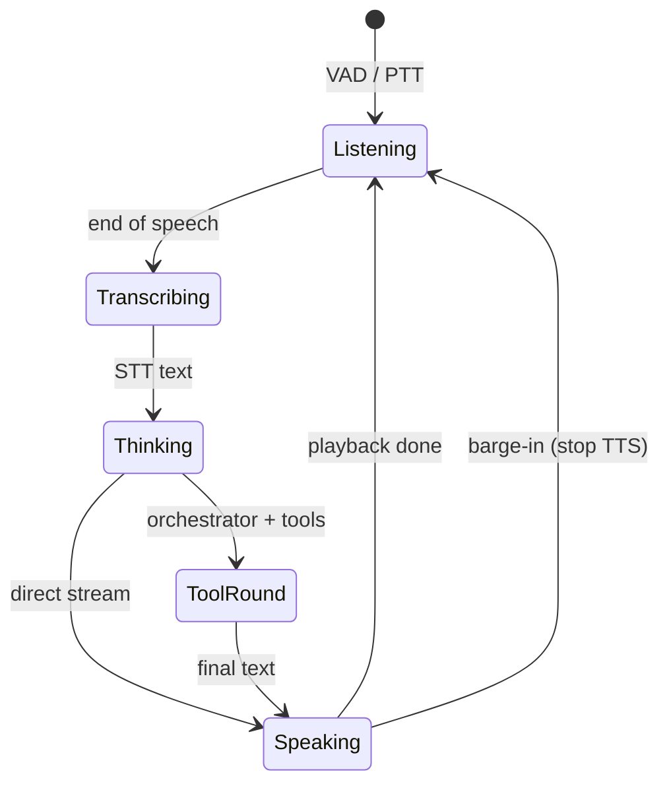

# Agent Orchestrator

**`VoiceAgent`** in `packages/voice-runtime/agent.py` is the central controller for every conversational turn. It connects STT output to LLM streaming, optional tool rounds, TTS playback, memory persistence, and barge-in cancellation in one coordinated state machine.

Understanding `VoiceAgent` is the key to debugging latency, empty replies, tool failures, and mid-sentence cutoffs.

## Design goal: overlap everything

Traditional voice stacks run STT → wait → LLM → wait → TTS → play sequentially. Maya **streams** LLM tokens into sentence chunker → TTS **while** tokens still arrive, and checks a **`stop` event** on every TTS sub-chunk so barge-in is cheap.

From the module header:

> Each LLM phrase is fed to `Qwen3TTS.stream(...)`, whose ~667ms audio sub-chunks are pushed to the speakers as they are produced, so generation and playback overlap for low latency.

## Turn lifecycle (conceptual)



### 1. Input modes

| Mode | Trigger | Code path |
|------|---------|-----------|
| Push-to-talk | Dashboard button | Buffered audio → STT once |
| VAD | `vad.py` turn detector | SharedMic frames → utterance window |

Weak transcripts (coughs, noise) may be filtered via `_is_weak_transcript`, `_is_barge_transcript` helpers.

### 2. Memory prefetch

Before LLM:

- **`MemoryManager.prefetch_context(user_text)`** — semantic hits from cognitive memory
- **Session history** — recent turns from DB-backed session store
- **Character/personality** — system prompt suffix from curated memory + skills index

See [[Voice Runtime/Memory and Tools]].

### 3. Orchestrator vs direct stream

When `CONFIG.llm.orchestrator_enabled` (`VA_LLM_ORCHESTRATOR=1`):

```python
# tools/loop.py — ToolLoop.run()
# Up to max_rounds native or JSON tool calls, then final speak text
```

When off, agent calls `llm.stream_reply()` immediately after STT—fastest path, no tools.

### 4. VOICE: delivery cue stripping

If TTS auto-instruct is enabled, the LLM may prefix replies with:

```
VOICE: whisper, gentle, slow
I am right here with you.
```

`strip_voice_cue_stream()` incrementally parses the token stream:

- Detects partial `VOICE:` prefix (don't speak too early)
- Extracts cue for TTS `instruct` parameter
- Yields only spoken reply tokens to chunker/TTS

Implementation detail: supports **newline** and **inline** boundary (lowercase cue → Capitalized reply) via `_INLINE_VOICE_BOUNDARY_RE`.

### 5. Text hygiene before TTS

`_clean_text()` pipeline:

1. `sanitize_llm_output` — strip `/no_think` artifacts
2. `_strip_voice_delivery_line`
3. Emoji removal (`_EMOJI_RE`) — prevents Windows console crashes and bad TTS
4. `polish_spoken_reply` — character card polish pass

Models often ignore "no emoji" instructions; stripping is mandatory.

### 6. Sentence chunking → TTS

`chunker.sentence_chunks` respects:

- Abbreviations (Mr., Dr., …)
- `CONFIG.chunk` min/max char limits

Each sentence invokes `tts.stream(text, stop=barge_event, instruct=cue)`.

### 7. Barge-in

While speaking, VAD listens on **`SharedMic`** (see [[Voice Runtime/VAD and Barge-in]]). On user speech:

- Set `threading.Event` → TTS generator exits early
- Flush player queue
- Run barge STT with stricter thresholds

## Observability

Turns record via `observability.record_turn` and `span()` contexts. Enable OpenTelemetry:

```env
VA_OTEL_ENABLED=1
OTEL_EXPORTER_OTLP_ENDPOINT=http://localhost:4317
```

Requires `pip install -e ".[otel]"`.

## Event emission

The agent accepts an `emit` callback (wired by hub/server) to push structured events to SSE:

- Partial transcripts
- Streaming assistant tokens
- Tool trace steps
- Turn completion / errors

Events carry `corr_id` for correlating logs with UI messages.

## Configuration knobs (agent-visible)

| Variable | Effect on agent |
|----------|-----------------|
| `VA_LLM_ORCHESTRATOR` | Tool loop on/off |
| `VA_LLM_MAX_TOKENS` | Spoken length cap |
| `VA_LLM_HISTORY_TURNS` | Context window size |
| `VA_TTS_DELIVERY` | full / hybrid / per-sentence TTS |
| `VA_TTS_AUTO_INSTRUCT` | VOICE: cue parsing |
| `VA_WEB_TOOLS_ENABLED` | Web search tools in registry |

Dashboard settings override many of these at runtime through [[Services/Settings Store]].

## Troubleshooting

| Symptom | Likely cause |
|---------|--------------|
| Reply cuts off mid-sentence | Barge-in false trigger — use headphones |
| Speaks "VOICE colon …" | Cue strip failed — check auto-instruct + model compliance |
| Long pause before speech | `VA_TTS_DELIVERY=full` waits for full LLM text |
| Tool loop never finishes | Model doesn't support tools — falls back to JSON mode or fails |
| Emoji spoken as silence/garble | Should be stripped — check `_clean_text` path |

## Related

- [[Voice Runtime/LLM]]
- [[Voice Runtime/TTS Pipeline]]
- [[Architecture/Request Pipeline]]
