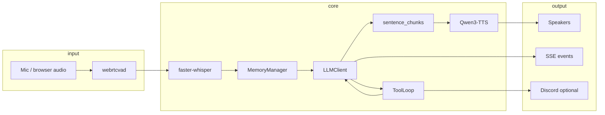

# Voice Runtime

The **`packages/voice-runtime/`** package is Maya's local streaming voice engine. It implements the full loop from microphone audio to synthesized speech, including memory, tools, Discord integration, and optional VTuber hooks.

In **Maya Unified**, this package is **embedded** behind the gateway—it is not started as an independent server on port `7861` unless you explicitly run `python packages/voice-runtime/server.py` for legacy debugging.

## Pipeline overview

From `agent.py` module docstring:

```
user input → STT (mic modes) → LLM token stream → sentence chunks
    → streaming TTS (chunk_size) → interruptible playback (barge-in)
```

The critical latency optimization: **`Qwen3TTS.stream()`** emits ~667ms audio sub-chunks while the model is still decoding, so playback begins before the full sentence is synthesized.



## Module map

| Module | Responsibility |
|--------|----------------|
| `agent.py` | `VoiceAgent` — turn orchestration, barge-in, VOICE: cue parsing |
| `llm.py` | OpenAI-compatible streaming + tool completions |
| `stt.py` | faster-whisper wrapper |
| `tts.py` | Qwen3-TTS streaming, `NullTTS` fallback |
| `vad.py` | WebRTC VAD, `SharedMic`, turn detection |
| `chunker.py` | Sentence splitting for TTS |
| `config.py` | All `VA_*` dataclass configs |
| `memory/` | Layered memory, skills, character cards |
| `tools/` | Registry, executor, loop, web, Discord, MCP |
| `server.py` | Legacy FastAPI hub (wrapped by unified VoiceHub) |
| `player.py` | Audio output, sounddevice |
| `observability.py` | Logging spans, optional OpenTelemetry |

## Unified vs standalone

| Topic | Standalone README | Unified behavior |
|-------|-------------------|------------------|
| Start command | `python server.py` | `python launch.py` |
| URL | `:7861` | `:8090` |
| Auth | None | Operator session required |
| Settings | Local JSON + `.env` | `services/settings/store.py` + dashboard |
| Data dir | `voice-runtime/data` | Repo root `data/` (`VA_DATA_DIR`) |

Always develop voice features in `packages/voice-runtime/` but test through **`launch.py`** so hub scoping and auth match production.

## Configuration entry point

All tunables flow through **`config.py`** dataclasses loaded from environment variables prefixed with **`VA_`**. Unified gateway applies dashboard overrides via `apply_to_config()` at runtime.

Full reference: [[Configuration/Environment Variables]].

## Deep-dive pages

| Topic | Page |
|-------|------|
| Turn loop, orchestrator, emoji strip | [[Voice Runtime/Agent Orchestrator]] |
| Whisper models, barge STT | [[Voice Runtime/STT Pipeline]] |
| LM Studio, LiteLLM, WebLLM | [[Voice Runtime/LLM]] |
| Clone vs custom voice, delivery modes | [[Voice Runtime/TTS Pipeline]] |
| SharedMic, barge-in | [[Voice Runtime/VAD and Barge-in]] |
| Memory layers, tools, MCP | [[Voice Runtime/Memory and Tools]] |

## Degraded operation

Maya Unified starts even when voice deps fail:

- Missing `faster_qwen3_tts` → `NullTTS` (text-only)
- Missing whisper → agent load may fail partially—check `/api/voice/agent/status`

Set `VA_TTS_ENABLED=0` to skip TTS initialization entirely during development.

## Related

- [[Architecture/Voice Hub Bridge]]
- [[Services/Voice Hub Service]]
- [[Development/Monorepo Conventions]]
