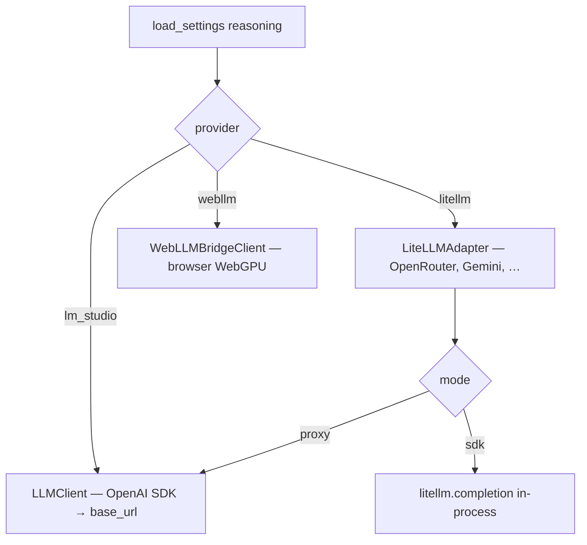

# LLM Streaming Client

`packages/voice-runtime/llm.py` defines **`LLMClient`**—the OpenAI-compatible streaming chat client that powers spoken replies and the tool orchestration loop. It targets **LM Studio** by default (`http://localhost:1234/v1`) but works with any server implementing `chat.completions` with streaming.

In Maya Unified, the dashboard can override provider settings; `services/llm/provider.py` constructs the active client and **hot-swaps** it on the live agent without restart.

## Two call shapes

The module docstring defines the intentional split:

| Method | Streaming | Tools | Used for |
|--------|-----------|-------|----------|
| **`stream_reply(user_text, history)`** | Yes | No | Spoken answer—lowest time-to-first-token |
| **`complete(messages, tools=...)`** | No | Yes | Tool loop rounds—native `tool_calls` parsing |
| **`stream_messages(messages)`** | Yes | No | Final speak pass after tools finish |

This separation keeps the happy-path voice latency low while still supporting multi-round tool use when `VA_LLM_ORCHESTRATOR=1`.

## Provider selection (unified)

`services/llm/provider.create_llm_client()` reads **persisted dashboard settings**, not only `.env`:



**WebLLM** runs inference in the browser; the server-side `LLMClient` is bypassed. Dashboard JS loads the model via WebGPU—no `VA_*` URL needed for inference itself.

### Hot swap

When Settings → Reasoning changes:

```python
swap_agent_llm(agent)  # replaces agent.llm, memory.llm, tool_loop.llm
```

## Configuration (`LLMConfig` in `config.py`)

| Env var | Default | Purpose |
|---------|---------|---------|
| `VA_LLM_BASE_URL` | `http://localhost:1234/v1` | OpenAI-compatible endpoint |
| `VA_LLM_API_KEY` | `lm-studio` | API key (LM Studio accepts placeholder) |
| `VA_LLM_MODEL` | `local-model` | Model id routed by server |
| `VA_LLM_TEMPERATURE` | `0.6` | Sampling temperature |
| `VA_LLM_TOP_P` | `0.9` | Nucleus sampling |
| `VA_LLM_MAX_TOKENS` | `220` | Cap spoken length (voice = short replies) |
| `VA_LLM_HISTORY_TURNS` | `6` | Recent user/assistant pairs kept |
| `VA_LLM_DISABLE_THINKING` | `1` | Qwen3 hidden thinking off |
| `VA_LLM_NO_THINK_TOKEN` | `/no_think` | Soft prompt token (avoid on Gemma) |
| `VA_LLM_REASONING_EFFORT` | *(empty)* | Set `none` for Gemma/reasoning models |
| `VA_LLM_ORCHESTRATOR` | `1` | Enable tool loop before speak |

### System prompt

`VA_LLM_SYSTEM_PROMPT` defaults to the Maya-sama character prompt in `config.py`. Personalities from `data/personalities.json` may override via memory/character card layers—see [[Configuration/Personalities]].

## Message assembly

`_messages(user_text, history)` builds:

1. **System** — `base_system_prompt()` plus optional auto-instruct guide
2. **History** — last `history_turns * 2` messages
3. **User** — current utterance (may include memory prefetch prefix from agent)

### Auto-instruct (`VOICE:` lines)

When `CONFIG.wants_style_cue()` is true (TTS auto-instruct), the system prompt appends `AUTO_INSTRUCT_GUIDE`:

```
VOICE: amused, warm, chuckling softly
Ha, that's a good one - you got me there.
```

`agent.py` strips the `VOICE:` line before TTS and passes the cue as **`instruct`** to Qwen3-TTS for per-reply delivery variation.

## Reasoning & thinking controls

`_extra_body()` sends provider-specific fields:

```python
extra_body["chat_template_kwargs"] = {"enable_thinking": False}  # Qwen3 / vLLM
extra_body["reasoning_effort"] = "none"  # Gemma-style reasoning models
```

If the server rejects `extra_body`, the client **retries once without it**—compatibility over strictness.

### Common failure: empty spoken reply

**Cause:** Model spends `max_tokens` on hidden reasoning.

**Fix:**

```env
VA_LLM_REASONING_EFFORT=none
VA_LLM_DISABLE_THINKING=1
VA_LLM_MAX_TOKENS=220
```

For Gemma, avoid appending `/no_think` to the system prompt—it may be echoed into spoken output (`sanitize_llm_output` strips known artifacts).

## Streaming implementation

`stream_reply` → `_stream_with_fallback`:

1. Opens `chat.completions.create(stream=True, ...)`
2. `_iter_stream_chunks` reads chunks on a **daemon thread** with **90s timeout**
3. If zero tokens arrived, falls back to non-streaming `complete()` and yields full text once

This prevents a hung LM Studio from blocking the voice thread indefinitely.

## Tool calling (`complete`)

When `tools` is provided:

```python
kwargs["tools"] = tools
kwargs["tool_choice"] = "auto"
```

Parses `tool_calls` into `ToolCall` dataclass objects. On server error with tools, raises **`ToolsUnsupported`** so `tools/loop.py` can fall back to JSON-in-text protocol.

## Sanitization

`sanitize_llm_output`:

- Strips control tokens like `/no_think`
- Delegates to `memory.character_card.strip_llm_artifacts`

Applied on **complete** responses; streaming path cleans in `agent._clean_text`.

## LiteLLM path (hosted models)

Example `.env` for OpenRouter via LiteLLM SDK:

```env
VA_LLM_PROVIDER=litellm
VA_LLM_LITELLM_MODE=sdk
VA_LLM_LITELLM_MODEL=openrouter/deepseek/deepseek-v4-flash
OPENROUTER_API_KEY=sk-or-v1-...
```

Dashboard Settings mirror these fields; provider module reads JSON store.

## Operational tips

| Goal | Setting |
|------|---------|
| Fastest replies | Lower `VA_LLM_MAX_TOKENS`, disable orchestrator |
| Tool use (web, Discord) | `VA_LLM_ORCHESTRATOR=1`, capable model |
| Local privacy | LM Studio only, no LiteLLM |
| GPU-free inference | WebLLM in dashboard (WebGPU required) |

## Related

- [[Voice Runtime/Agent Orchestrator]] — when stream vs tool loop runs
- [[Voice Runtime/Memory and Tools]]
- [[Configuration/Environment Variables]]
- [[Services/Voice Hub Service]] — hot-swap entry point
