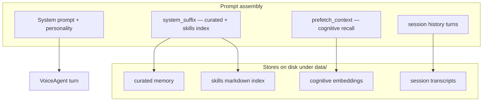

# Memory and Tools

Maya's agent combines **layered long-term memory** with an **extensible tool system** so conversations persist beyond the LLM context window and the model can act (web search, Discord, memory writes, MCP servers).

Orchestration centers on **`MemoryManager`** (`memory/manager.py`) and **`ToolLoop`** (`tools/loop.py`).

## Memory architecture



### MemoryManager responsibilities

From module docstring:

- Build **frozen session prefix** (curated + skills) for prompt caching stability
- **Prefetch** semantically relevant memories each turn
- Provide **recent conversation history** (DB-backed sessions)
- Log turns and run **background review** engine
- Register memory/session/cognitive/**skill tools**
- Hold **write-approval staging queue** for UI

### Memory layers

| Layer | Module | Purpose |
|-------|--------|---------|
| **Curated** | `memory/curated.py` | Human-approved facts, character facts, scoped by `MemoryScope` |
| **Cognitive** | `memory/cognitive.py` | Embedding-based recall (`VA_MEMORY_COGNITIVE_ENABLED`) |
| **Sessions** | `memory/sessions.py` | Turn-by-turn conversation log |
| **Skills** | `memory/skills.py` | Markdown skill files in `data/skills/` |
| **Character card** | `memory/character_card.py`, `png_card.py` | SillyTavern-style personas |
| **User profile** | `memory/user_profile.py` | Long-term user model |
| **Review** | `memory/review.py` | Post-turn LLM review for memory extraction |

### Scopes

`MemoryScope` limits curated/cognitive visibility to operator, room, or global contexts—important in unified multi-operator mode via hub scoping.

### Write approval

When `write_approval` enabled, memory writes stage in UI queue before committing—prevents accidental long-term pollution from tool calls.

### Dashboard

Browse memories at **`/memory`**. Edits may require reload of memory section — hub `_RELOAD_SECTIONS` includes `"memory"`.

## Tool system

### Registry & executor

- **`tools/registry.py`** — `ToolSpec` definitions (name, schema, handler)
- **`tools/executor.py`** — runs tool calls, captures errors/traces
- Built-ins in `tools/web.py`, `tools/discord_bot.py`, `tools/mcp_bridge.py`, etc.

Enable web tools:

```env
VA_WEB_TOOLS_ENABLED=1
```

Discord requires `VA_DISCORD_*` settings — [[Platform/Discord Integration]].

### ToolLoop (`tools/loop.py`)

When `VA_LLM_ORCHESTRATOR=1`, agent runs up to **`max_rounds`** (default 3) tool round-trips before speaking.

**Two protocols:**

| Protocol | Mechanism | When |
|----------|-----------|------|
| **native** | OpenAI `tools` + `tool_calls` | LM Studio / capable models |
| **json** | Model emits `{"tool": "...", "args": {...}}` in text | Fallback |

**Auto mode** tries native first; on `ToolsUnsupported` from [[Voice Runtime/LLM]], session falls back to JSON parsing for remaining turns.

```python
@dataclass
class ToolLoopResult:
    final_text: str
    trace: list[dict]
    rounds: int
```

Trace surfaces in dashboard SSE for debugging tool failures.

### MCP (Model Context Protocol)

Optional MCP servers via `pip install -e ".[mcp]"` and `mcp_servers.json`. Bridge in `tools/mcp_bridge.py` exposes remote tools to the registry.

## Skills

Markdown files in **`data/skills/`** (seeded from `examples/skills/`) extend behavior with structured instructions—see [[Configuration/Skills]].

Skills index appended to stable system suffix; individual skills can be loaded as tools.

## Personalities

**`data/personalities.json`** defines character voice + prompt tone — [[Configuration/Personalities]]. Bundled: Maya-sama, Professor Mari, Call Center Scammer.

## Settings reload

Changing memory/tools/discord sections in dashboard triggers hub reload without full restart when section ∈ `_RELOAD_SECTIONS`.

## Troubleshooting

| Issue | Check |
|-------|-------|
| Model never uses tools | Orchestrator off, or model lacks tool support |
| Web search 403/timeout | `VA_WEB_TOOLS_ENABLED`, network |
| Memory not recalled | Cognitive disabled, or empty index |
| Wrong persona | Personality selection + curated scope |
| MCP tool missing | Server config, mcp extra installed |

## Related

- [[Voice Runtime/Agent Orchestrator]]
- [[Voice Runtime/LLM]]
- [[Configuration/Skills]]
- [[Apps/Dashboard]] — `/memory` UI
