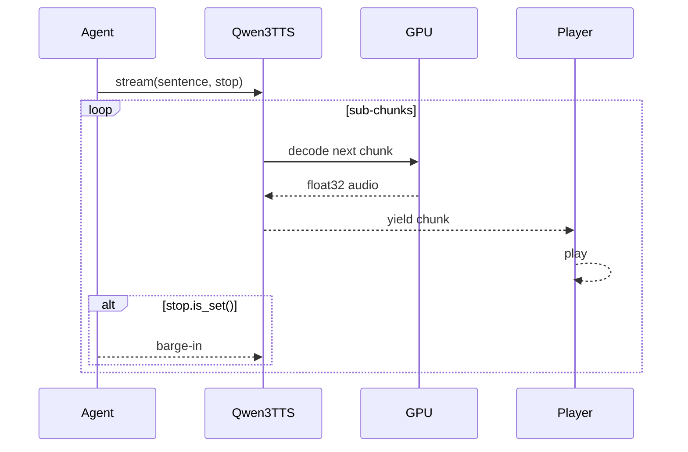

# TTS Pipeline

Text-to-speech uses **[faster-qwen3-tts](https://github.com/andimarafioti/faster-qwen3-tts)** wrapped by **`Qwen3TTS`** in `packages/voice-runtime/tts.py`. The wrapper exposes a single streaming interface for two voice modes:

| Mode | Env | API | Use case |
|------|-----|-----|----------|
| **clone** | `VA_TTS_MODE=clone` | `generate_voice_clone_streaming` | Reference clip + transcript (ICL) |
| **custom** | `VA_TTS_MODE=custom` | `generate_custom_voice_streaming` | Built-in speaker IDs (`aiden`, …) |

When TTS cannot load, **`NullTTS`** no-ops all streams—Maya continues with text-only output.

## Streaming model

`stream(text, stop, instruct)` yields `(float32_mono_numpy, sample_rate)` tuples as sub-chunks are decoded—typically **~667ms of audio per chunk** when `VA_TTS_CHUNK_SIZE=4` (8 steps ≈ 667ms in Qwen3-TTS docs).

The agent passes a **`threading.Event`** as `stop` so barge-in aborts decode between sub-chunks without waiting for full sentence synthesis.



## Loading & degraded mode

`load_tts(cfg)`:

1. If `VA_TTS_ENABLED=0` → `NullTTS`
2. Try construct `Qwen3TTS`
3. On `ImportError`, missing weights, CUDA OOM → `NullTTS` with printed WARNING

`launch.py` pre-checks imports and suggests `make setup` if packages missing.

## Clone mode (default)

Reference audio from `VA_TTS_REF_AUDIO` (default `voices/ref.wav` relative to voice-runtime package). Transcript auto-loaded from:

- `<audio_basename>.txt` (e.g. `ref.wav` → `ref.txt`)
- or `ref.txt` beside clip

Bundled example copied on first unified launch — [[Getting Started/Bundled Examples]].

### x-vector-only (`VA_TTS_XVEC_ONLY`)

Default **`True`**. Uses speaker embedding without putting full reference audio in model context—reduces "reference audio bleeding into output start" artifact. Set `0` for maximum likeness if artifacts acceptable.

## Custom mode

Uses preset speakers on **`Qwen/Qwen3-TTS-12Hz-1.7B-CustomVoice`**:

```env
VA_TTS_MODE=custom
VA_TTS_SPEAKER=aiden
VA_TTS_INSTRUCT=warm, friendly narrator
```

## Delivery modes (`VA_TTS_DELIVERY`)

Controls **latency vs prosody continuity**:

| Value | Behavior |
|-------|----------|
| **`full`** (default) | Synthesize entire reply in one generation—most natural, waits for full LLM text |
| **`hybrid`** | First sentence immediately, remainder as one block—one seam |
| **`off`** | Per-sentence generations—lowest latency, more tone variation between sentences |

Voice replies are short (`VA_LLM_MAX_TOKENS=220`); `full` is usually fine. For chatty models, try `hybrid`.

## Sampling consistency

Per-sentence TTS in `off` mode can sound like different "takes." Mitigations in `TTSConfig`:

- Fixed **`VA_TTS_SEED=1234`** (set `-1` to randomize)
- Lower **`VA_TTS_TEMPERATURE`**
- **`repetition_penalty`**

## Auto-instruct (per-reply delivery)

When `VA_TTS_AUTO_INSTRUCT=1`, LLM emits `VOICE: whisper, excited, …` prefix parsed by agent; cue passed as **`instruct`** overlay on base `VA_TTS_INSTRUCT`.

See [[Voice Runtime/LLM]] and [[Voice Runtime/Agent Orchestrator]].

## Key environment variables

| Variable | Default | Purpose |
|----------|---------|---------|
| `VA_TTS_ENABLED` | `1` | Master switch |
| `VA_TTS_DEVICE` | `cuda` | GPU device |
| `VA_TTS_DTYPE` | `bf16` | Model precision |
| `VA_TTS_CHUNK_SIZE` | `4` | Sub-chunk granularity |
| `VA_TTS_WARMUP` | `1` | Throwaway gen at startup |
| `VA_TTS_CLONE_MODEL` | `Qwen3-TTS-12Hz-0.6B-Base` | Smaller = faster TTFA |
| `VA_OUTPUT_VOLUME` | `1.0` | Playback gain |

## Warmup

`warmup()` runs tiny synthesis at startup when enabled—avoids multi-second cold start on first real user sentence.

## Troubleshooting

| Issue | Fix |
|-------|-----|
| Reference audio at start of reply | Enable `VA_TTS_XVEC_ONLY=1` or shorten ref clip |
| No audio, text OK | Check `[tts] WARNING` logs; `make tts-check` |
| CUDA OOM | Smaller clone model, or `VA_TTS_ENABLED=0` for dev |
| Robotic sentence seams | `VA_TTS_DELIVERY=full` |
| Slow first reply | Normal cold GPU; ensure warmup on |

## Related

- [[Voice Runtime/Agent Orchestrator]]
- [[Configuration/Environment Variables]]
- [[Getting Started/NixOS]] — optional TTS on Nix
