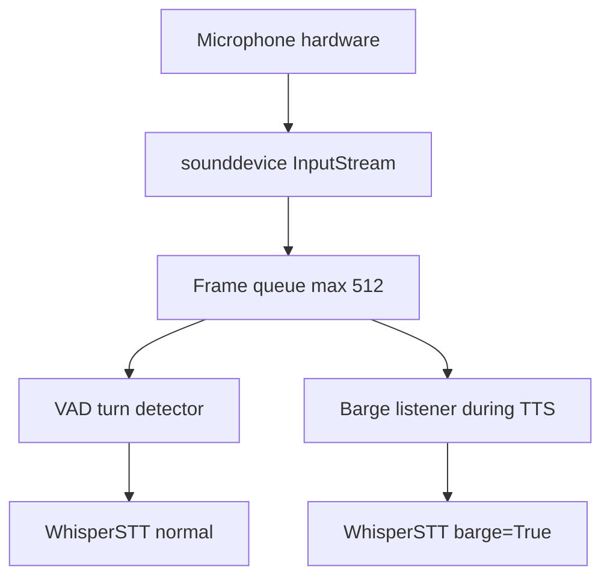

# VAD and Barge-in

**Voice Activity Detection (VAD)** decides when the user is speaking. **Barge-in** lets the user interrupt Maya mid-sentence—TTS stops, new speech is transcribed, and a new turn begins.

Both features live primarily in `packages/voice-runtime/vad.py` with acoustic echo considerations in `aec.py`.

## SharedMic architecture

Traditional push-to-talk avoids echo by muting capture during playback. Full-duplex **always-listening** mode keeps one mic stream open via **`SharedMic`**:

> SharedMic keeps one device stream open for the session and delivers **raw** frames. AEC is applied per consumer (idle listen + barge STT), never in the capture callback.

### WebRTC VAD

`_VADState` wraps **`webrtcvad`**:

| Setting | Default | Meaning |
|---------|---------|---------|
| `VA_VAD_AGGRESSIVENESS` | `2` | 0–3, higher = stricter speech filter |
| `VA_VAD_FRAME_MS` | `30` | Frame size — must be 10, 20, or 30 |
| `VA_VAD_SILENCE_MS` | `500` | Trailing silence ends turn |
| `VA_VAD_MIN_SPEECH_MS` | `250` | Ignore shorter bursts (clicks) |
| `VA_VAD_MAX_TURN_MS` | `30000` | Safety cap on utterance length |

Turn detector accumulates speech frames, waits for silence threshold, then emits audio buffer to STT.

## Barge-in mechanics

During TTS playback the agent:

1. Keeps **`SharedMic`** running
2. Passes `stop=threading.Event` into `Qwen3TTS.stream()`
3. On VAD speech detection → **`stop.set()`**
4. TTS generator exits between sub-chunks
5. Audio player flushes queue
6. Runs STT with **`barge=True`** stricter whisper settings — [[Voice Runtime/STT Pipeline]]

Result: user can interrupt within ~sub-chunk latency (~ hundreds of ms) rather than waiting for full sentence synthesis.

## Echo and false barge-in

**Most common production issue:** speakers bleed into mic → VAD thinks user is speaking → constant TTS cancellation.

**Mitigations:**

1. **Headphones** — strongly recommended in all docs
2. Lower speaker volume / `VA_OUTPUT_VOLUME`
3. Increase `VA_VAD_AGGRESSIVENESS` (careful—may clip soft speech)
4. Acoustic echo cancellation via `aec.py` when enabled in config
5. Use push-to-talk mode in noisy environments

## Push-to-talk vs VAD

| Mode | Echo risk | UX |
|------|-----------|-----|
| Push-to-talk | Low — mic active only while held | Manual control |
| VAD always-on | High without headphones | Hands-free |

Dashboard Settings expose mode selection; stored in settings JSON applied by hub.

## Weak / confirmation transcripts

`agent.py` filters some STT outputs:

- `_is_weak_transcript` — too short/noisy to treat as full turn
- `_is_confirmation_like` — backchannel "yeah", "uh-huh" during agent speech
- `_is_barge_transcript` — specialized handling for interrupt phrases

These reduce spurious turn resets during overlap windows.

## Debugging

| Observation | Interpretation |
|-------------|----------------|
| Maya never stops talking | Barge not armed — check mode, mic permissions |
| Cuts off every word | False barge — headphones, lower VAD sensitivity |
| Long delay before interrupt | TTS sub-chunk size — expected bound |
| Barge works but wrong text | barge STT thresholds — room noise |

## Related

- [[Voice Runtime/Agent Orchestrator]]
- [[Voice Runtime/STT Pipeline]]
- [[Getting Started/Quick Start]] — headphones note
